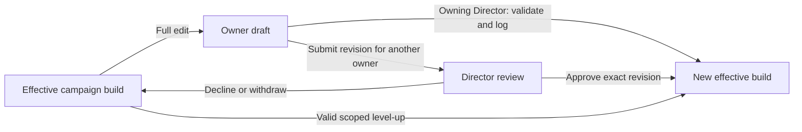

# Character wizard specification

Version 0.7 — consolidated specification checkpoint, 2026-09-14 (terminology and implementation-status
corrections to the 2026-09-11 checkpoint). Specification; the implementation status below is not approval
of any interface.

This is the consolidated specification for character creation, advancement, editing, progression history,
campaign admission, and Forge Steel interchange. **Confirmed requirements** reflect the product decisions made
in the character-wizard discussion. **Proposed implementation contracts** make those requirements concrete
without committing to a database schema or UI framework. **Open decisions** identify behavior that still needs
resolution before its dependent feature ships.

This document is the primary entry point for implementing the wizard. [Foundation notes](character-wizard.md)
retain the source investigation and examples; [interchange research](forge-steel-interchange.md) supplies
file-format evidence.

**V1 wizard specification work, 2026-09-14:** the user assigned this thread the fuller V1 wizard,
alongside separate v0.01 build and broader V1 specification threads. The
[core-content and decision contracts](v1-character-wizard-contracts.md) now detail all ancestry budgets,
culture pools, career grants, core class baselines and progression patterns, nested choices, kit
composition, and representative acceptance cases. The reproducible
[coverage matrix](research/v1-wizard-coverage-matrix.md) enumerates every core ancestry and all nine
classes through ten levels, plus their supporting option catalogs. Source-backed research, proposed
application behavior, remaining decisions and implemented coverage remain distinct. This work does not
mark the v0.01 R01–R03 contracts or the V1 implementation complete.

**Implementation status in this checkout, 2026-09-14:** owned characters with authored details (name,
appearance, biography, owner-private notes), save/reopen with stale-edit protection, combat edit locks and
immutable saved selection revisions exist (`convex/characters.ts`, `convex/characterTables.ts`,
`shared/characterDraft.ts`, temporary desktop page `web/characters.tsx`). No decision evaluator exists:
every saved revision carries status `awaiting-rules-evaluation`, and `derivedBaseline` and `liveState` are
stored as `null`. Decision definitions, validation, the derived baseline, live-state initialization,
campaign admission/review, effective-build activation, level-up, progression restoration and interchange
are not implemented. The older `src/` code remains a bounded headless combat experiment and a static
character-source inventory, not the wizard. See [app status](workstream-app-status.md).

The [v0.01 character sheet spec](character-sheet-spec.md) supplies the first-pass desktop display,
field inventory and table interactions, guided by the user-supplied paper sheet. This wizard specification
continues to own the build, draft, review and derived/live-state contracts.

The [data architecture checkpoint](data-architecture-spec.md) proposes the shared storage model and
encounter/session archive lifecycle. Character progression restoration remains independent of encounter undo;
closed sessions are permanently read-only in v1, independently of the wizard's restorable build history.

The [accounts and access specification](accounts-and-access-spec.md) defines campaign membership, active
Director appointments, and character viewing/combat grants. References here to full-sheet access exclude
character notes for everyone except the character owner, including Directors. Any additional private-field
exclusions remain open. Sharing never delegates build choices. Character-control sharing is limited to current
members of the character's campaign and includes progression-history viewing. Multiple eligible recipients can
hold grants simultaneously; this grants no additional build-edit authority. Character notes remain
owner-private, and the separate personal-inventory visibility restriction still applies. Viewing progression
history does not grant build editing or restoration authority.

The [Director table capability doctrine](accounts-and-access-spec.md#director-table-capability-doctrine)
applies to operations at the table. Character progression is a separate track: build and level-up choices
remain with the owner under this specification, with Director review where already required.

## 1. Product outcome and scope

### v0.01 scope

**Confirmed v0.01 slice, 2026-09-11:** the first hero is created through a minimal working wizard, with
devil ancestry, Fury class and level one. The user goes through the full character-creation sequence,
including ancestry, culture, career, class, kit and the other applicable sourced steps, using the step names
and order of [Making a Hero](../vendor/steel-compendium/en/unified/md/chapter/making-a-hero.md#step-by-step-hero-making)
(ancestry, culture, career, class, kit, free strikes, complication, details, connections; in the pinned
Compendium, [Background](../vendor/steel-compendium/en/unified/md/chapter/background.md) is the chapter
containing Culture and Careers, not a step). Each step may expose
only one supported option or valid selection set. Limited option breadth must not replace the creation flow
with a prepared-character load. Record the actual selections and derive the resulting character through the
shared character operations, then use it in the campaign/table journey. Preserve valid choice counts, budgets
and dependencies even when only one complete path is supported. Exact remaining fixture choices can be
established from the existing source-grounded example; this clarification does not select them individually.
See [the pre-alpha journey](pre-alpha-design-gaps.md#confirmed-first-acceptance-journey). Broader creation,
advancement and interchange requirements below remain the fuller product destination; their complete delivery
is not automatically a v0.01 gate. Selecting wizard entry does not cancel the eventual import requirement.

**Scope clarification, 2026-09-14 (Q-R-103):** v0.01 supports only the **Berserker** Fury aspect.
Reaver and Stormwight are outside the prototype's playable creation scope and remain later V1
coverage. Mountain remains the supported v0.01 kit. Broader source pools may be documented without
making those options playable; UI and headless selection must enforce the same supported subset.
This does not expand class-specific runtime automation beyond the existing manual-play scope.

**Implementation note, 2026-09-14 (R01):** the sourced decision definition for this slice is delivered as
`docs/fury-level-one-decisions.md` with its machine-readable mirror `shared/content/fury-level-one-decisions.json`
and the verbatim-source check `tests/fury-decisions.test.ts`. It lists all ten *Making a Hero* steps in source
order with stable decision ids, selection shapes, full option pools (the v0.01 supported subset is an explicit
marking), counts and budgets with their source sentences, dependencies and automatic grants, plus three worked
selection sets. The complication step is recorded but not presented (Q-CHAR-1). Source silences it found are
Q-R-100 to Q-R-103 are now resolved in `rules-questions-for-user.md`; their confirmed contracts appear below.
This closes readiness-audit gap G1 as a contract; A02 renders it and R02 derives values from it. Rules review
is pending.

**Confirmed editing scope:** v0.01 includes reopening a saved character in the same minimal wizard and
editing it outside combat. Restore its actual selections into the editor and use the same decision/validation
system as creation; one supported option/set per step remains acceptable. Saving an edit retains the
character's identity. Existing campaign review, effective-build isolation and combat edit locks apply;
authored details retain their established separate review policy. Save character-build revisions in v0.01;
the interface for browsing and restoring earlier builds is deferred.

**Confirmed advancement scope:** leveling up is deferred beyond v0.01. The prototype supports creation and
editing at level one. Retain the shared decision/evaluation model and saved build revisions as the foundation
for future progression; higher-level choices and a working level-up flow are not prototype gates. The fuller
advancement requirements below remain for later work.

**Confirmed interchange scope:** neither Forge Steel import nor export needs implementation in v0.01.
Compatibility must inform the basic character/wizard design now so those adapters can be added without
rebuilding the wizard. The minimum architecture must represent actual selections and their owning branches,
content references, authored details, derived baseline and live state independently of screen layout. Use
the existing interchange research to check these boundaries; retaining compatibility intent does not claim
a working converter or a tested file-version range.

Proposed engineering contract: the wizard and a future import adapter feed the same character model and
validation operations; export reads that model through its own adapter. Preserve scoped identity/mapping
information as definitions are translated. Allow original payloads and unknown imported fields to be retained
separately when import is implemented, without putting Forge Steel's whole object graph into ordinary wizard
state. A source snapshot must not be mistaken for chronological progression history. No import/export UI,
file processing, empty compatibility storage or round-trip implementation is required for this prototype.

**Confirmed inventory scope:** the entire inventory system is deferred beyond v0.01. The minimal wizard does
not need item instances, starting-equipment inventory creation or equipment-management controls. This qualifies
the earlier full-creation-sequence requirement for inventory work only. Keep the applicable sourced build
choices, including kit selection and its baseline contributions, in the character decision system. The broader
inventory requirements below apply when that subsystem is implemented; no placeholder inventory workflow is
required to finish the first character.

### Fuller product scope

A user can build a character through a guided decision system, advance it through a narrower level-up flow,
edit its complete build, and restore earlier progression points. The character carries independently authored
details and inventory, plus a sheet derived from its build and changing play state. The later
[inventory specification](inventory-spec.md) establishes campaign-level character/party inventories,
equipped/unequipped state, and transfers. Inventory management is character data even when items affect the
character; authorized party/character transfers are available between sessions. Inventory management is also
available while paused if the character is not combat-locked. Personal inventory inspection is restricted to
the owner and active Director, qualifying broader sheet-view grants for this data. V1 excludes direct
character-to-character transfers and free-text custom inventory entries; players cannot manually create new
items in their personal inventory, obtaining later loot through the Director's stash instead. Starting
equipment is part of character creation and is supplied through that workflow without stash allocation.
Existing inventory import/retention requirements remain separate from manual creation. Players can discard
items from their own or the shared party inventory but cannot return them to the Director's stash. The active
Director can directly edit character inventories; this permission does not grant progression choices or bypass
the combat sheet-edit lock. Inventory history is Director-reviewable, undoable, and redoable; players may read
their own inventory history, and campaign members may read party inventory history. Owners retain access to
personal inventory history after their character leaves a campaign. Players cannot undo personal inventory
changes or their changes to party inventory. This remains separate from progression rollback, which retains
present inventory. Actual item-use gameplay retains its separate rules. Reconcile that scope with the
detachment/duplication retention requirements below before implementation; this does not silently change those
requirements.

Each character belongs to one user and is either unattached or attached to one campaign. The Director approves
other owners' campaign admission and full edits; the owning active Director's changes are logged without
approval. Ordinary level-ups need no review. The campaign continues using its effective build while edits
await approval.

The complete wizard exposes foundational choices and all levels/options available in the supported rules
content. **Confirmed v1 target: every core class through levels 1–10.** V1 uses core rulebooks only; all
official supplemental content and homebrew character options/items are excluded. User-created characters using
core choices remain supported. This coverage target does not require full gameplay automation of every
ability. The inspected source set contains 11 classes with level 1–10 entries, including Beastheart and
Summoner. **User-confirmed scope: Summoner and Beastheart are official MCDM supplemental classes, not
core-rulebook classes, and neither they nor their associated mechanics are v1 targets.** The observed corpus
size must not be treated as the v1 class target; see the [reference/source scope](reference-library-spec.md).
The implementation must report its actual supported coverage; importing this corpus does not establish a
working choice system for every class.

In scope: creation, advancement, full editing, history, authored details, inventory integration, derived
sheets, attachment/detachment/duplication, Director review, and required Forge Steel import. Compatible Forge
Steel export is not required for v1. The data model must preserve the information and interchange-adapter
boundary needed to add it without rewriting the system. Import remains a v1 requirement; export implementation
and demonstrated compatibility are later delivery work.

The app is mobile-optimized and online-first. Shared character operations must also work through the headless
development client. Full combat automation, a digital battle map, a general-purpose version-control product,
and complete campaign administration are not deliverables of this wizard specification.

## 2. Character concepts

The following separation is required conceptually. Storage layout and exact type names are provisional.

| Concept | Meaning |
| --- | --- |
| Character identity | A stable character ID and owning user, separate from imported Forge Steel IDs and campaign roles. |
| Build | The selected level, foundational and progression choices, automatic grants, and referenced content. |
| Progression history | Recorded decision points and the builds they produced, including points within creation or a level transition. |
| Working draft | The owner's editable proposal, which can be incomplete and can differ from the effective campaign build. |
| Effective build | The build currently supplying character mechanics. For an attached character this advances by approved admission/full edit, logged admission/full edit by its owning active Director, or a valid ungated level-up. |
| Authored details | Name, appearance, descriptions, backstory, flavor, notes, and explicit customizations. Flavor and mechanical overrides are distinguishable. |
| Inventory | Independent item instances, quantities, and item state; applicable item rules determine their mechanical contribution. |
| Derived baseline | Characteristics, maximum Stamina/Recoveries, granted abilities, and other supported values produced by the build. |
| Live state | Damage/current resources, conditions, temporary effects, and recorded adjustments, distinct from the baseline. |
| Campaign values | Values connected to campaign operations, including XP and Victories, cleared when leaving a campaign. Their complete enumeration remains open. |
| Compatibility data | Preserved imported data and mappings that allow conversion without making Forge Steel's full object graph our character model. |

The character sheet combines the effective build, applicable inventory effects, and live state. While that
character is in an encounter, sheet editing is locked and encounter gameplay changes immediately update this
same main-sheet state. No independent encounter copy or later writeback is used. See the
[encounter sheet-lock contract](table-spec.md#character-sheet-lock-during-encounters). A draft sheet previews
that same evaluation for the proposed build. It must be clear which is being shown. An ability the hero
possesses remains on the sheet when it is currently unaffordable or otherwise unavailable to use.

Recalculation must not heal damage, replenish resources, remove conditions, or erase adjustments merely
because the wizard was reopened. Baseline changes use the following confirmed reconciliation policy.

### Current values when a build changes

**Confirmed 2026-09-15 (Q-CHAR-2):** Activating an edited, advanced or restored build updates its
baseline and maxima while retaining each compatible current value. Increasing a maximum does not
increase the current amount. If a new maximum is below the current amount, reduce the current amount
to that maximum: `newCurrent = min(oldCurrent, newMaximum)` for a value with such a maximum.

For example, Stamina 20/30 becomes 20/36 when the maximum rises, and 18/18 when the maximum falls to
18. Recoveries 7/10 becomes 7/12, or 6/6 if the maximum falls to six. This preserves current amounts;
the earlier proposal to preserve the numerical damage/spending deficit (20/30 → 26/36) is superseded.
Do not add a zero floor to source-authorized negative values.

This applies to values that actually have separate current amounts and maxima. Derived values such
as recovery value, characteristics and winded threshold still recalculate from the effective build;
this decision does not invent a second spendable/current version of those statistics. Preserve
conditions and compatible counters. A replaced resource type requires explicit reconciliation;
this rule supplies no automatic conversion between different resources. Actual source-defined
restoration, including a completed respite, remains a separate operation.

Preview the changes and apply the build and any required caps atomically through the shared
UI/headless operation, under existing activation locks and review rules. This is user-selected app
behavior; it is not a rulebook formula or a claim that the implementation has been updated.

## 3. Decision system

### Confirmed behavior

- Confirmed 2026-09-14 (Q-R-103), with [independent source research](research/fury-kit-eligibility.md):
  Berserker/Reaver use the 21 ordinary Chapter 6 kits; Stormwight uses Boren, Corven, Raden or Vuken.
  This follows the aspect-specific Kit/Beast Shape grants and separate source sections. Do not infer
  eligibility from the flattened catalog or a Martial-only filter. For v0.01, only Berserker with
  Mountain is supported; Reaver and Stormwight remain outside prototype creation scope.
- Confirmed 2026-09-14 (Q-R-102): the v0.01 culture/career language choices use spoken languages
  only: the printed Languages by Ancestry and Vaslorian Human Languages tables. Dead languages
  are not selectable at creation. Deduplicate names shared by those tables. Caelian remains visible
  as the automatically known common tongue and consumes no choice (Q-R-100). UI and headless
  selection use the same pool and validation. This does not decide later language acquisition or
  the separate V1 custom-language question.
- Confirmed 2026-09-14 (Q-R-101): display all five characteristics. Values automatically assigned
  by the selected class are filled in and uneditable in this assignment step. The remaining slots
  start blank for a new build. After choosing a source-permitted array, the player drags its three
  or four assignable values into the remaining slots, in any order. The class and chosen array
  determine the actual count and values; Fury has fixed Might 2 / Agility 2 and three assignable
  values. Repeated values are separate available numbers, each used once. An empty slot is unset,
  not an implicit zero. Existing saved assignments reopen as recorded; the example fixture is not
  automatic input for a new hero.
- Headless equivalence reaffirmed with Q-R-101: every wizard interaction that changes choices must
  have a headless operation with the same validation, persistence and derived results. Characteristic
  assignment accepts named characteristics and values; it must not require simulating a drag gesture.
  UI and headless callers use the same shared build operation, which preserves class-fixed values,
  checks the selected array's values/counts and records the assignment. Reassignment uses that same
  path. This extends the existing headless requirement to these wizard interactions without making
  drag-and-drop an independent implementation of character rules.
- Confirmed 2026-09-14 (Q-R-100): show **Caelian** as an automatically known language with a short
  description, such as “The common tongue, known by all heroes.” It is informational, not a language
  the user spends a choice on. Keep it visible but unavailable as a culture/career language selection;
  the automatic grant consumes none of those slots. Record it once as an automatic grant. Existing
  fixture selections that spend a slot on Caelian need correction through the normal choice flow;
  do not count the old duplicate as a fulfilled slot or silently invent a replacement choice.
- Foundational choices include ancestry, culture, career, and class, followed by the class-dependent kit and
  the source's optional complication step, using the step names of
  [Making a Hero](../vendor/steel-compendium/en/unified/md/chapter/making-a-hero.md#step-by-step-hero-making).
  In the pinned Compendium, "Background" is the chapter containing Culture and Careers, not a creation step.
  These are normally made once but may be revisited through full editing. Exact culture and career substeps
  (environment/organization/upbringing/language; skills, languages, perk, inciting incident) follow the
  content, rather than inventing additional independent selections. Resolved 2026-09-14 (Q-CHAR-1): the
  v0.01 wizard does not present the optional complication step; heroes are created without a complication.
  Complications return with fuller creation coverage (V08). See
  [the questions record](rules-questions-for-user.md#q-char-1-must-the-v001-wizard-present-the-optional-complication-step).
- The main wizard provides access to all levels and their applicable options; it is not limited to level 1 or
  the currently unlocked level-up prompts.
- Available options and resulting grants depend on previous choices and progression. The model must handle
  nested choices and cross-dependencies.
- Changes to a parent choice update the dependent choices and the resulting sheet. Invalidated selections
  cannot continue granting benefits.
- Automatic grants are distinct from choices the player must make.

### Proposed implementation contract

Represent the decisions as a dependency graph. A node identifies its owning branch, rule/content references,
availability conditions, selection shape, count or point budget, allowed options, timing, and effects on
dependent choices or grants. Choices may select content, assign numeric values, or contain nested choices; the
graph is not limited to single-choice dropdowns.

Retain invalidated selections for explanation and possible reuse without treating them as active. Distinguish
incomplete, invalid, and unsupported states. A saved draft may contain any of those states; it must not be
presented as a fully validated build. Unsupported combat automation is separate from invalid character
creation: a legal ability can appear on a valid sheet even if its effects require manual play.

Use one evaluator for creation, level-up, full editing, import validation, and headless clients. The level-up
operation enforces its scope independently of what a screen allows. Preserve build/respite/play selection
timing when translating Forge Steel definitions; a respite choice is not automatically another creation
prompt.

Each derived value or ability should identify the choice, grant, item, or effect that supplied it. Resolve
official text through Compendium SCC references. Unknown requirements must stay visible rather than being
interpreted as satisfied, false, or harmless.

**Implementation note, 2026-09-15 (A02):** `shared/evaluate/character.ts` implements the R02
contract; `characters.evaluate` runs it as a shared read and every saved revision persists its
`EvaluationResult` and `derivedBaseline`. The wizard (`web/wizard/`) renders every presented R01 step
in source order with the full pool visible and unsupported options labeled and disabled; a changed
parent prunes the selections it invalidates.

**Implementation note, 2026-09-14 (R02):** the evaluator contract for this section is delivered as
`shared/contracts/characterEvaluation.ts` (types only) with its sourced formulas, provenance rule, status
rules and three hand-computed examples in `docs/character-derived-values.md`, mirrored in
`shared/content/character-evaluation-examples.json` and checked by `tests/character-derived-values.test.ts`.
Input is the R01 decision ids and selection shapes; output is `complete | incomplete | invalid | unsupported`,
diagnostics keyed by decision id, and a derived baseline in which every value carries the decision id,
selected value and source sentence that supplied it. Status precedence (`invalid` > `unsupported` >
`incomplete`) is a labeled engineering choice within this vocabulary; warnings never change the status. The
baseline is distinct from live values (R03). Remaining questions are Q-CHAR-10 and Q-CHAR-11. Q-CHAR-12 was resolved through
[source research](research/remaining-character-questions-review.md#q-char-12) on 2026-09-15: use the
class-named potency characteristic with specific overrides. A02 implements the evaluator against these types.

## 4. Wizard flows

**Confirmed Director-owned character path:** An active Director's own character admission and full edits are
logged and require no approval step. Other characters retain Director review. This exemption does not bypass
build validation, campaign source limits, or combat character-edit locks. References below to campaign review
apply to other characters; the Director-owned path records and applies a valid completed revision without
review.

| Flow | Scope | Result when unattached | Result for a campaign |
| --- | --- | --- | --- |
| Create | Full main wizard, foundational choices and all levels/options. | Save the owned character and its build. | Submit for Director approval; an owning active Director logs and applies a valid build without approval. |
| Level up | Only the choices available to this character over the requested level transition. | Apply a valid advancement and record it. | Apply a valid advancement without Director review. |
| Full edit | Reopen the complete wizard when the character is not locked in an encounter. | Save the revised build and retain history. | Submit for review; keep the effective build until approved. An owning active Director logs and applies a valid revision without approval. |
| Restore progression | Select a previously recorded decision point. | Restore that build and its baseline. | Propose the restored build through the full-edit review path. |

All flows preserve independent inventory when changing progression. A historical point can be an incomplete
build; restoring it to a draft does not make it campaign-ready automatically.

### Language edits and respite kit changes

**Confirmed 2026-09-15 (Q-CHAR-5):** Language changes, including filling a previously deferred
language choice, use the normal edit workflow and its existing Director approval rules. No special
language-change operation or approval exemption is required. Preserve existing language entitlements;
this workflow decision does not grant extra languages.

Kit swapping is also available in the regular character editor, where it follows normal Director
approval rules outside the respite path (including the established owning-Director exception).
Kit swapping has a dedicated option in the respite gameplay loop. The owner selects an eligible kit
through that scoped, logged activity without a separate full-edit approval submission. Apply the
source's ordinary respite-activity cost and any actual named exceptions; the option does not grant
unlimited free swaps. It cannot carry unrelated build edits. Finalization records a build revision,
with current values reconciled under Q-CHAR-2 and respite restoration handled at its actual boundary.
Use the same shared operation for UI and headless clients, respecting applicable session permissions.
Respite remains deferred beyond v0.01.

This ruling covers languages and kits only. It does not establish approval exemptions for prayers,
wards, augmentations or other class reconfigurations, nor enable optional general ability swapping.
The existing full-edit policy remains unless a specific future respite contract establishes another
path. See [the respite mode](table-spec.md#respite-mode) and
[the source research](research/remaining-character-questions-review.md#q-char-5).

### Main creation and editing

Proposed user flow: choose/create an owned character, establish a target level, work through the applicable
decisions, add authored details, inspect the derived sheet and outstanding choices, then save or submit for
campaign review. Users can revisit earlier decisions without starting over. Screen order is a presentation
choice; it must not define the rules dependencies.

The owner can open full editing even while attached, except while the character is in an encounter. That
encounter locks draft/choice edits, level-ups, progression restoration, build activation, and out-of-play
sheet edits until normal ending or voiding; pause retains the lock. Existing drafts remain preserved but
cannot be changed or activated while locked. Viewing and authorized encounter operations remain available. A
full edit that changes only level still follows full-edit review. Foundational edits cannot be smuggled
through the level-up operation to evade review. Merely opening an editor or inspecting history does not
replace an effective build.

### Level-up

Start from the current effective build and evaluate the choices/grants made available by the level transition.
Preserve earlier choices except for replacements explicitly permitted by that advancement's rules. Apply and
record a valid completed result without a review queue. Ungated review does not mean unrestricted
advancement.

**Confirmed 2026-09-15 (Q-CHAR-3):** The campaign awards XP; the character sheet owns advancement
eligibility and the level-up steps. Awarding XP does not choose build options or automatically activate
a new build. The owner completes the scoped level-up through the character sheet and equivalent
shared headless operation, under existing timing, encounter locks and validation.

A transferred higher-level hero starts with zero destination-campaign XP and earns toward the next
level from the admitted effective level. Keep an eligibility offset equal to that entry level's
minimum standard XP threshold, separate from campaign XP. Compare `offset + campaignXP` against
standard cumulative advancement thresholds. A level-seven entrant has offset 96 and needs 16 new
campaign XP to reach level eight's threshold of 112. The offset remains the admission baseline as
XP accumulates; ordinary level-ups do not reset campaign XP or add the offset again. A retained
higher historical build does not set the offset when the hero enters at a lower level.

This transfer policy is an app decision. Source-defined advancement timing during respite remains;
the campaign/character responsibility split does not change XP award rules or enable a separate
advancement mode. Source restoration remains distinct from activating the level-up build. See
[the current-value policy](#current-values-when-a-build-changes) and
[source research](research/remaining-character-questions-review.md#q-char-3).

## 5. Progression history

**Confirmed v0.01 scope:** record saved character-build revisions and preserve them through save/reload.
Browsing and restoring earlier builds through a history interface is deferred beyond the prototype. This
decision covers saved builds, not every in-progress wizard interaction, and does not settle combat history.
The fuller restoration requirements below remain the design destination.

Confirmed example: restore a level-7 wood elf Shadow to the build they had at level 3. Restore its choices,
including ones later replaced, automatic grants, and build-derived stats/abilities. Retain present inventory.
Lowering a numeric level field alone does not meet this requirement.

| Restored | Retained independently |
| --- | --- |
| Selected progression point, active decisions, automatic grants, and resulting baseline | Present inventory, independent descriptions/flavor, and current live state subject to necessary resource reconciliation |

History must survive save/reload and support recorded finalized decision points, not only completed levels.
Navigating to an earlier point must not erase later records or rerun item/resource grants. Retain enough
resolved state and source context to restore the historical build without reinterpreting it against a newer
corpus. Evaluating present inventory against that restored build is distinct from replaying historical game
effects.

**Confirmed 2026-09-15 (Q-CHAR-4):** Character history follows the user's commit/snapshot model.
Each finalized edit records a new immutable build revision at the top of the chronological history.
Restoring an earlier build copies that recorded build into a new latest revision; it does not move
the active history position backward or remove the intervening entries. Record which earlier
revision supplied the restored snapshot. Subsequent finalized edits continue from this new latest
revision. Restoring a previously recorded higher-level build works the same way: another new entry.

Example, oldest to newest: level-three revision A → level-seven revision B → revision C restoring
A's level-three build → revision D containing new choices. C follows B in history and identifies A
as its restoration source; A and B remain unchanged and available to inspect or restore. Display
D first when listing newest entries first. This establishes snapshot/history behavior, without
requiring Git storage or a branch/merge interface.

A history entry snapshots the build scope defined above, not old inventory or live encounter state.
Current values use [the confirmed maximum policy](#current-values-when-a-build-changes). Merely
previewing an old entry does not finalize an edit. Finalizing a revision does not bypass campaign
review or activation locks; pending revisions leave the effective campaign build unchanged. UI and
headless restoration use the same shared operation. This decision does not bring the deferred
history/restoration interface into v0.01.

Progression restoration and table-history restoration have different scopes. Table rollback restores the
recorded affected game state. Progression rollback restores only the build and its baseline, combines them
with present independent state, and follows campaign review when applicable. Inspecting a historical build
never grants permission to activate it in a campaign.

## 6. Ownership, attachment, and permissions

### Confirmed access rules

| Actor | Owns character | Makes its build choices | Sheet/history access, subject to private-field policy | Approves campaign admission/full edits |
| --- | --- | --- | --- | --- |
| Character owner | Yes | Yes | Yes, through ownership | If active Director, own admission/full edits are logged without approval; otherwise Director review applies. |
| Campaign owner who is not the character owner or Director | No | No | Yes | Not established by campaign ownership. |
| Active Director who is not the character owner | No | No | Yes | Yes. |
| Other players | No | No | Owner can grant same-campaign members sheet/progression-history viewing and combat control for the current session or until revoked; notes remain owner-private and inventory retains its separate restriction. | No authority specified. |

The Director reviews choices made by the owner and can approve the proposed build; they do not choose
replacement options. Owning a character and acting as Director remain separate roles. Each participant can own
multiple campaign characters.

### Campaign lifecycle

Confirmed character management outside combat: owners may edit names, appearance, biography, and notes without
Director review, and may detach their own characters without Director approval. Notes retain owner-only
visibility. Pending full edits survive departure as a private draft; detachment does not activate that draft.
Duplication copies the currently active build, excluding pending edits, while retaining the established
independent inventory/history and cleared campaign-value rules. Owners may withdraw a submitted review before
the Director decides. Both the character owner and campaign owner may detach a character. The campaign owner
can kick a player or remove individual attached characters; removing a character alone does not remove its
owner's campaign membership. Director status alone does not grant this campaign-management power. Removed
characters remain owned by their creators and follow the established detachment policy. Existing combat locks
and separate campaign/account deletion rules remain in force.

Deleting a campaign preserves its members' detached characters; deleting an account deletes that account's own
characters, even during active combat in another campaign. Combat edit locks do not block account deletion.
Prior actions in other retained campaigns keep their username attribution; historical records are distinct
from a surviving playable character.

Campaign deletion automatically detaches characters using the existing rules below: retain current level,
build, authored details, inventory, and personal history; clear campaign values including XP and Victories.
Deletion does not require prior closure of an open or paused session. The deletion flow ends live activity and
releases its character locks; campaign deletion offers no combat keep/reset choice. Proposed default: retain
current recorded character state before applying detachment resets, with no encounter-start restoration or
encounter rewards. Campaign-owned logs are deleted, independently of retained personal history.

- A character is unattached or attached to exactly one campaign. Review status is separate from these two
  attachment types.
- On attachment, the owner chooses an entry level no higher than the character's current level. Select the
  corresponding build and submit it for Director approval. A retained higher-level history entry does not
  automatically raise this entry ceiling.
- Initial approval is required for characters created directly for the campaign, existing characters joining
  it, and imported/duplicated characters entering it. There is no effective campaign build before approval.
- An attached campaign can connect operations to character values such as XP and Victories.
- Detaching makes the character free to attach elsewhere. Campaign values clear, including XP and Victories.
  The character keeps its current level, build/history, authored details, and inventory. Cleared XP must not
  undo level progression.
- Duplicating into another campaign produces an independent user-owned character with a new identity and
  cleared campaign values. It follows destination admission: Director approval for other owners, or logged
  admission without approval for the owning active Director. Changes to the duplicate do not affect the
  original, including the original's campaign values.

Proposed admission contract: submitting for admission reserves the character's one campaign attachment slot
until accepted, withdrawn, or declined. The Director can inspect the submitted sheet/history during that
period. Pending admission does not authorize campaign play, XP awards, or a second campaign attachment.
Decline/withdrawal releases the reservation. This timing is a proposed default; it does not invent another
attachment type.

Proposed detachment contract: revoke live access granted by the attachment, invalidate its pending approvals,
clear campaign values, and release the attachment as one operation. Preserve existing campaign log records
under that campaign's history policy. Confirmed: keep the effective build and preserve pending edits
separately as a private draft; departure does not approve or activate them. Duplication uses the effective
build and excludes pending edits. The character owner can detach outside combat without Director approval; the
campaign owner may also detach any attached character. Removing only a character does not kick its owning
user.

## 7. Revision and review lifecycle

The separation between a working proposal and an effective campaign build is required. The following revision
mechanics are proposed implementation contracts.

For the active Director's own character, record and activate a valid completed admission/full edit without the
review steps below. Proposed validation rechecks current Director authority and combat locks at activation.
All other characters use this review contract.

1. Start full editing from a known effective revision. Save drafts without altering the effective build.
2. Submit an immutable revision for review, including its base revision and source context. Present the full
   sheet/history plus the proposed changes and derived consequences.
3. The Director approves that exact submitted revision. Approval activates it only if the attachment, review
   authority, and base build are still valid.
4. Further editing produces a different revision requiring review of those changes. Approval of an older
   submission never approves unseen edits.
5. Confirmed: the character owner may withdraw a submitted review before the Director decides. Declining or
   withdrawing a full-edit proposal leaves the effective build intact. Proposed consistency invalidates that
   submission so a stale approval cannot activate it. The relevant review UI surfaces requests and their
   state; v1 has no notification system. Feedback presentation remains a UI decision. All notifications,
   including email/push review alerts, are deferred beyond v1.
6. A valid scoped level-up advances the effective build without review and records the transition. If a
   pending full edit was based on an earlier build, mark it stale and require reconciliation/resubmission
   rather than silently overwriting the level-up.

**Implementation note, 2026-09-15 (A02):** submit, withdraw, approve and decline are the registered
operations `character.submit|withdraw|approve|decline` (`convex/lib/characterOperations.ts`), wrapped
by `characters.submit|withdraw|approve|decline` for the character page and the headless CLI. A
submission is a `characterReviews` row naming the exact revision; `characters.campaignId` and
`effectiveRevisionId` change only on activation (approval, or the owning active Director's logged
submission). A save after submission marks the review `stale` so a later approval cannot activate
unseen edits. First activation initializes live state per R03; later activations leave it untouched
and record unreconciled maximum changes labeled Q-CHAR-2. **Follow-up:** the confirmed
[current-value policy](#current-values-when-a-build-changes) supersedes that provisional behavior;
apply downward caps and retire maximum-only uncertainty markers. Resource-type changes still need
explicit reconciliation. Withdraw and decline are not blocked by the
combat lock (they change no effective build); submit, save and approve are.

Initial admission uses the draft/review/activation path without an existing effective build, with the
confirmed owning-Director exemption. Approval references belong to the campaign attachment; copying a
character or its history does not copy authorization into another campaign.

Build activation is blocked during an encounter. After the lock is released, approving a build must update it
and its derived contribution against current inventory/live state. It must not replace live state with a stale
draft snapshot. Ordinary combat/resource changes are not full edits and must not create Director-review
requests. Confirmed: outside combat, owners can edit names, appearance, biography, and notes without Director
review. These authored-detail changes do not activate pending mechanical choices. Inventory retains its
separately specified permissions and combat locks.

## 8. Content and Forge Steel compatibility

Reusable definitions belong to content packs, with campaign-selectable sources. The
[pack contract](data-architecture-spec.md#32-campaign-source-selection--proposed-behavior) proposes applying
the campaign's selected releases to wizard choices and rechecking them at admission/build activation. Imported
or unattached characters retain their content references; destination incompatibilities must be visible.
Disabling a pack preserves existing characters' use of and advancement within content they already have; the
proposed enforcement retains required releases and progression dependencies without opening unrelated new
choices. Engine compatibility metadata follows the
[engine release contract](engine-architecture.md#engine-releases-and-content-compatibility).

Use Forge Steel's progression/choice structure as an input while keeping our own UI and character model.
Official displayed rules and ability content should come from the pinned Steel Compendium. Store explicit
source references and local transformations outside both unmodified dependencies.

Investigated pins:

| Source | Commit |
| --- | --- |
| Forge Steel | `5a846aadb623a9855a023e9403bb887a956c341f` |
| Steel Compendium | `fb83a789da8f0327a389c277a0c790b1648d5810` |

Class files alone are insufficient: subclasses, domains, kits, factory defaults, nested selections, and choice
timing contribute rules. Use scoped mappings to SCC IDs; Forge Steel IDs can repeat across branches. Name
matching can suggest mappings but cannot silently resolve ambiguity. Keep official definitions,
customizations, and unmapped homebrew distinguishable. Source updates are deliberate, never automatic during
startup/build, and must not silently rewrite recorded history.

### Required import

Required for the fuller product; implementation is explicitly deferred beyond v0.01. The architecture above
must accommodate it from the first character model.

Accept the researched `.ds-hero` and `.drawsteel-hero` JSON formats within an explicitly tested support range.
Validate structure before creating a character; an incomplete valid draft differs from malformed input.
Translate selections and relevant state while retaining the original payload and unmapped data separately.
Imported ownership IDs, campaign references, or approvals never grant authority in this application.

Forge Steel embeds definitions and selections recursively; it stores Stamina damage and Recoveries used rather
than simply our current totals, and some resource state lives in feature data. Reconcile those representations
explicitly. Unmapped mechanics remain visible and preserved, not silently treated as supported. Our canonical
current values take precedence over preserved compatibility data, particularly after clearing campaign
XP/Victories.

A hero export supplies a snapshot, not chronological build history. Treat that snapshot as an initial known
revision. If an earlier level is requested, reconstruct only what the available data establishes and request
missing choices; do not claim a guessed build is the player's recorded past.

### Desired export

Implementation is explicitly deferred beyond v0.01; preserve the adapter path alongside future import.

Export the explicitly selected character revision into a compatible hero graph. Proposed default: the
effective build for an attached character and the current saved build for an unattached one; exporting a draft
should be a separately identified choice. Patch translated fields into preserved payloads for imported
characters, and construct the graph for characters created here. Preserve supported customizations and
unmapped data where compatible. Do not resurrect cleared campaign values from the original file.

Success means the character retains expected semantic choices and state after Forge Steel loads and updates
it. Valid JSON alone is insufficient: Forge Steel refreshes known definitions and can discard unavailable
nested selections. For v1, verify import with real files and missing-sourcebook/unsupported-data cases,
documenting limitations without enabling excluded content. Verify export round trips when that later adapter
is implemented; they are not a v1 release gate. See [interchange research](forge-steel-interchange.md). No
live round trip has been demonstrated yet.

Project-authored code is GPLv3; upstream code, game content, and artwork retain their respective terms. See
[third-party notices](../THIRD_PARTY_NOTICES.md).

## 9. Shared operations and reliability

These proposed contracts specify behavior without fixing endpoint names or storage tables. Both UI and
headless clients use the same operations.

| Operation group | Responsibilities |
| --- | --- |
| Draft and choices | Create/save drafts, list available decisions, apply a selection, report affected branches, derive a preview, validate completion. |
| Progression | Read history, inspect/restore a point, prepare and commit a scoped level-up. |
| Review | Submit/withdraw, read submitted revision and comparison, approve/decline the exact revision. |
| Attachment | Request admission with entry level, detach, duplicate into a destination campaign. |
| Interchange | Inspect/import a file with diagnostics; export a chosen revision when supported. |
| Play projection | Supply the effective build's supported abilities/stats to the shared game operations; retain unsupported content visibly. |

Persist drafts, progression records, effective revision, and review status across sessions. Convex is the
chosen application backend; calculations and decision evaluation remain client-independent. Existing
`src/contracts.ts` combat entities are projections, not the saved-character schema. Exact schema,
authentication setup, and frontend framework are implementation work, not established by this spec.

Check caller identity, ownership, current campaign role, and attachment on authoritative operations. Enforce
single-campaign attachment under concurrent requests. Use expected revisions and idempotent command handling
so retries do not create duplicate grants, attachments, approvals, or level-ups. Report stale submissions
explicitly; never silently merge unrelated builds or reuse an approval from an earlier attachment.

Record actor, operation, relevant inputs, and before/after results for effective build changes. Enforce the
encounter edit lock and preserve the shared main-sheet history when encounter operations change live state.
Source/engine changes must not cause history navigation to rerun rules or dice.

## 10. Mobile interaction requirements

These are fuller-product presentation requirements. V0.01 uses temporary desktop UI under the
[technology scope](v1-tech-stack-spec.md#1-decision-status-and-product-constraints); phone layouts and visual
polish are deferred. Correct draft/review/effective-state feedback and usable controls still apply to the
prototype's exposed flows.

Proposed presentation requirements: a resumable wizard with an overview of decisions grouped by foundation and
level, visible outstanding choices, and access to the full relevant rule text. The level-up view presents only
the transition's choices. Changing a parent decision explains which choices became invalid and how the
proposed sheet changed.

Distinguish draft, awaiting review, effective, and historical views in ordinary user-facing language. Show the
attached campaign and selected level. Review provides the proposed character and a comparison with the
effective build. Pending edits must not make the play sheet appear already changed. Show save/submit progress
and recover from reconnects without duplicate operations.

Use phone-sized layouts, touch-accessible controls, labels, keyboard/screen-reader access, and errors linked
to the relevant choice. The user-facing wizard should not expose internal SCC IDs or version-control
terminology as prerequisites for using it. Exact screen order and visual design remain open.

## 11. Acceptance scenarios

These describe fuller-product outcomes, not tests already passing or automatic v0.01 gates. For the
prototype, demonstrate the supported level-one creation/edit/review path on desktop, saved selections and
build revisions through reload, correct permissions/locks, and the resulting effective table character.
Keep unsupported choices and unresolved mechanics explicit. Build-history navigation UI, advancement, inventory,
grants and actual interchange follow their separate deferrals.

Establish numeric mechanics from pinned rules independently of the evaluator. Verify actual stored/read-back
state through shared operations. Exercise phone dimensions when mobile delivery returns to scope.

| Scenario | Required result |
| --- | --- |
| Build and resume | Complete a supported legal character, save/reload, and recover choices, authored details, inventory, and expected sheet values. Incomplete drafts remain editable. |
| Dependent choices | Change a class/subclass choice; incompatible grants disappear from the preview, invalid choices are identified, and independent details persist. Illegal option/count/budget selections are rejected. |
| Coverage and text | Expose all applicable levels/options in the main wizard for supported content. Display Compendium text and distinguish unsupported mechanics from legal-but-manual combat abilities. |
| Ungated level-up | Complete a sourced level transition in a campaign, preserving foundational choices. Effective stats/abilities and history update without a review request. Foundational edits through this operation are refused. |
| Initial admission | Submit a new/imported campaign character. The Director can inspect it; campaign play cannot use it before approval. Approval activates exactly the submitted build. |
| Full-edit isolation | Outside an encounter, full edits leave the effective build unchanged until approval. During an encounter, editing and activation are blocked for owner and Director alike. Existing drafts remain intact. The Director approves choices without choosing replacements. |
| Review races | Edit a submitted proposal, level up its base, change Director, or detach. An outdated/unauthorized approval cannot activate unseen changes or overwrite intervening build changes. |
| Historical build | Restore the recorded level-3 wood elf Shadow from level 7. Earlier choices and derived baseline return, later contributions disappear, present inventory stays identical, and no grants repeat. Campaign activation waits for edit approval. |
| Intermediate history | Save/reload and inspect an earlier point within a decision sequence. Restore it without rerunning rules; later history remains available. |
| Entry ceiling | Submit a level-7 character at level 3; after approval, its effective build is level 3 with retained inventory/history. Reject an entry level above the pre-admission current level. Missing imported history produces explicit missing choices. |
| Attachment exclusivity | Competing admissions cannot attach the same character to two campaigns. A duplicate has a new independent identity and needs destination approval. |
| Detachment/reset | Detach a character with nonzero XP/Victories. Both clear while current level/build/history/inventory remain. A campaign duplicate starts cleared without changing the original's values. |
| Live-state preservation | Gain an item or take damage through gameplay while a full edit awaits review. Encounter changes reach the main sheet immediately. Approval must wait until the encounter lock ends, preserve those changes, and apply the established maximum-reconciliation policy. |
| Authorization | Character owner and campaign Director/owner can inspect as specified; player grants permit sheet viewing/combat control under the access spec. Neither friendship nor guessed IDs grant access. Director/controller status does not permit selecting another user's build choices; character notes are owner-private; any additional private-field exclusions remain open. |
| V1 import / future export compatibility | Import a real core character, nested-domain character, and customized/homebrew example. Preserve supported selections and unknown data with diagnostics. For export, test both an imported and a locally built hero by reopening in Forge Steel. |

Rules support, conversion fidelity, and workflow behavior are separate acceptance dimensions. Approval by a
Director does not certify parser correctness or turn unsupported automation into supported behavior.

## 12. Open decisions

These do not prevent implementing draft/choice evaluation and history foundations. Resolve each before
shipping the dependent behavior; no silent default is authorized merely by listing it here.

The V1 research pass supplies concrete recommendations and source evidence in
[Q-CHAR-2 through Q-CHAR-13](rules-questions-for-user.md#open-questions). They cover the existing
resource/XP/history questions and newly exposed choice-timing, career-point, nested-trait and
starting-treasure cases. See [the contracts](v1-character-wizard-contracts.md#11-remaining-work-and-review-handoff)
for work that can proceed independently. These recommendations are not user rulings.

| Decision | What it affects |
| --- | --- |
| Resource-type replacement requiring explicit reconciliation | Q-CHAR-2 resolves compatible current values and maximum changes in [the confirmed policy](#current-values-when-a-build-changes); it does not provide an automatic conversion between different resources. |
| **Implementation note, 2026-09-14 (R03):** readiness-audit gap G3 is delivered as a contract: `live-state-initialization.md` (first-admission values with source sentences, the draft-save/re-evaluation rule, `HeroEntity`/`FoeEntity` projections with worked examples), `shared/contracts/liveState.ts`, `shared/contracts/entities.ts`, `tests/live-state-initialization.test.ts`. The original contract surfaced `UnreconciledMaximumChange` labeled **Q-CHAR-2**. The confirmed current-value policy now supersedes maximum-only uncertainty; executable repair remains separate. Re-admission after detachment is **Q-R-201**. | Apply the confirmed cap policy through shared activation; explicitly reconcile incompatible resource types. |
| Full list of campaign values to clear on transfer | XP/Victories clearing is settled. Q-CHAR-3 now resolves transferred advancement eligibility and character-sheet ownership of level-up; any additional campaign-value reset enumeration remains separate. |
| Non-campaign live-state transfer on detachment/duplication | Active build retention and private-draft preservation on detachment are confirmed; duplication excludes pending edits. Damage/resource reconciliation still needs definition. |
| Entry reservation timing, detachment during active play, and former-campaign history access | Finalizing proposed admission/detachment contracts and table linkage. |
| Player visibility without a grant, additional private-field exclusions, historical review visibility, and handling multiple competing submissions | Remaining access and review UX details; sheet viewing/combat grants are now established. |
| Historical Forge Steel shapes and export coverage; preserving unsupported imported data | Homebrew and official supplemental content are excluded from v1 playable choices. Compatibility preservation must not enable them; conversion/export claims must follow demonstrated cases. |

## 13. Proposed delivery sequence

The confirmed v0.01 scope in section 1 takes precedence over the earlier broader delivery proposal.

1. **Prototype choice/revision foundation:** implement the complete minimal level-one devil Fury creation
   path using sourced choices, real selections, dependencies, derived values and authored details. Save
   revisions and reopen the same character for editing. One supported option/set per step is sufficient;
   a second build, inventory and historical restoration UI are not prerequisites.
2. **Prototype campaign integration:** connect the wizard to owned characters, one-campaign attachment,
   exact-revision review, effective-build isolation and the table through shared persisted operations and
   temporary desktop UI. Apply the confirmed live-resource reconciliation policy before activating affected edits on played
   characters. Use interchange research to review the model boundary without implementing converters.
3. **Later progression and history UI:** add sourced higher-level choices, scoped level-up and historical
   browsing/restoration. Use the level-7-to-3 Shadow example and differing class structures to verify the
   broader model when those features return to scope.
4. **Later interchange and broader coverage:** implement Forge Steel import and expand core classes/levels.
   Preserve the adapter path for desired export, which is not a V1 delivery requirement. Conversion claims
   follow real files and semantic round trips, not merely compatible-looking structures.

Each delivered slice includes usable client behavior and headless verification of the same operations.
Inventory and additional lifecycle workflows follow their owning scope decisions. This ordering is an
engineering proposal, not implementation authorization or a reduction of the fuller product requirements.
