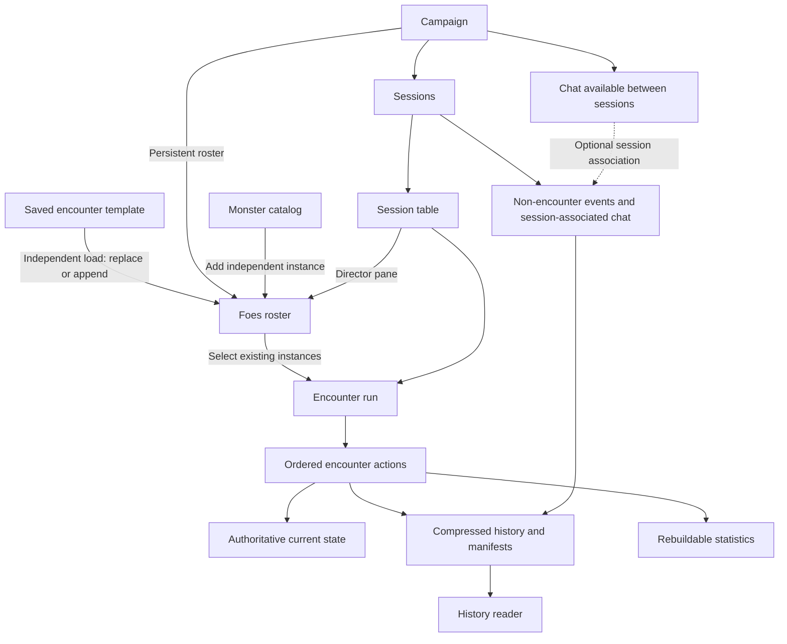

# Data structure and architecture specification

Version 0.13 — technology and sustained table workload alignment, 2026-09-11. Specification; the pre-alpha
checkout now has a partial Convex schema (`convex/schema.ts`: users, campaigns, memberships, join requests,
sessions, events, commands, character and foe tables). Where this document describes the current checkout it
says so; everything else remains proposal or confirmed intent, not implementation.

**Pre-alpha upgrade policy:** development data is disposable, and the latest live, playable application takes
priority over preserving old prototype records through breaking updates. Reset/reseed is an acceptable
development path; migration compatibility is not a v0.01 completion gate. This qualifies cross-version data
retention during development, while normal saved-state, reconnect and history behavior within a running
version still apply. See [development policy](development-process.md#confirmed-pre-alpha-development-policy).

**Milestone scope:** apply the [v0.01 feature checkpoint](pre-alpha-design-gaps.md) before implementing the
broader data model below. Saved character-build revisions and visible gameplay history are included;
inventory, chat, character grants, Director delegation and interchange implementation are deferred. Preserve
their conceptual boundaries without requiring unused records or full future workflows now. Detailed
combat-history and resource-reconciliation contracts remain open.

This is the primary checkpoint for the app's data model and storage lifecycle. It brings together the
[character wizard](character-wizard-spec.md), [monster catalog](monster-catalog-spec.md), and
[engine architecture](engine-architecture.md). The [storage analysis](data-storage-analysis.md) retains the
supporting research, alternatives, corpus measurements, and illustrative scaling estimates.

**Current direction:** an encounter owns its action-by-action undo journal; the open session is the live
shared-play context; after session closure, detailed history can be compressed and retained while ordinary
records hold current state, summaries, statistics, and archive references.

Confirmed requirements below describe user intent. Proposed contracts describe how to implement it. Open
decisions remain unresolved; this checkpoint does not authorize silently choosing defaults for them.

## 1. Confirmed requirements and decision status

Confirmed v1 mode scope: combat, free play, and a dedicated respite flow are included; respite is core
gameplay. Dedicated montage-test and negotiation flows, and downtime-project tracking, are excluded from v1.
Earlier descriptions of montage/negotiation as distinct structured states describe future design, not required
v1 modes. Their core reference text remains in scope. Research respite rules before designing its detailed
lifecycle; downtime-project integration is not a v1 prerequisite.

Confirmed v1 chat policy: authors cannot edit or delete their sent campaign-chat messages. This does not alter
campaign deletion, which removes its chat, or account deletion, which preserves username attribution in other
retained campaigns. No separate Director moderation power is established by this decision.

- Distinguish shared game data from user-created data. Steel Compendium is the source of truth for official
  rules content; characters, campaigns, sessions, homebrew, and saved encounters belong to application
  users/campaigns under their respective permissions.
- Group reusable content into packs/sets using the same system for official content, future MCDM content that
  becomes available for inclusion, community-authored content, and personal homebrew. Campaign creation must
  allow enabling/disabling content sources. Portability is a design requirement; the exact interchange format
  and first-release tooling remain proposed below.
- Disabling a pack stops future selections while preserving existing characters' use of and advancement within
  content they already have. Existing loaded encounters and history remain intact.
- **Confirmed v1 scope: core rulebooks only.** Character creation and advancement support every core class
  through levels 1–10. All official supplemental content, if present in the source corpus, is outside v1,
  including Summoner, Beastheart, and their associated mechanics. Homebrew monsters, character options, and
  items are also excluded. Creating characters from core options and saving encounters/rewards assembled from
  core content remain in scope; these are user-created records, not homebrew rules content. Preserve the
  general pack/content model for future use without enabling excluded sources in v1.
- V1 reference libraries include searchable core rules, eligible official retainers/companions/summons, and
  in-scope official items regardless of current automation coverage. Summoner and Beastheart are official MCDM
  supplemental classes, not core; their classes and associated mechanics are excluded from v1. Track official
  provenance, core status, release inclusion, and automation support separately under the
  [reference-library scope](reference-library-spec.md).
- Version the rules engine so authored content can identify the engine it was built for and tested with.
  Engine releases are distinct from content releases and file-format versions.
- Convex is the chosen application backend. Shared play needs realtime updates during a session.
- The campaign is the day-to-day hub and contains sessions; each session contains its table. Only one session
  per campaign may be active. The Director starts/pauses/ends sessions and manages their selected players. A
  paused session freezes the table; a closed session becomes historical. Lifecycle is independent of presence:
  Director disconnection or zero connected clients never automatically pause or close a running session. See
  the [table specification](table-spec.md).
- Encounter start locks the party roster until normal ending or voiding. Voiding skips normal ending
  awards/consequences and lets the Director keep current character/monster state or restore pre-encounter
  state; see the [table contract](table-spec.md#voiding-an-encounter). Preserve the starting gameplay state
  before encounter-start effects.
- Combat, montage tests, negotiations, and respite are distinct structured table states with their own loops.
  The user clarified that “encounter” is broader in the rules; existing encounter-run/journal/void contracts
  here describe combat and must not automatically be extended to other types. Future montage tests have
  Director start/end controls; dedicated montage/negotiation flows are excluded from v1; the user
  provisionally chose one active structured state at a time, with nested activities a possible later
  extension. Detailed transitions and persistence contracts remain open.
- Respite is a dedicated table mode with its own gameplay loop, started and ended by the Director. Its
  mechanics, possible downtime relationship, and detailed lifecycle need research/design; do not automatically
  reuse combat-specific state or cleanup contracts.
- Every action within an encounter must be undoable within the confirmed limits: players undo their own
  character's uninterrupted latest actions to the nearest seam; the Director rewinds sequentially within the
  current encounter; no gameplay undo crosses Finish cleanup or Void archival. See
  [undo permissions](table-spec.md#undo-permissions-and-proposed-campaign-control) and
  [formal encounter closeout](table-spec.md#formal-encounter-closeout). Restoration changes actual affected
  state using recorded values, without rerunning the engine or dice.
- Preserve every session's game log for campaign review. All current campaign members can read all past
  session logs by default, including sessions they did not attend. Separate Director-only history views will
  be added if specific information requires them; no attendance-based history partition is required. After a
  session ends, its detailed log can be compressed and relevant data delivered to persistent records and
  statistics.
- V1 includes character and shared party inventories at campaign level, equipped/unequipped mechanics, and
  transfers between party and character inventories. Inventory management is classified as character data
  rather than gameplay actions; authorized party/character transfers work between sessions. Inventory
  management also works while paused unless the character is combat-locked. Personal inventory reads are
  restricted to its owner and the active Director. Players may discard items from their own or shared party
  inventory but cannot return them to the Director's stash. The Director can directly edit character
  inventories subject to the existing combat character-edit lock; these edits do not grant progression
  choices. V1 excludes direct character-to-character transfers and free-text custom items. Players cannot
  manually create new items in their inventories; starting equipment is supplied by character creation and
  later loot enters through approved Director-stash allocations, while existing party transfers remain
  supported. Persist those data changes independently of active-session gameplay without modifying a closed
  session's history. Transfers, discards, and edits require an inventory-change history the Director can
  review, undo, and redo. Players can read their own character inventory history, and all current campaign
  members can read party inventory history. Players cannot undo personal or party inventory changes; owners
  retain personal inventory-history access after their character leaves the campaign, while dependent-change
  reconciliation remains open; history reads must not reveal unrelated private character inventories or reopen
  closed sessions. Provisionally, each campaign has one persistent Director-managed stash for claimable loot,
  including rewards from successive encounters, with the whole stash hidden until the Director shares it. The
  Director can add/remove stash contents at any time; this is separate from provisional claims and final
  inventory deposits. Finalization must validate allocations against the current stash, including any Director
  removals. The Director can reveal the stash at any time; visibility permits inspection and provisional item
  claims both inside and outside wrap-up. An accepted stash claim reserves the item, making it unavailable for
  a second claim; the Director can still reassign the provisional allocation, and players may withdraw their
  own unapproved claims to release reservations. Director approval of the final allocation is required before
  deposits occur in either context. Richer sharing mechanisms are deferred. Standalone saved stashes are
  excluded from v1; saved encounters include rewards-stash preparation, with a rewards-stash step in normal
  cleanup. During the encounter wrap-up screen, player claims are provisional allocations; the Director may
  change them. Items are only deposited into party/character inventories after Director approval; finishing
  wrap-up performs that approval during an encounter, and the same finalization is available independently
  outside wrap-up. Proposed persistence keeps allocations separate from item locations and commits validated
  deposits with wrap-up completion without duplication. Cleanup can finish while rewards remain unclaimed; the
  wrap-up view uses persistent stash storage, so unclaimed contents remain in that same live stash afterward
  instead of being discarded, moved to a replacement container, or automatically transferred. Saved reward
  preparation remains separate from the common live stash. Loading the saved encounter adds its reward items
  to that live stash immediately; encounter start/wrap-up must not add them again. Proposed load consistency
  commits monster loading and reward addition together and preserves prior stash contents. Confirmed Void
  restore returns Director-panel foes/loot state to its combat-start snapshot, removing post-start reward
  additions and restoring pre-start contents. Keep retains current state. Record enough item/load/location
  provenance to reconcile claims and transfers without duplication; no per-encounter persistent stash
  collection is required. See the
  [inventory checkpoint](inventory-spec.md) for proposed item/location/transfer contracts and open
  detachment/lifecycle questions.
- Keep character progression history independent of encounter undo. Restoring a build retains present
  inventory and follows the wizard's campaign review requirements.
- The Director's foes roster retains live monster stat blocks/state until removed, supporting free play and
  selection into encounters. Catalog additions and saved-encounter loads create independent instances; a
  nonempty roster requires a replace/append choice. Each foe has a show/hide toggle. A separate toggle beside
  Add sets initial visibility for newly added monsters without changing existing entries; new campaigns
  default it to hidden, its value persists per campaign, and saved-encounter loads use the current value as
  well. The foes roster does not lock during running combat: the Director can add/remove participating monsters
  without ending or voiding the encounter. The roster belongs to the campaign and persists across session
  closure with the resulting keep/reset state; later sessions reuse its retained instances. The encounter
  builder supports reusable preparation; live foes-roster additions/removals and saved-encounter loads are
  allowed between sessions and during running combat; pausing locks both rosters, including regrouping
  and saved-encounter loads. History/void-reset
  treatment of mid-encounter additions/removals remains open.
- The v1 encounter builder calculates difficulty for a planning party made from hypothetical character stubs
  with individually adjustable levels and/or party stubs imported from campaigns the user owns or actively
  directs. Imported stubs can be removed individually, their levels edited, and their levels reset to the
  source character's current actual level without changing source characters or live campaign rosters.
  Proposed source references and authorized reads support that reset. The saved encounter persists the party
  strength calculator's last configuration, including hypothetical/imported stubs, individual removals, and
  adjusted levels. Reopening restores this configuration without automatically refreshing imported levels;
  explicit reset reads the current actual level. Loading the encounter does not add planning stubs to the
  session roster. Treat that guidance as derived from monster/party inputs and verified rules; required inputs
  and formulas need research. A current-EV comparison in the Director's foes roster is proposed. Its confirmed
  scope includes all undefeated roster monsters regardless of visibility or active-combat membership. Defeated
  monsters stop contributing immediately while remaining on the roster until normal cleanup. This
  current-state display does not rewrite historical encounter difficulty or define rewards. Exact party inputs
  still need definition.
- V1 saved encounters retain the monster selection, including quantities, the last party strength calculator
  setup, a rewards stash, and prepared monster initiative groups, minion squads and captain assignments;
  no other authored supporting content is required. Reopening and duplication preserve the preparation;
  loading maps it to independent live instances and relationships within that load. Saved templates are private to
  their creator in v1, with sharing deferred; independent loaded roster instances retain their table
  permissions. Retain the definition references and rule data needed to instantiate those selections.
- Saved encounter templates and loaded encounters remain independent. Editing a template, official definition,
  or homebrew revision cannot silently change an existing load.
- Normal encounter cleanup removes defeated foes from the campaign roster while preserving history; during
  combat they remain marked as defeated unless the Director removes them. Survivors remain on the roster.
  Voiding skips that normal cleanup and follows keep/reset.
- Future feature: a campaign Slain table records what the party killed, how each died, and who killed it.
  Preserve supporting history after roster removal; attribution and undo/void treatment are later design work.
- Character/campaign statistics dashboards are outside v1, but the data collection model must retain relevant
  structured gameplay information linked to characters, campaigns, and sessions for later statistics and app
  usage analysis. Specific metrics and the speculative analysis engine remain to be defined; omitting the
  dashboard must not mean discarding underlying facts.
- The engine and shared application operations remain usable without the visual UI; the engine's contracts
  remain independent of storage vendors.

The proposed implementation uses portable JSON content packages, structured Convex records during play, and
compressed JSON archives after closure. JSON is the recommended format, not a previously established user
requirement; XML was raised as an alternative. Exact schemas, compression codec, chunk sizes, and physical
table names are not settled.

Earlier documents described rollback to a point in any session. Confirmed v1 direction: **closed sessions are
permanently read-only**. They cannot be reopened for gameplay or live undo/redo, and further play requires a
new session. Retain detailed history for review and analysis; archival is a storage change, not a way to
reactivate closed state.

The [accounts and access specification](accounts-and-access-spec.md) adds friendship/request/blocking
controls, campaign admission/removal derived from user blocks, one active Director, and session/until-revoked
character grants. Friendship initially grants no additional content access. Its proposed session-expiry and
privacy boundaries must be carried into closure, subscriptions, archives, and authorization. Gameplay undo
must not restore friendships, friend requests, memberships, or access grants, or remove personal blocks. One
active session per campaign is now confirmed. Pause remains distinct from closure and must not accidentally
expire session-scoped roles or grants under the proposed lifecycle.

## 2. Ownership and lifetime boundaries

V1 has one user-to-user Block control and no separate campaign-ban feature or independently managed ban.
Blocking removes the target from every campaign owned by the blocker and prevents new membership
requests/admission to those campaigns, including future campaigns. It also revokes character shares between
the two users in both directions. Unblocking lifts the campaign restriction caused by that block. Unblocking
does not restore removed memberships or revoked character shares; those require fresh admission approval or
owner-issued sharing. If the blocker owns a campaign whose active Director is the blocked user, active
Director control immediately returns to the campaign owner. In a campaign owned by someone else where both
users remain members, blocking does not hide either user's campaign-chat messages: chat access follows
campaign membership. Remaining active-combat removal handling and invitation behavior still need definition.

V1 has no campaign archiving or campaign ownership transfer. The campaign owner can delete a campaign;
deletion is the only campaign end-of-life operation in v1. Deletion automatically detaches attached characters
under the existing detachment rules: retain current level, build, authored details, inventory, and personal
history, while clearing campaign values including XP and Victories. It permanently removes campaign chat,
session logs, the foes roster, party inventory, and the Director's stash. The owner does not have to close a
running or paused session before deleting the campaign. Campaign deletion does not offer the combat keep/reset
choice. Proposed default: preserve the character's current recorded state before applying the confirmed
detachment resets, without restoring the encounter-start checkpoint or running encounter rewards. Saved
encounters are user content, not campaign content, and survive campaign deletion. Deleting a user account also
deletes every campaign that account owns, using the campaign deletion policy; other users retain their
detached characters. Account deletion also deletes that user's characters and saved encounters. In other
users' retained campaigns, their past actions and chat remain attributed to their username, not a generic
deleted-user label. Account deletion is allowed even while their character is in another campaign's active
combat; combat locks must not prevent deletion. Historical attribution does not preserve a usable account or
live character. If a deleted account was the active Director of another user's retained campaign, that
campaign's owner automatically becomes the active Director. This changes the play role, not campaign
ownership. Handling affected combat participation still needs an operational contract. The deletion flow must
terminate live campaign activity and release its character locks without requiring a separate prior
session-close operation. This does not remove the existing closed-session history and storage-compression
requirements for retained campaigns.

| Concept | Responsibility and lifetime |
| --- | --- |
| Content pack | Portable grouping of reusable definitions with stable identity, authorship/provenance, and separate application ownership/access policy. Common to official, community, and personal homebrew content. |
| Content edition / pack release | Proposed immutable version of a pack, identifying its definitions, dependencies, and source/transformation versions. The earlier official-content edition model becomes a release of an official pack. |
| Content definition | A rule, monster, ability, item, or progression definition with portable identity, revision, readable text, structured fields, and explicit unsupported/unresolved information. |
| User creation | User-owned character, homebrew, or encounter template, with editable working data and retained revisions where needed. |
| Campaign | Persistent membership, roles, characters' attachments, enabled content sources, and campaign context spanning sessions. |
| Session | A distinct period of campaign play, containing its table, selected participants, chronology, running/paused state, and archival status. Only one active session per campaign. Closing voids any active encounter with an explicit keep/reset state choice. Pause preserves it without a duration limit. |
| Table | The realtime play surface inside a session, with role-dependent controls, a roster/presence view, dice, and the v1 game log. Free-play and encounter modes share operations and state. |
| Encounter template | Reusable authored preparation and versioned monster selections. It has no ongoing combat state. |
| Foes roster | Director-managed live monster instances, independent definition copies, current values, and per-foe visibility; supports free play and successive encounters until entries are removed. Belongs to the campaign and persists across session closure with the resulting keep/reset state; later sessions use the same retained instances. |
| Encounter run | A particular combat in one session, referencing selected heroes and existing roster monsters, with recorded starting state, encounter-scoped values, and an ordered undo journal. Starting combat does not recreate roster monsters. |
| Game event | Recorded intent/resolution/state transition attributed to a session and, when applicable, an encounter run. |
| Archive | Immutable compressed detailed history for a sealed event range, with retained content/state dependencies and a database manifest. |
| Summary/statistic | Small derived record for navigation or analysis; it is rebuildable from preserved facts and does not replace them. |

A session may contain successive encounters and non-encounter activity. Each encounter run belongs to one
session: closing that session voids any active encounter using the same keep-current/restore-starting-state
choice as explicit voiding. It cannot resume in a later session. The Director may explicitly Void while paused using the existing keep/reset choice, leaving the
session paused and its roster lock intact. Ordinary gameplay remains blocked. Pausing itself retains the session and encounter
indefinitely. This supersedes the prior cross-session encounter-segment proposal; archive chunking can still
use bounded event ranges without implying live continuation.

An encounter journal is a logical collection owned by the encounter. It need not be one physical file while
play is active. Proposed storage uses individual event records with bounded payloads, then packages sealed
ranges as files. This avoids repeatedly rewriting an ever-growing session or encounter blob.

Proposed deletion/history contract: retain historical actor identifiers and username text with the surviving
campaign records so their attribution does not depend on a live account/profile lookup. Existing historical
state remains distinct from deleted live characters. Revoke live access on deletion; retaining attribution
must not preserve authentication or character-control grants. Username-retention details for later name
reuse/renaming remain unspecified.

## 3. Shared game content

Keep upstream Compendium files pinned and unmodified. Build app-ready definitions from its Markdown and
existing JSON, retaining complete readable text and source context alongside extracted data. Forge Steel's
pinned progression/choice structure remains supporting input for the wizard, with scoped mappings and local
transformations outside both dependencies.

Produce portable content packs with release manifests, lightweight catalog summaries, full definitions, and
required source/dependency records. Manifests identify source commits where applicable and
format/importer/parser versions. A pack-qualified identity plus revision identifies a definition; names and
filenames are display/location information. See the proposed common pack contract below.

Propose an initial Convex mirror for indexed library reads and authoritative application lookups. Load summary
fields for browsing and full definitions when opened or needed. Keep the package portable so public immutable
content can later move to cacheable static delivery without changing the engine or saved-character contracts.

Updates create new pack releases. Publish a complete staged release before changing that pack's
default-library reference. A library default does not change a campaign's selected release. Retain content
versions needed by saved builds, templates, loaded encounters, and archives. A newer parser or source revision
does not reinterpret recorded history automatically.

Homebrew belongs to packs through the same definition/parser boundary as official content, retaining authored
source and immutable revisions. Unsupported mechanics remain readable and manually resolvable; successful
storage or parsing alone does not establish complete automation.

### 3.1 Common pack contract — proposed

A pack can contain several supported kinds of reusable content: character options, monsters, items, abilities,
and supporting rules. It is not inherently one content type or one sourcebook. Characters, campaign
membership, live resources, and game logs retain their existing records; grouping reusable definitions does
not turn a pack into a campaign backup.

Proposed minimum manifest: stable pack ID, display name, author/publisher attribution, release version, format
version, engine authoring/testing metadata, source and license/attribution records, and dependencies on
specific pack releases. Definitions have stable IDs within their pack and retained revisions. Local database
IDs and account IDs are not portable content identities. Two packs can both contain a monster named “Goblin
Archer” without collision; editing a copy into one's own homebrew creates a new identity with a reference to
its origin. No implicit replacement by matching name or pack load order.

Use editable drafts and immutable releases for every authoring source. A personal pack can remain private;
creating a usable release does not mean publishing it publicly. A default “My Homebrew” pack could keep
one-off authoring simple while allowing named packs for sharing. The exact default and authoring UX are
proposals.

Propose versioned JSON import/export with a manifest, definitions, readable authored text, and any
distributable supporting assets, packaged as an archive when needed. Retain exact dependency references and
report missing dependencies; bundle them only where permitted. Import validates identity, format, references,
and supported declarative structures before making a release selectable. Reimporting the same release is
idempotent; conflicting data under the same identity/version must not overwrite it. Pack data cannot install
executable code or confer ownership, permissions, or verified publisher status. Parser support and format
compatibility are separate from content availability.

### 3.2 Campaign source selection — proposed behavior

Campaign creation includes a content-source selector. For v1, only supported core-rulebook sources are
eligible; propose preselecting those core packs. Adding official supplemental, community, or private homebrew
sources belongs to later releases. The general pack architecture does not enable excluded content in v1. A
campaign stores exact selected releases and a source-selection revision. Newly available packs and updates are
offered for deliberate adoption; they do not automatically join existing campaigns. The physical record layout
remains open.

Campaign character choices, advancement, item selection, and encounter preparation use that selection through
shared operations. Authoritative admission, build activation, and encounter loading also check it; filtering a
UI alone is insufficient. An unattached character or reusable encounter can retain other sources, with
incompatibilities shown when entering a campaign. Director review does not implicitly enable a disallowed
pack. Pending submissions are rechecked if the campaign selection changes.

Resolve required dependencies explicitly. Propose one release per pack in the campaign's active selection,
with exact compatible dependencies; reject unresolved, cyclic, or conflicting requirements before activation.
Explain required sources in the selector, and prevent disabling a dependency while a selected pack requires
it. This does not prevent retaining older releases for existing builds and history.

**Confirmed disable direction:** disabling a pack stops future selections while existing characters keep using
and advancing within content they already have. Preserve accepted builds, owned item instances, loaded
encounters, and historical records.

Proposed enforcement: retain the exact content releases and dependencies needed for those builds, including
their further progression options. This exception does not enable the whole pack for unrelated new choices,
new characters, or new encounter loads. Show affected uses before changing the selection. Do not erase
choices, recalculate them against another release, or rewrite snapshots. Deliberately adopting an update must
likewise preserve loaded encounters and follow existing build-review rules where builds change.

### 3.3 Access and remaining decisions

Campaign selection determines allowed content; it does not grant authorship or publication rights. A public
campaign listing must not expose private packs. Pack ownership, campaign reading, copying/editing, and export
rights remain separate under the [access specification](accounts-and-access-spec.md). Propose sharing the
selected private release with the campaign while leaving other releases and drafts private; withdrawal and
retained-use rights still need a product decision. Attribution metadata does not establish permission to
redistribute content or artwork.

Open decisions: who can change sources after creation (campaign owner, active Director, or both); the precise
boundary of retained progression options; which core packs are required; private-pack sharing and withdrawal
behavior; and whether complete pack import/export and authoring tools ship in v1 or follow the foundational
pack model. A public marketplace, automatic updates, pack override ordering, and third-party executable
plugins are not established requirements.

Future pack-authoring acceptance examples (outside v1): round-trip a homebrew pack without losing
identities/text/references; keep same-named definitions from different packs distinct; reject missing
dependencies and conflicting reimports; show different available choices in campaigns with different enabled
packs; reject stale/disallowed selections through headless operations; preserve existing state/history after
source changes; and enforce private-pack access independently of campaign discovery.

### 3.4 Engine compatibility metadata

Authored content can declare the versioned engine it was built for and tested with. The
[engine release contract](engine-architecture.md#engine-releases-and-content-compatibility) proposes exact
`builtWith` and `testedWith` versions plus an optional intended `compatibleWith` range on each pack release.
Preserve these declarations through export/import; unknown metadata remains unknown. An author's compatibility
claim does not establish tested or fully automated support.

Runtime compatibility is checked separately from campaign source permission. Retained content still needs
compatible engine support; disabling its pack does not solve or change engine compatibility. Recording engine
versions does not require hosting every historical runtime. Runtime selection, upgrade policy, and warning
versus blocking on a mismatch remain open.

Confirmed roster-management timing: when the session is paused, both rosters are locked until resume,
including session-player/character changes, foe additions/removals, regrouping and saved-encounter loads.
This supersedes the earlier paused-edit permission. Outside a pause, party changes require no active combat;
the Director can manage foes between sessions and during running combat. The encounter builder remains the
reusable preparation tool. Monster gameplay actions require a running session; closed history stays read-only.

V1 users can duplicate their own saved encounters as independent templates, including monster selection,
party-strength calculator setup, and prepared rewards. Duplication does not load live foes or grant loot. The
public campaign directory is deferred beyond v1; campaigns are unlisted by default and v1 discovery uses
campaign share codes/URLs. Opting into a public listing belongs to the later directory feature.

## 4. User records and current state

Hiding the Director's stash cancels all outstanding provisional claims and releases their reservations without
transferring items. The Director cannot approve claims while the stash is hidden. Revealing it again requires
fresh claims; previously approved deposits remain completed. V1 excludes item stacks: each inventory/stash
item is represented individually, with no stack splitting, merging, or partial-quantity claims. Multiple
copies of an item may exist as separate instances; monster quantities in saved encounters are unaffected.
Proposed consistency: hiding the stash and canceling provisional allocations commit together; approval
rechecks visibility and claim status so a stale request cannot finalize canceled claims.

Confirmed character management outside combat: owners may edit names, appearance, biography, and notes without
Director review, and may detach their own characters without Director approval. Notes retain owner-only
visibility. Pending full edits survive departure as a private draft; detachment does not activate that draft.
Duplication copies the currently active build, excluding pending edits, while retaining the established
independent inventory/history and cleared campaign-value rules. Owners may withdraw a submitted review before
the Director decides. Both the character owner and campaign owner may detach a character. The campaign owner
can kick a player or remove individual attached characters; removing a character alone does not remove its
owner's campaign membership. Director status alone does not grant this campaign-management power. Removed
characters remain owned by their creators and follow the established detachment policy. Existing combat locks
and separate campaign/account deletion rules remain in force. Proposed storage keeps draft ownership separate
from campaign review visibility; leaving invalidates the review without deleting or activating the draft.
Withdrawal and approval must check the same submission state so a withdrawn revision cannot be activated by a
stale request.

Confirmed delivery scope: the app is web-only for phones, tablets, and desktop, with no plans for native apps.
The [v1 tech stack](v1-tech-stack-spec.md) records selected Better Auth, Cloudflare/Convex hosting, future LAN
portability, and sustained table performance. V1 has no character/campaign statistics dashboards, reference
bookmarks, private direct messages, or admin-dashboard
functionality. Campaign chat is the only v1 messaging surface. Statistics are deferred at the presentation
layer: retain relevant structured gameplay data so later analysis does not require reconstructing missing
facts. Forge Steel export is not required for v1, but the character data model must preserve the information
and adapter boundaries needed to add it without rewriting the system; import remains required.

V1 user discovery for friendship uses a personal share code and URL, analogous to campaign share codes/URLs;
username search is not included. Friend requests, campaign join requests, and character review requests
surface in the relevant UI areas. There is no notification system in v1. All notifications, including email
and push event alerts, are deferred beyond v1. Password reset is the only email flow to design for v1. Both
personal and campaign share codes/URLs can be regenerated by their owner at any time, invalidating the old
code/link without invalidating already-pending requests. Proposed: link/code lookup resolves a request target
without treating the code as authentication or a private-content grant. Relevant request/review records supply
the UI directly; do not introduce a separate notification feed or delivery pipeline under this scope.

Confirmed: campaign-chat reads follow membership and do not filter out messages based on user-to-user blocks
when both users remain members. Block-driven membership removal from blocker-owned campaigns still removes the
former member's campaign access. Unblocking does not restore memberships or grants. Proposed operation
consistency records Director reassignment with removal when an owner blocks their active Director; stale
delegated commands must fail after the change.

An active Director's own character admission and full edits are logged and require no approval step. Other
characters retain Director review. This exemption does not bypass build validation, campaign source limits, or
combat character-edit locks. Record these changes in character progression/admission history, independently of
whether a play session is running. Character-control sharing is limited to current members of the character's
campaign and includes progression-history viewing. Multiple eligible recipients can hold grants
simultaneously; this grants no additional build-edit authority. Character notes remain owner-private, and the
separate personal-inventory visibility restriction still applies. Viewing progression history does not grant
build editing or restoration authority.

Proposed logical records:

| Record group | Key responsibilities |
| --- | --- |
| Accounts/social relationships | Stable user identities, friend requests, mutual friendships, and directed personal blocks under the access spec's proposed contracts. Friendship alone grants no content access. |
| Campaigns/memberships | Owner, active Director, participants, and admission requests. Admission/removal derives from user-to-user blocks; no separate campaign-ban feature in v1. Ownership and Director authority remain distinct. |
| Access grants | Director appointments and character viewing/combat grants, with current-session or until-revoked scope; expiry and relationship invalidation follow the access spec's proposals. |
| Character identities/attachments | Stable character ID and owner; at most one campaign attachment/reservation; attachment identity and campaign values. |
| Character drafts/build revisions/reviews | Owner choices, automatic grants, recorded derived baseline, source context, effective build, exact submitted/base revisions, and approval status. |
| Character details/inventory | Independently authored details and individual item instances/state; item stacks are outside v1. Separate from progression snapshots; confirmed owner-private character notes require a separate access boundary, including exclusion from Director reads. |
| Character play state | One authoritative live state shared by main-sheet and table views. Encounter operations update it immediately; an active encounter binding locks out character edits. |
| Encounter starting-state record | Immutable pre-encounter gameplay values and Director-panel snapshot, including foes-roster membership/stable identities, group/squad/captain relationships, loot/stash contents and allocation/item-location relationships, and source character/build identity for history and void/reset. Restore removes post-start foe additions and restores removed original instances from recorded state; not an independent live character copy. |
| Encounter templates/revisions | Monster selections/counts, prepared initiative groups, minion squad membership and captain assignments, last party strength calculator configuration (stubs and adjusted levels), rewards-stash preparation, and access scope; version-qualified references are proposed. No other authored supporting content is required for v1. |
| Foes roster/content/instances | Immutable per-load definition copies; distinct live monster instances with visibility; squad relationships and pooled resources. Survive encounter ending and session closure until removed from the campaign roster. Encounter membership references these instances. |
| Encounter resources | Shared encounter-scoped resources and turn state, distinct from roster lifetime. |
| Session/encounter control | Lifecycle status, selected recorded state, last committed sequence, pending operations, and expected revisions. |
| Events/payloads/checkpoints | Detailed inputs and outcomes, recorded state changes, initial/checkpoint state, and ordering. |
| Archive manifests/summaries | Storage references, sealed ranges, completion status, participants, and derived totals. |

The campaign stores the Director-controlled monster health-display mode: Numerical, Bar, or Winded. New
campaigns default to Bar. Player/observer table projections first omit hidden foes from roster reads and then
omit loaded monster stat blocks, exposing exact current health, a remaining proportion, or winded status
respectively. Director reads retain full state. Hidden roster monsters remain usable for gameplay, including
attacks against players; roster visibility must not become an action-eligibility gate or an in-game
concealment condition. Provisionally, hidden foes' names remain visible in game-log entries without revealing
their roster entries or full stat blocks. Setting changes are presentation configuration, permitted at any
time, and must not mutate health or trigger rules. Historical projection behavior remains open; see the
[table specification](table-spec.md#monster-visibility-and-health-display).

Party audience projections expose Stamina and Recoveries, not full peer sheets absent separate permission.
Roll records distinguish audience from submitter: ordinary rolls are public to the table audience; planned
tower results are Director-only even when another user submits the roll. Store the full result for authorized
use, but keep it out of unauthorized command responses, subscriptions, and log/archive projections. Later
historical disclosure remains open. Proposed content sharing requires its own disclosure record/contract and
must not silently become a character-control grant.

The user replaced the independent encounter-character snapshot model with a sheet lock: while a character is
in an encounter, sheet editing is blocked and accepted encounter changes immediately update the main sheet.
Maintain one authoritative live character state for both views. Capture pre-encounter values for restoration
only; do not create a second editable sheet or defer a merge until encounter end. Loaded monsters live in the
foes roster with state independent of saved encounter templates. Free-play and encounter operations update
those same instances; encounter-start checkpoints record existing values for void-reset. Removed/replaced
roster entries must remain resolvable by retained historical records under the proposed archive contract;
squad Stamina and shared Malice retain their proper shared scopes.

Character and encounter state are persisted together with accepted action history: a crash before closure must
not lose accepted damage, resource spending, or inventory changes. These changes already affect the main
sheet; ending/closure must not apply them a second time. Void-and-keep retains them, and void-and-reset
restores recorded starting gameplay values. Archival remains separate from accepting/saving gameplay state.

Build activation and character editing are blocked while the character is in an encounter, including during
pause. Once unlocked, build approval changes the effective build against current inventory/live state and
never replaces them with an old draft snapshot. Record historical resolved build baselines; progression
restoration does not rerun grants. Preserve original Forge Steel imports and unmapped compatibility data
separately from routine sheet records, with files for large opaque payloads.

The [inventory specification](inventory-spec.md) now records campaign-level individual/party inventories and
the proposed Director's stash. Reconcile those scopes with the wizard's prior inventory-retention requirements
on detachment/duplication; campaign deletion preserves personal inventory/history and removes party inventory
and the Director's stash. Campaign deletion offers no combat keep/reset choice; retaining current recorded
state before detachment resets is proposed. Other live-resource reconciliation remains open. Campaign
ownership transfer is excluded from v1.

## 5. Encounter actions and undo

Confirmed minion state constraint, 2026-09-13: living squad member identities and current pooled
Stamina are distinct state. Losing a captain’s Stamina bonus reduces total squad Stamina without
casualties, even if the pool is below the surviving members’ combined stat-block values. Do not derive
living count unconditionally from pool/Stamina, normalize the pool to that count, or create per-member
current-Stamina tracks. Record the stat adjustment distinctly from damage and preserve it in history.
Confirmed: later non-area damage exhausting the pool defeats all surviving ordinary members, even
when stat adjustment previously left the pool below their combined values. Preserve casualty identities
and source exceptions; do not extend this to area damage’s affected-member restriction. Non-exhausting
damage thresholds and other membership transitions retain their separate contracts. Confirmed bonus
gain: a replacement captain’s Stamina bonus adds to the pool for surviving members only; no revival,
new member identity, damage reset or action refresh results from the adjustment.

Current checkout before S02, 2026-09-14: `convex/schema.ts` had no encounter-run record; `sessions` carried a
`combatActive` boolean, `events` required a user `actorId`/`actorName` with a `kind` and `description` but no
before/after change payload, and `commands` recorded `commandId`/`fingerprint`/`result` for idempotent retries.
The [readiness audit G7](v0.01-readiness-audit.md#g7-dice-generation-and-event-storage) recorded the required
replacements; the implementation note below records what S02 stored.

Implementation note (S02, 2026-09-14): storage contracts for the proposals in this section, with no
gameplay operation added. Types are in `shared/contracts/history.ts`; tables in
`convex/encounterTables.ts` and `convex/schema.ts`.

- **Encounter record.** `encounters` (campaign, session, `status` `draft` | `committed` | `closed-out` |
  `voided`, `precombatSnapshotId`, `createdAt`, `archivedAt`) replaces `sessions.combatActive`;
  `sessions.encounterId` points at the current run. Combat locks (party roster, character edits,
  session closure) apply while the status is `committed` (`convex/lib/encounters.ts`); a draft locks
  nothing, matching "Director OK commits encounter setup ... and applies combat locks". `closed-out`
  and `voided` set `archivedAt`; `appendEvent` refuses new events in an archived encounter.
- **Events.** `events` gains `origin` (`user` | `engine` | `clock`), `actorId`/`actorName` optional and
  required only for `origin: user` (enforced in `convex/lib/events.ts`), `encounterId`, `commandId`,
  `causeEventId` for automatic consequences, `disposition` (`applied` | `undone` | `redone` |
  `corrected` | `archived`, default `applied`), optional `dice` and `payload`. The per-campaign
  `sequence` is allocated from `campaigns.eventSequence` inside the writing mutation; concurrent
  appends conflict on that document and one re-runs, so sequences are distinct and consecutive.
- **Undo unit.** One user-initiated command and all of its automatic consequences share the
  command's `commandId` on their events. The journal of a unit is every `changes` row of those events
  ordered by (event `sequence`, `ordinal`); undo reverses the whole list from last to first and redo
  replays it from first to last, restoring recorded values without calling modifiers
  (`commandJournal` in `convex/lib/journal.ts`). Another character's accepted response is a separate
  command, so it is a separate unit and a seam (A06 computes seams; S02 only stores the unit).
- **Change journal.** `changes` rows: event, command, `ordinal`, `entityTable`, `entityId`, dotted
  field `path` (`""` for whole-document create or delete), `before`, `after`. Values are
  `{ present: false }` or `{ present: true, value }`, so field absence and deleted documents restore
  exactly. `journalPatch`/`journalInsert`/`journalDelete` apply the write and record leaf-level
  changes; unchanged fields produce no row. Arrays are recorded as one value.
- **Snapshots.** `snapshots` (encounter, `kind` `encounter-start` | `checkpoint`, `eventId`, `state`,
  `createdAt`) holds the recorded starting state for void/reset; the operation taking it (A04) owns
  the shape of `state`.
- **Dice.** `dice.roll` is an `internalMutation`; registered operations call `rollDice`
  (`convex/lib/dice.ts`) in-process and record the accepted faces on their event. The generator is a
  per-campaign hash DRBG: a 32-byte seed from `crypto.getRandomValues` stored in `diceStates`, value
  n = SHA-256(seed || n), rejection sampling for uniform faces. Accepted rolls are stored in `rolls`
  keyed by (campaign, `commandId`): a retry with the same id and dice returns the same faces; the
  same id with different dice is rejected. Clients never supply faces. Audience is recorded as
  `public`; the tower audience is outside v0.01.

Each logical action needs a stable command ID, actor, relevant entities, source/build versions, the exact
engine release and relevant parser versions, expected state revision, and session/encounter association.
Preserve the requested intent, modifier invocations, committed effects, and displayed explanation distinctly.

The confirmed operation model distinguishes un-fired per-user selection from active effect membership,
turn entries and actual turn occurrences from group activation, and spent entry/participant allowances
from group completion. Multiple entries can reference one creature without duplicating its live state.
A squad subgroup has shared turn participation, individual member identities/effects and an optional
captain with separate Stamina/actions. Ordinary regrouping moves the selected entry; squad membership
is a different relationship. Preserve interrupted turn context and spending across immediate turns.
Persistent card projections may update while original event records remain immutable. Keep signed resource
representation: legal negative Talent clarity differs from an unaffordable use, which shared execution
must block. Fixed costs debit automatically at execution; optional pre-resolution choices remain inputs.

Confirmed persistent-value/log boundary, 2026-09-13: Stamina, Recoveries, Heroic Resources, Malice
and Victories are authoritative persistent values with their own rules and lifecycle. Director edits
on sheets, stat blocks or resource displays update current state and append an attributed **Manual
adjustment** event with field and before/after values. Roll-local edges/banes and result inputs remain
separate action artifacts. The persistent game log exposes editable inputs only through case-specific
interactive cards; their submissions append records rather than rewriting history. See
[the owning table contract](table-spec.md#persistent-values-and-manual-adjustment-entries).

Director OK commits encounter setup, takes the precombat restoration snapshot and applies combat locks
before initiative/start effects. Draft cancellation preserves independently accepted roster mutations.
Requests and opportunities retain their specific closing events; do not expire everything merely because
it is scrolled out of view. See [table operations](table-command-spec.md).

Proposed action sequence:

1. Authorize the caller, check the expected state and command ID, and durably record the relevant inputs
   before invoking a modifier.
2. Resolve against those inputs. Record choices, dice outputs, engine outputs, and manual adjudications;
   retain partial/failed/pending dispositions.
3. Recheck authoritative state and permissions, then atomically commit the actual state changes and their
   journal record. Reject a stale result instead of applying it to newer state.
4. Update the live clients from committed state. Derive statistics from accepted records independently of the
   response shown to the initiating client.

A retry must not apply an action twice or silently reroll accepted dice. Reusing a command ID with different
inputs is an error. External computations can require retries, but their accepted gameplay effects commit
once. Resumed manual/automated steps reference the same action and explicitly identify completed and
outstanding effects.

For undo, retain the prior and resulting values of every affected field or small record, including field
absence, removed conditions, created/deleted entities, resources, pending effects, and turn/encounter
progress. Preserve an initial state and periodic checkpoints. Record replacement values, not merely
instructions to subtract an amount later.

Backward/forward navigation applies those recorded values and restores actual authoritative state, including
character sheets. It does not call modifiers. Read-only inspection of old history must not change the shared
live state. Undo must respect dependent changes; an encounter boundary does not permit selectively reverting
an earlier action while retaining incompatible later effects on the same character.

Confirmed history policy, updated 2026-09-13: player undo follows the uninterrupted latest actions of
one character to the nearest seam, with turn/FreePlay start as outer bounds. Another character's action
or a committed Director correction closes that window. Automatic consequences stay linked to their
cause. Shared controller identity does not remove character seams. Director rewind is sequential across
seams within the current encounter; restore recorded redo forward, with no new dice or rule execution.
Enable user undo defaults on; disabling it preserves Director undo/redo. Any older-event correction after later gameplay requires
sequential rewind first, even within the same turn and including for the Director. End turn undo is available only while neither an
intervening action seam nor next-turn start has closed the player window. Finish cleanup, or Void
after applying keep/reset, makes the encounter a readable historical archive: gameplay undo cannot reopen it or cross the completed boundary,
and ordinary corrections cannot edit its events. New current-state adjustments are separate records.
Archive status takes effect on finalization, independently of compression/storage layout. Setting-management
timing remains open. See [history](table-spec.md#undo-permissions-and-proposed-campaign-control).

Corrections and undo append new entries without rewriting original records; state and later interpretation
follow the effective current branch. Undoing an adjudication restores the prior result independently of
undoing the source ability. Manual damage overrides survive modifier edits until explicitly cleared.
New gameplay after undo clears redo availability while preserving abandoned history. Explicit Redo
restores recorded actions, dice and consequences. New executions resolve current conditions with fresh
dice, including turn/round work; no separate boundary-result cache or changed-effect reuse is required.
Refunded optional hero-token spending can be chosen if a new result qualifies; explicit redo restores
the recorded spend. Accepted-command retries retain accepted outcomes and do not duplicate changes. See the [table history contract](table-spec.md#undo-permissions-and-proposed-campaign-control).

Retain later records when navigating backward. Automatic consequences belong to their originating
action; another character's accepted response is a separate action seam and cannot be absorbed into a
player undo unit. Remaining internal event grouping, manual-resolution and correction cases need contracts. Character progression history remains a
separate operation with its narrower restoration scope.

Non-encounter gameplay belongs to the running session's chronology and needs durable state-change records.
Sheet viewing and chat remain available while paused and outside sessions; gameplay actions are blocked in
those contexts. Character-data inventory management is a separate category; party/character transfers are
confirmed available between sessions. Chat therefore needs storage and access independent of an active
session. Confirmed for v1: campaign chat and the game log are separate entities. UI composition is deferred; a
later view may combine chat with a curated game-log feed while preserving those separate records and
lifetimes. Campaign-level party chat is available to members, including observers who are not selected session
players. Such members can observe the permitted table view but cannot submit session gameplay commands.
Propose messages with optional session association for the live feed and historical ranges; no session is
required to send a message, and later messages must not append to a sealed session archive. Channel layout and
historical presentation remain open. FreePlay player undo covers its current stretch; chat/history presentation during navigation remains
open, without changing chat records or treating chat as a new gameplay branch. No fake combat encounter or session is required to preserve chat.

Voiding is now a separate encounter termination with an explicit keep/restore choice, not ordinary
history-cursor navigation. The proposed contract retains the journal and void disposition, atomically closes
pending work and releases the combat-imposed roster lock, retaining any applicable session pause lock,
and restores recorded starting gameplay values only when requested.
It never runs normal ending rewards/cleanup effects, restores revoked access, or rewrites the saved encounter
template. General undo of a void and statistics treatment remain open; see the
[table specification](table-spec.md#voiding-an-encounter).

## 6. Session closure and compression

Propose separate lifecycle fields for the session (`open`, `closing`, `closed`), running/paused status within
an open session, and its archive work (`pending`, `writing`, `ready`, `failed`). These are implementation
labels, not required UI language. The current checkout stores one `status` of `running`/`paused`/`closed`
with `closedAt`, and has no archive fields; closed sessions are already read-only server-side.
Implementation note (S02, 2026-09-14): the encounter archive boundary is stored as
`encounters.status` (`closed-out` | `voided`) plus `encounters.archivedAt`, and the events of an archived
run carry `disposition: archived` when A07 finalizes; `appendEvent` refuses writes into an archived
encounter or a closed session. Session archive work fields and compression remain proposed. Pause preserves the session and its underlying activity; sheet viewing/chat
remain available, gameplay changes are blocked, and in-flight commit handling remains open in the table spec.
A closed session can have a pending archive while its original database records remain readable.

Closing should:

1. Verify the Director's authority. If an encounter is active, obtain the explicit keep/reset choice and
   commit its void outcome with closure; canceling the dialog leaves both unchanged. Skip normal
   encounter-ending rewards/consequences. Record pending work as canceled/superseded without applying it. Seal
   the final boundary so stale commands cannot commit after closure; do not carry an encounter into another
   session.
2. Record the consistent ending state/checkpoint after the selected void result, participants, and encounter
   disposition. Keep/restore is applied once, before archival, not by an archive worker.
3. Package the sealed gameplay history as compressed JSON, in bounded chunks where needed. Include encounter
   runs and non-encounter game events. Campaign chat remains separately stored; an archive may reference an
   authorized time range without owning or sealing the campaign conversation.
4. Verify readable archive contents, event ordering/ranges, and retained state/content references. Publish the
   manifest only after the package is complete.
5. Build/update session and character/campaign summaries and statistics from the sealed records. Retried
   processing must not duplicate totals or reapply game effects.
6. Remove redundant active event payloads only after durable archival is verified and outstanding work no
   longer depends on those copies. Readers support both storage locations during the transition.

Archival failure must leave the original data available and the work retryable. This follows session closure;
the earlier analysis's optional 90-day archival threshold is not the lifecycle proposed at this checkpoint.
Cleanup timing can still be tuned for storage recovery and reliable history delivery.

Proposed archive contents:

| Part | Required information |
| --- | --- |
| Manifest | Archive/schema version, campaign/table/session IDs, encounter run IDs, sequence ranges, chunk locations, and completion metadata. |
| Source context | Exact content/build, engine, and relevant parser versions and retained definitions required to interpret the archived record; embedded copies or durable retained references. |
| Starting/checkpoint state | Recorded state at the archived range's start, including relevant participants, monsters, resources, and pending work. |
| Ordered journal | Commands, modifier inputs/outputs, dice/choices, manual resolutions, dispositions, and before/after state changes. |
| Ending state | State at the sealed boundary after normal completion or the selected void outcome, including dispositions of canceled pending work. |
| Presentation data | Readable log messages and separately authorized chat/hidden information. |

Lossless compression preserves the detailed record. The simplified post-session database holds current values,
session/encounter summaries, statistics, and archive manifests. Summaries alone are insufficient for
historical inspection and future metric definitions. Retained detail does not authorize restoring a
completed encounter into live play.

No encounter remains live after session closure. Later play creates a new encounter; kept character/monster
values do not turn it into a continuation of the voided run. Resuming a paused session uses its still-current
encounter state without invoking archival or an old action. Closed history cannot be restored into live play
in v1.

Private archives must retain campaign/history access controls; possession of an archive identifier is not
sufficient authorization. Historic access does not grant authority to change a detached character or a
character now attached elsewhere. Backup/recovery remains necessary separately from gameplay undo and
archival.

## 7. Realtime and analytics boundaries

Confirmed: statistics dashboards are deferred beyond v1; preserving the relevant data is a v1 design
requirement. Proposed capture uses the existing game records: actor/target and source identities, event
order/time, actions and rolls, before/after state, outcomes, and undo/redo/void disposition. Keep detailed
records alongside any summaries so future metric definitions can be computed from retained facts. This does
not authorize extra personal tracking or override private-note boundaries or confirmed account/campaign
deletion. The summary/statistics machinery below is proposed delivery sequencing; dashboard deferral does not
require shipping an analytics service now.

During shared play, subscribe to relevant current state and a bounded recent feed. Read older events and
detailed payloads on demand. After closure, history can load from an archive without maintaining subscriptions
to its full contents. This scopes the shared-play workload; it does not prohibit normal responsive character
editing or campaign updates between sessions.

The table is the primary two-to-six-hour realtime workload. Bound retained browser data as well as mounted
rows, and release unused detail subscriptions/caches as views change. UI cleanup never deletes persistent
foes, accepted actions, inventories, or claims. See the
[table resource lifetimes](v1-tech-stack-spec.md#5-browser-state-and-table-resource-lifetimes) and
[sustained-session acceptance](v1-tech-stack-spec.md#9-verification-and-acceptance). Mostly single-user screens
still need timely permission/review updates; this clarification does not authorize stale access.

Partition event access and sequence allocation by table/encounter scope, retaining a total session chronology
for interleaved actions. Index the actual reads needed for sessions, encounters, characters, and membership.
Avoid entire-campaign reads or one global state/statistics document updated for every action. Precise indexes
and payload bounds are implementation work.

Record structured facts linked to event, action, session, encounter, character/attachment, actor/target, and
content revision. Desired dashboards may count entering winded, established monster defeats, and accepted
ability uses. Define credit and counting rules before claiming those metrics are correct. A multi-target
ability, a network retry, and resumed effect batches must not automatically become multiple ability uses.

Keep actual app activity distinct from accepted game history: attempts and rewound actions may matter for app
usage but should not necessarily count toward character accomplishments. Summaries need a metric version and
processed position/history generation. Authorized changes to open-session history invalidate affected
summaries for adjustment/rebuild; closed-session history remains read-only in v1. Preserve structured evidence
so future analysis is not limited to today's counters.

Propose Convex summaries initially, with asynchronous updates/finalization at session close. A separate
analytical store is optional future work, not a prerequisite for this design. Do not route routine play
through an analytical service. Character/campaign current values, personal statistics, and app-wide aggregates
have different authority and access scopes.

## 8. Acceptance scenarios for later implementation

These are required/proposed outcomes to verify when the dependent feature is implemented, not tests already
passing.

| Scenario | Expected result |
| --- | --- |
| Shared encounter action | All authorized live clients read the same committed state; retrying the command does not duplicate its effect. |
| Undo/redo | Recorded before/after state restores all affected values and entity changes without engine/dice calls. |
| Manual completion | Resolved and outstanding effects remain distinguishable; resumption does not repeat completed effects. |
| Disconnect before session closure | Previously accepted character and encounter changes remain persisted. The session remains running regardless of Director or all-client disconnection; reconnection does not restart or change its lifecycle. |
| Void encounter | Keep preserves current foes membership/relationships and character/monster values; restore recovers pre-start roster membership/relationships and gameplay state without modifiers, removing later foes and restoring removed originals. Both skip ending awards/effects, retain the void record, and prevent late action commits. |
| Independent roster loads | Two loads of a template have independent instances/state; template/catalog updates change neither. Append preserves existing values; replacement follows the explicit choice. Selecting a roster monster for combat retains its current state. |
| Session closure | An active encounter is voided with an explicit keep/reset choice; archive the resulting state and sealed history. Skip normal ending awards and do not double-count/reapply changes. |
| Archive failure/retry | Original detailed records remain available; retry publishes one coherent archive manifest before redundant data is removed. |
| Indefinitely paused encounter | Pause preserves the same encounter for later resumption, without a time limit. Closing instead voids it; a later session cannot resume that run. |
| Non-encounter activity | Noncombat gameplay is recorded without a fabricated combat encounter. Campaign chat retains its own records and lifetime, with optional session association. |
| Character edit lock | Active encounter binding blocks edits/level-ups/build activation, including stale editor saves. Encounter actions update the main sheet immediately; pause retains the lock and normal ending/voiding releases it. |
| Historical permissions | History inspection cannot overwrite a character in another campaign or expose unauthorized hidden data. |
| Future statistics data | Retained facts distinguish actions, targets, retries, undo/redo, and voids so later metrics can be derived. Dashboard delivery and final metric definitions are outside v1. |

## 9. Open decisions at this checkpoint

- Define undo-setting management/change timing and how reactions, interrupted actions and manual
  completion form a dependent undo step. Turn/FreePlay player scope, Director encounter rewind, recorded
  redo and mandatory rewind before older-event edits after later gameplay are confirmed.
- Define the concrete storage/projection for appended corrections/reversals, abandoned branches and
  recorded action outcomes for undo/redo. No separate boundary-roll cache is required. New gameplay already clears redo availability without deleting history.
- How does chat behave during undo, and which specific historical information needs a Director-only view, and
  what remains readable after leaving a campaign? Current members can read all past session logs by default
  regardless of attendance.
- How are in-flight results and pending resolutions sealed consistently with the encounter void and chosen
  state at session closure? No pending encounter continues into the next session.
- One active session per campaign is confirmed. How do participant/character selection changes, multiple
  controllers, and pause interact with authoritative play-state writes? The table provisionally permits only
  one active structured state; nested activities are a possible later extension. Active encounters at closure
  follow the confirmed void/state-choice flow.
- How are current resources reconciled when a build or campaign attachment changes? The wizard's existing
  unresolved policies still apply.
- What are the precise metric definitions, attribution rules, and scope of the speculative analysis engine?
- What JSON archive schema, compression codec, chunk/checkpoint intervals, and recovery/cleanup policy best
  fit measured workloads?

This checkpoint settles the conceptual lifecycle to carry forward. It confirms permanently read-only closed
sessions for v1 without committing to a particular database schema, engine runtime, or archive implementation.
