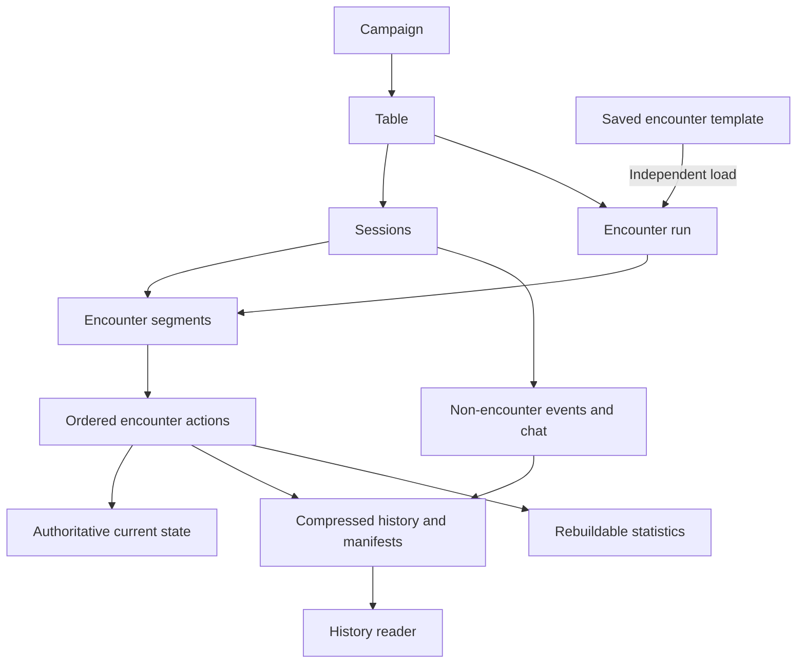

# Data structure and architecture specification

Version 0.1 — discussion checkpoint, 2026-09-10. **Specification only; no persistence implementation or deployment delivered.**

This is the primary checkpoint for the app's data model and storage lifecycle. It brings together the [character wizard](character-wizard-spec.md), [monster catalog](monster-catalog-spec.md), and [engine architecture](engine-architecture.md). The [storage analysis](data-storage-analysis.md) retains the supporting research, alternatives, corpus measurements, and illustrative scaling estimates.

**Current direction:** an encounter owns its action-by-action undo journal; the open session is the live shared-play context; after session closure, detailed history can be compressed and retained while ordinary records hold current state, summaries, statistics, and archive references.

Confirmed requirements below describe user intent. Proposed contracts describe how to implement it. Open decisions remain unresolved; this checkpoint does not authorize silently choosing defaults for them.

## 1. Confirmed requirements and decision status

- Distinguish shared game data from user-created data. Steel Compendium is the source of truth for official rules content; characters, campaigns, sessions, homebrew, and saved encounters belong to application users/campaigns under their respective permissions.
- Convex is the chosen application backend. Shared play needs realtime updates during a session.
- Every action within an encounter must be undoable. Restoration changes actual affected state using recorded values, without rerunning the engine or dice.
- Preserve every session's game log for campaign review. After a session ends, its detailed log can be compressed and relevant data delivered to persistent records and statistics.
- Keep character progression history independent of encounter undo. Restoring a build retains present inventory and follows the wizard's campaign review requirements.
- Saved encounter templates and loaded encounters remain independent. Editing a template, official definition, or homebrew revision cannot silently change an existing load.
- Retain structured gameplay information linked to characters, campaigns, and sessions for future statistics and app usage analysis. Specific metrics and the speculative analysis engine remain to be defined.
- The engine and shared application operations remain usable without the visual UI; the engine's contracts remain independent of storage vendors.

The proposed implementation uses portable JSON content packages, structured Convex records during play, and compressed JSON archives after closure. JSON is the recommended format, not a previously established user requirement; XML was raised as an alternative. Exact schemas, compression codec, chunk sizes, and physical table names are not settled.

Earlier documents described rollback to a point in any session. The latest discussion establishes encounter undo and session closure as the important boundaries, but **whether a closed session can be reopened for live undo is unanswered**. Preserve sufficient history rather than discarding it while that policy is open. Do not interpret compression as either granting permission to reactivate old state or making all archived encounters permanently review-only.

The [accounts and access specification](accounts-and-access-spec.md) adds friendship/request/blocking controls, campaign request/ban rules, one active Director, and session/until-revoked character grants. Friendship initially grants no additional content access. Its proposed session-expiry and privacy boundaries must be carried into closure, subscriptions, archives, and authorization. Gameplay undo must not restore friendships, friend requests, memberships, or access grants, or remove personal blocks. Concurrent sessions remain an open decision; the access spec proposes one open session per campaign initially.

## 2. Ownership and lifetime boundaries

| Concept | Responsibility and lifetime |
| --- | --- |
| Content edition | Immutable interpretation of pinned official sources, identified by source and transformation versions. Shared by app features. |
| Content definition | A rule, monster, ability, item, or progression definition with portable identity, revision, readable text, structured fields, and explicit unsupported/unresolved information. |
| User creation | User-owned character, homebrew, or encounter template, with editable working data and retained revisions where needed. |
| Campaign | Persistent membership, roles, characters' attachments, and campaign context spanning sessions. |
| Table | Campaign play space connecting participants and shared operations. It can host successive sessions; allowed concurrent tables/sessions remain open. |
| Session | A period of shared play, its chronology, participants, start/end boundaries, and archival status. Closing it does not inherently reset character resources or end an encounter. |
| Encounter template | Reusable authored preparation and versioned monster selections. It has no ongoing combat state. |
| Encounter run | A particular loaded encounter with independent definition snapshots, participants/instances, current state, and an ordered undo journal. |
| Encounter segment | Proposed relationship joining an encounter run to the portion played in one session, with event boundaries and archive references. |
| Game event | Recorded intent/resolution/state transition attributed to a session and, when applicable, an encounter run. |
| Archive | Immutable compressed detailed history for a sealed event range, with retained content/state dependencies and a database manifest. |
| Summary/statistic | Small derived record for navigation or analysis; it is rebuildable from preserved facts and does not replace them. |

Propose that a session may contain several encounter runs and non-encounter activity. An encounter run may span sessions: session A can end mid-fight and session B can resume the same run. A segment records that relationship without copying the entire encounter into a new independent run or losing chronology.

An encounter journal is a logical collection owned by the encounter. It need not be one physical file while play is active. Proposed storage uses individual event records with bounded payloads, then packages sealed ranges as files. This avoids repeatedly rewriting an ever-growing session or encounter blob.

## 3. Shared game content

Keep upstream Compendium files pinned and unmodified. Build app-ready definitions from its Markdown and existing JSON, retaining complete readable text and source context alongside extracted data. Forge Steel's pinned progression/choice structure remains supporting input for the wizard, with scoped mappings and local transformations outside both dependencies.

Produce a portable content package with an edition manifest, lightweight catalog summaries, full definitions, and required source/dependency records. The manifest identifies the source commits and package/importer/parser versions. A source-qualified identity plus revision identifies a definition; names and filenames are display/location information.

Propose an initial Convex mirror for indexed library reads and authoritative application lookups. Load summary fields for browsing and full definitions when opened or needed. Keep the package portable so public immutable content can later move to cacheable static delivery without changing the engine or saved-character contracts.

Updates create new editions. Publish a complete staged edition before changing the active-library reference. Retain content versions needed by saved builds, templates, loaded encounters, and archives. A newer parser or source revision does not reinterpret recorded history automatically.

Homebrew uses its own identity namespace, ownership/access fields, authored source, and immutable revisions. It should reach the same normalized definition/parser boundary as official content. Unsupported mechanics remain readable and manually resolvable; successful storage or parsing alone does not establish complete automation.

## 4. User records and current state

Proposed logical records:

| Record group | Key responsibilities |
| --- | --- |
| Accounts/social relationships | Stable user identities, friend requests, mutual friendships, and directed personal blocks under the access spec's proposed contracts. Friendship alone grants no content access. |
| Campaigns/memberships | Owner, active Director, participants, admission requests, and owner-wide bans. Ownership and Director authority remain distinct. |
| Access grants | Director appointments and character viewing/combat grants, with current-session or until-revoked scope; expiry and relationship invalidation follow the access spec's proposals. |
| Character identities/attachments | Stable character ID and owner; at most one campaign attachment/reservation; attachment identity and campaign values. |
| Character drafts/build revisions/reviews | Owner choices, automatic grants, recorded derived baseline, source context, effective build, exact submitted/base revisions, and approval status. |
| Character details/inventory | Independently authored details and item instances/quantities/state. Separate from progression snapshots; proposed owner-private notes also require a separate access boundary. |
| Character play state | Current resources, conditions, adjustments, and an authoritative active-play binding where needed. |
| Encounter templates/revisions | Versioned selections, preparation choices, authored supporting data, and access scope. |
| Loaded content/instances | Immutable per-load definition copies; distinct monster instances; squad relationships and pooled resources; shared encounter resources. |
| Session/encounter control | Lifecycle status, selected recorded state, last committed sequence, pending operations, and expected revisions. |
| Events/payloads/checkpoints | Detailed inputs and outcomes, recorded state changes, initial/checkpoint state, and ordering. |
| Archive manifests/summaries | Storage references, sealed ranges, completion status, participants, and derived totals. |

Keep one authoritative owner for each changing value. A sheet and table can present the same hero's Stamina, but must not maintain separately writable copies. A loaded monster has independent play state. Squad Stamina and shared Malice have their own appropriate scopes rather than duplicated pools.

Current state is persisted as actions are accepted. Session closure is not a deferred save of the character sheet: a crash before closure must not lose accepted damage, resource spending, or inventory changes. Closing a session packages history and completes derived work; it must not apply those effects a second time.

Build approval changes the effective build against current inventory/live state. It never replaces them with an old draft snapshot. Record historical resolved build baselines; progression restoration does not rerun grants. Preserve original Forge Steel imports and unmapped compatibility data separately from routine sheet records, with files for large opaque payloads.

The complete inventory/live-resource reconciliation and campaign transfer policies remain governed by the wizard's open decisions.

## 5. Encounter actions and undo

Each logical action needs a stable command ID, actor, relevant entities, source/build versions, expected state revision, and session/encounter association. Preserve the requested intent, modifier invocations, committed effects, and displayed explanation distinctly.

Proposed action sequence:

1. Authorize the caller, check the expected state and command ID, and durably record the relevant inputs before invoking a modifier.
2. Resolve against those inputs. Record choices, dice outputs, engine outputs, and manual adjudications; retain partial/failed/pending dispositions.
3. Recheck authoritative state and permissions, then atomically commit the actual state changes and their journal record. Reject a stale result instead of applying it to newer state.
4. Update the live clients from committed state. Derive statistics from accepted records independently of the response shown to the initiating client.

A retry must not apply an action twice or silently reroll accepted dice. Reusing a command ID with different inputs is an error. External computations can require retries, but their accepted gameplay effects commit once. Resumed manual/automated steps reference the same action and explicitly identify completed and outstanding effects.

For undo, retain the prior and resulting values of every affected field or small record, including field absence, removed conditions, created/deleted entities, resources, pending effects, and turn/encounter progress. Preserve an initial state and periodic checkpoints. Record replacement values, not merely instructions to subtract an amount later.

Backward/forward navigation applies those recorded values and restores actual authoritative state, including character sheets. It does not call modifiers. Read-only inspection of old history must not change the shared live state. Undo must respect dependent changes; an encounter boundary does not permit selectively reverting an earlier action while retaining incompatible later effects on the same character.

Retain later records when navigating backward. The grouping of reactions/manual steps into one undoable action, and continuation after undo, remain product decisions. Character progression history remains a separate operation with its narrower restoration scope.

Non-encounter gameplay and chat still belong to the session's chronology. The former also needs durable state-change records; the exact undo scope outside encounters and chat's behavior during navigation are open. No fake combat encounter is required just to preserve these records.

## 6. Session closure and compression

Propose separate lifecycle fields for the session (`open`, `closing`, `closed`) and its archive work (`pending`, `writing`, `ready`, `failed`). These are implementation labels, not required UI language. A closed session can have a pending archive while its original database records remain readable.

Closing should:

1. Verify the caller's authority and seal a specific session event boundary so no later command can commit into the range being archived. Resolve or explicitly carry forward pending operations; do not silently discard them.
2. Record the boundary's consistent ending state/checkpoint and participants. If an encounter continues, preserve its current state and pending-resolution context for resumption.
3. Package the sealed detailed history as compressed JSON, in bounded chunks where needed. Include encounter segments, non-encounter events, and chat under their respective visibility rules.
4. Verify readable archive contents, event ordering/ranges, and retained state/content references. Publish the manifest only after the package is complete.
5. Build/update session and character/campaign summaries and statistics from the sealed records. Retried processing must not duplicate totals or reapply game effects.
6. Remove redundant active event payloads only after durable archival is verified and outstanding work no longer depends on those copies. Readers support both storage locations during the transition.

Archival failure must leave the original data available and the work retryable. This follows session closure; the earlier analysis's optional 90-day archival threshold is not the lifecycle proposed at this checkpoint. Cleanup timing can still be tuned for recovery or reopening needs.

Proposed archive contents:

| Part | Required information |
| --- | --- |
| Manifest | Archive/schema version, campaign/table/session IDs, encounter segment IDs, sequence ranges, chunk locations, and completion metadata. |
| Source context | Exact content/build versions and retained definitions required to interpret the archived record; embedded copies or durable retained references. |
| Starting/checkpoint state | Recorded state at the segment's start, including relevant participants, monsters, resources, and pending work. |
| Ordered journal | Commands, modifier inputs/outputs, dice/choices, manual resolutions, dispositions, and before/after state changes. |
| Ending state | State at the sealed boundary, including incomplete encounter/resolution context. |
| Presentation data | Readable log messages and separately authorized chat/hidden information. |

Lossless compression preserves the detailed record. The simplified post-session database holds current values, session/encounter summaries, statistics, and archive manifests. Summaries alone are insufficient for historical inspection, future metric definitions, or possible restoration.

A continuing encounter can acquire another segment in the next session. Its ending/starting states must align without rerunning the archived actions or awarding resources twice. Whether undo can cross the previous session boundary depends on the unresolved reopening policy.

Private archives must retain campaign/history access controls; possession of an archive identifier is not sufficient authorization. Historic access does not grant authority to change a detached character or a character now attached elsewhere. Backup/recovery remains necessary separately from gameplay undo and archival.

## 7. Realtime and analytics boundaries

During shared play, subscribe to relevant current state and a bounded recent feed. Read older events and detailed payloads on demand. After closure, history can load from an archive without maintaining subscriptions to its full contents. This scopes the shared-play workload; it does not prohibit normal responsive character editing or campaign updates between sessions.

Partition event access and sequence allocation by table/encounter scope, retaining a total session chronology for interleaved actions. Index the actual reads needed for sessions, encounters, characters, and membership. Avoid entire-campaign reads or one global state/statistics document updated for every action. Precise indexes and payload bounds are implementation work.

Record structured facts linked to event, action, session, encounter, character/attachment, actor/target, and content revision. Desired dashboards may count entering winded, established monster defeats, and accepted ability uses. Define credit and counting rules before claiming those metrics are correct. A multi-target ability, a network retry, and resumed effect batches must not automatically become multiple ability uses.

Keep actual app activity distinct from accepted game history: attempts and rewound actions may matter for app usage but should not necessarily count toward character accomplishments. Summaries need a metric version and processed position/history generation. Corrections or later reactivation invalidate affected summaries for adjustment/rebuild. Preserve structured evidence so future analysis is not limited to today's counters.

Propose Convex summaries initially, with asynchronous updates/finalization at session close. A separate analytical store is optional future work, not a prerequisite for this design. Do not route routine play through an analytical service. Character/campaign current values, personal statistics, and app-wide aggregates have different authority and access scopes.

## 8. Acceptance scenarios for later implementation

These are required/proposed outcomes to verify when the dependent feature is implemented, not tests already passing.

| Scenario | Expected result |
| --- | --- |
| Shared encounter action | All authorized live clients read the same committed state; retrying the command does not duplicate its effect. |
| Undo/redo | Recorded before/after state restores all affected values and entity changes without engine/dice calls. |
| Manual completion | Resolved and outstanding effects remain distinguishable; resumption does not repeat completed effects. |
| Disconnect before session closure | Previously accepted character and encounter changes remain persisted. |
| Independent encounter loads | Two loads of a template have independent state; template/catalog updates change neither load. |
| Session closure | A fixed complete range becomes readable compressed history; current values remain intact and summaries are not double-counted. |
| Archive failure/retry | Original detailed records remain available; retry publishes one coherent archive manifest before redundant data is removed. |
| Encounter spans sessions | Next session resumes retained state with a new segment; prior actions remain inspectable without replay. |
| Non-encounter activity | Chat and noncombat changes remain present in session history without a fabricated encounter. |
| Character full edit during play | Pending build remains isolated; approval uses the exact reviewed revision and preserves intervening inventory/resources. |
| Historical permissions | History inspection cannot overwrite a character in another campaign or expose unauthorized hidden data. |
| Statistics | Multi-target actions/retries count according to defined metric policy; rewound results are treated consistently. |

## 9. Open decisions at this checkpoint

- Can a closed session be reopened for live encounter undo, or is archived history review-only? What authority and reconciliation would reopening require?
- Can undo cross sessions within a continuing encounter, or cross encounter boundaries within a session? How are dependent character changes handled?
- Who can undo, and how do reactions, interrupted actions, and manual completion define one undo step?
- What happens to retained later history when new play begins from an earlier point?
- How does chat behave during undo, and who can inspect historical hidden information or records after leaving a campaign?
- How should pending resolutions be completed or suspended when closing a session?
- How many sessions/encounters may be active at once, and how is a character protected from competing active-table writes?
- How are current resources reconciled when a build or campaign attachment changes? The wizard's existing unresolved policies still apply.
- What are the precise metric definitions, attribution rules, and scope of the speculative analysis engine?
- What JSON archive schema, compression codec, chunk/checkpoint intervals, and recovery/cleanup policy best fit measured workloads?

This checkpoint settles the conceptual lifecycle to carry forward. It does not settle the unanswered reopening question or commit the project to a particular database schema, engine runtime, or archive implementation.
