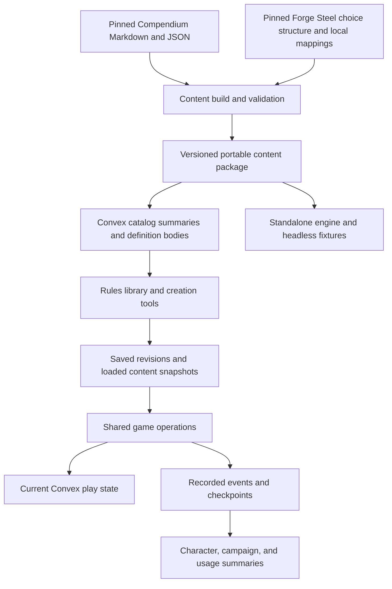

# App data storage analysis

Research and recommendation, 2026-09-10. **Proposed architecture for discussion; no schema, importer, or deployment implemented.** Convex is already the chosen application backend. This analysis recommends how to use it alongside portable content files, and identifies decisions that remain open.

The later [data structure and architecture specification](data-architecture-spec.md) controls the current data
and history contracts. It frames encounter undo, realtime sessions, and compression after session closure;
it supersedes the optional age-based archival timing below. This analysis remains supporting research.
Closed sessions are permanently read-only under the current product contract. Earlier proposals below for
cross-session live restoration or archive activation are historical, not current implementation requirements.
See also the [pre-alpha clarification queue](pre-alpha-design-gaps.md) for the immediate milestone scope.

**Recommendation:** keep Steel Compendium as the versioned source for official content; compile a portable, structured content package; serve searchable definitions through Convex initially; store user creations and authoritative play state as structured Convex documents; preserve history as ordered records of actual state changes with checkpoints; derive statistics from that history. Use file storage for original imports, media, package downloads, and eventually compressed historical payloads. A second operational database is unnecessary for the described scope.

The most useful efficiency target is **bounded work per action, screen, and history page as campaigns accumulate years of play**. Saving a few megabytes of rules content matters much less than preventing each action from reading, rewriting, or subscribing to an entire campaign history.

## Evidence and scope

Read together, the [monster catalog specification](monster-catalog-spec.md), [character wizard specification](character-wizard-spec.md), [product inventory](product-features.md), and [engine architecture](engine-architecture.md) establish these constraints:

- Official content is shared; homebrew is user-owned but should reach the same parser and engine contracts.
- Saved encounters load as independent snapshots. Later edits to the template or catalog cannot change an existing load.
- Character identity, build decisions, inventory, derived baseline, live state, and campaign values have distinct lifetimes.
- Character drafts and submitted revisions can differ from the effective campaign build. Approval activates precisely the reviewed revision against current inventory and resources.
- Progression restoration retains current inventory; table restoration restores all affected game state. Both preserve recorded outcomes without rerunning rules or dice.
- Every session's game log should remain available to the campaign. The present request adds cross-session usage analysis and possible character/campaign statistics such as winded occurrences, monster defeats, and ability uses.
- The standalone engine receives supplied data; its contracts must remain independent of Convex IDs, accounts, and UI.

The repository currently has a local TypeScript combat experiment and file-based history, with no installed Convex package or application schema. Platform capabilities below were checked against current official documentation; they are not measurements of this app in production.

I measured the checked-out unified corpus at Compendium commit `fb83a789da8f0327a389c277a0c790b1648d5810` by counting files and summing their byte lengths:

| Material | Files | Uncompressed bytes | MiB |
| --- | ---: | ---: | ---: |
| Unified Markdown | 3,111 | 7,082,346 | 6.754 |
| Unified JSON | 3,083 | 7,738,861 | 7.380 |
| Combined | 6,194 | 14,821,207 | 14.135 |

These are file sizes, not database billing estimates or counts of distinct rules. They exclude Git history, artwork, other generated formats, and book-specific material outside the sparse checkout. The largest individual source file is about 185 KB. The [monster audit](research/monster-import-audit.md) identifies 527 stat blocks, including the proposed initial 409 standard foes; the wizard research identifies 11 classes with level 1–10 entries.

**The official corpus is small.** Its hard problems are content fidelity, dependency resolution, and deliberate updates. Structured JSON already exists, but the research found omitted effect text and conflicting stat projections. Moving it into a database does not resolve those problems.

## Two origins, several storage patterns

Your two categories correctly describe where data comes from and who controls it. Within each category, storage should also follow how often data changes, how it is queried, and how long it must remain available.

| Data responsibility | Recommended representation and location | Why |
| --- | --- | --- |
| Official source | Pinned Compendium Markdown/JSON in Git | Reviewable upstream source and reproducible input. |
| App-ready official content | Versioned portable JSON package, mirrored into Convex catalog records | One interpretation shared by library, wizard, headless tools, and table operations. |
| Homebrew | Editable authored text and fields in Convex; immutable published/saved revisions | Ownership and edits need application permissions; resolved definitions can share official-content contracts. |
| Characters, campaigns, encounters | Typed Convex documents and relationships | Indexed reads, authoritative permissions, transactional changes. |
| Current game state | Small Convex records partitioned by table and affected entity/resource | Frequent updates without rewriting immutable rules or old history. |
| Build and game history | Immutable revisions/events, separate payloads, and checkpoints | Exact restoration and durable context without replaying modifiers. |
| Statistics | Rebuildable summary records in Convex | Dashboards read a few summaries instead of years of events. |
| Uploads and eventual archives | Convex file storage, with metadata and access rules in the database | Large opaque payloads do not need field indexes or reactive document subscriptions. |
| Presence and typing | Separate short-lived state | These should not become permanent gameplay history. |

JSON is an interchange representation; Markdown is an authoring/display representation; a database provides indexed access and concurrency. They complement one another. Inside Convex, use validated objects with queryable fields, rather than putting every character or session into a string containing JSON. Small bounded nested objects and arrays are appropriate; an ever-growing campaign event array is not.

## How official content reaches the app

Adopt the monster spec's portable package boundary for rules, monsters, items, abilities, and the wizard's progression definitions. Share identity/version conventions while retaining specialized schemas for their different mechanics. A universal untyped content blob would make validation harder.

The build should normalize source-qualified SCC identity, retain full readable source text and context, and produce structured definitions for supported behavior. Use existing JSON as an extraction aid. Preserve unresolved fields explicitly. Recover book-specific entries where unified paths have displaced content, as documented in the [navigation guide](compendium-navigation.md). Full text availability, successful extraction, and working automation remain separate properties.

A package manifest should identify source commits, package schema version, importer/parser versions, and local transformation version. Forge Steel's pinned choice structure is supporting input; it does not replace Compendium as the official displayed rules source. Stable identity plus an immutable revision identifies content; a name or filename does not. An importer correction can create a new derived edition without changing the Compendium pin.

Use three delivery records initially:

1. **Catalog summary:** identity/revision, name, type, sourcebook, and relevant filters such as monster level, organization, and role.
2. **Definition body:** full readable content, structured baseline/options/features, source references, and support diagnostics. Fetch when opened or needed by an operation.
3. **Edition manifest:** available package versions, publication status, and the active library edition.

Keep full raw import envelopes and downloadable packages outside routine library responses. Source bodies needed for reading can remain in definition documents at this corpus size. Separate long text search projections from lightweight browse summaries if measured result sizes justify it.

For an alphabetical library or numeric filters, use ordinary indexed queries. For text search, Convex supports one indexed text field with equality filters and relevance ordering. This is useful for names and rules text, but is not an arbitrary faceted query engine: numeric ranges, tag membership, combined filters, and alternative sorting need deliberate query design. [Convex full-text search](https://docs.convex.dev/search/text-search).

Stage an edition in batches, validate completeness, then atomically move the active-library pointer. Retain old revisions referenced by builds or saved encounters. A campaign/content selection records its edition; opening the app never silently upgrades it. Deliberate adoption produces new revisions and, where it changes play, recorded state transitions.

**Why start with a Convex mirror?** The corpus is small, Convex is already needed, public library reads can be independent of campaign membership, and both the backend and client can resolve the same definitions. This is the simplest initial operational model. It also fits the monster spec directly.

**Where static delivery helps later:** immutable public definitions can be served as cacheable JSON assets through the selected web host/CDN, while Convex retains metadata and any engine-ready data needed by authoritative operations. A static public reference site can be attractive if anonymous reading dominates traffic. Preserve the portable package now so changing delivery later does not require changing content semantics. Avoid requiring a phone to download the entire corpus or fetching remote files inside the transaction for each attack.

## User content and the character model

Keep all authoritative application writes in Convex initially. There is no benefit in dividing official/user data into different database products merely because their ownership differs.

The following are logical record groups, not a committed table count:

| Group | Important fields and boundaries |
| --- | --- |
| Campaigns and memberships | Owner, current Director, user membership/roles; separate membership rows rather than a growing participant/history object. |
| Tables and sessions | Campaign/table relationship; session dates, labels, status, and event boundaries. A session is a time segment, not necessarily a new encounter or a reset of play state. |
| Character identity | Stable portable ID, owner, current build reference, draft reference, and current attachment reference/reservation. |
| Character attachments | Campaign, character, attachment identity, effective build, campaign values, and lifecycle status. Reattachment creates a new attachment identity. |
| Build revisions | Parent/previous point, decisions and grants, resolved build baseline, content references, evaluator version, and operation provenance. Immutable after recording. |
| Drafts and reviews | Editable draft; immutable submitted revision; base revision, attachment, status, reviewer, and outcome. Approval authority is checked at execution time. |
| Details and inventory | Independently authored text and item instances/quantities/state. Build restoration does not restore these from an old build snapshot. |
| Homebrew and encounter templates | Owner/access scope, authored material, immutable revisions, source lineage, selected definition revisions, and preparation choices. |
| Loaded encounters | Immutable copied definitions/supporting rules for that load; separate monster instances, squads, and encounter resources. |
| Play state | Persistent hero values plus encounter-scoped entities, conditions, pending resolutions, shared Malice, and turn state. |

Store a complete compact build snapshot at each recorded decision point initially, including its resolved baseline. Character history is likely modest, and this makes exact restoration simple. Reference shared immutable definitions rather than copying every sourcebook body into each revision. If real build histories become large, introduce checkpoints and recorded changes within that subsystem later. Do not record every keystroke as a progression decision, or discard intermediate decisions that the wizard promises to restore.

A derived baseline is normally recalculable, but **the historical baseline is evidence of the result at that point**. Preserve it. Restoring a level-3 build must not reinterpret it using today's parser or rerun starting equipment grants. Combining that baseline with present inventory is a separate operation; current-resource reconciliation remains an unresolved product/rules decision.

An approved full edit switches the effective build reference and applies the accepted baseline change against current independent state. It does not copy a draft's old damage or inventory back into play. A valid level-up advances the effective revision without approval and makes incompatible older submissions stale. A mutation must enforce the single attachment constraint and bind review to that attachment and exact base/submitted revisions.

Keep original Forge Steel files in file storage with mapping/diagnostic metadata linked from the character. Translate known choices and state into our canonical fields; preserve unknown data for export. This avoids making every sheet read load a recursively embedded foreign object graph. Imported account IDs, approvals, and campaign links convey no authority here.

Use one authoritative owner for each changing value. For example, a hero's persistent resources can live in a character play-state record referenced by the table; the table must not hold a second independently writable copy of the same Stamina. Table-specific state can live separately. The precise field partition depends on the unresolved transfer policies, but dual authority is avoidable now.

Loaded monsters intentionally have independent state. Copy each distinct definition once per load and let repeated instances reference that immutable copy. Pooled minion Stamina belongs to the squad; shared Malice belongs to the encounter. Existing library content and homebrew edits cannot change a loaded definition.

## Realtime reads and authoritative actions

Subscribe to the active table's small state records and a bounded recent feed. Fetch the effective build/definition when its revision changes. Load older history in pages on demand; fetch full resolution details only when inspected. A character list should read summary fields, not every build revision and original import.

Convex tracks query dependencies and updates subscribed results as those dependencies change. Structure reads so one action touches the affected table and relevant entities, with separate permissions for Director-only information. Selecting a few return fields from a large document does not eliminate the underlying document read. Separate heavy bodies from frequently read summaries. [Convex realtime](https://docs.convex.dev/realtime), [query and index performance](https://docs.convex.dev/database/reading-data/indexes/indexes-and-query-perf).

Use indexes that follow actual access patterns, for example `(tableId, sequence)` for chronology, `(sessionId, sequence)` for a session, `(characterId, revisionNumber)` for builds, and `(campaignId, userId)` for membership checks. Add a character-event relation only if direct cross-session character timelines require it; do not create every possible analytics index on the heavy event payload table.

Per-table ordering is useful: one accepted transition has a unique sequence and known predecessor. A small table control record can hold sequence and expected state revision. It serializes that table's gameplay, which matches turn-based play; unrelated campaigns do not contend on it. Avoid a global sequence/counter and avoid updating gameplay control state for typing or presence. Monitor whether concurrent reactions/operations create unacceptable contention.

The project's requirement to **persist modifier inputs before invocation** means the durable flow needs an explicit request stage:

1. Authenticate and authorize, deduplicate the command ID, validate expected state, and persist the exact command, relevant input snapshot/references, and invocation request.
2. Invoke the engine or dice modifier against that recorded input. Record each modifier's inputs before it runs; persist dice output before using it as engine input. External computation stays outside database mutations.
3. In a final mutation, check current authority and state revisions, record the output/disposition, update all affected authoritative values, and append the accepted transition together. Stale results do not apply to newer state.

This works whether the engine is eventually an in-process library or a separate service. Convex mutations provide serializable atomic writes, but an action/external computation does not become part of one atomic transaction merely because Convex initiated it. Application-level idempotency and stale-intent checks remain necessary. [Convex transactions](https://docs.convex.dev/database/advanced/occ).

Use durable pending/failed/abandoned request states and a recoverable execution policy. A retry with the same command ID and different payload is rejected. An external computation may execute more than once after a crash; the committed gameplay effect must occur once. Preserve already accepted random outcomes and choices. Do not silently reroll on retry. Partial automation links subsequent effect batches to the original action and records what is applied, manually completed, or still unresolved.

## History that can grow and still restore exactly

The current [local history implementation](../src/history.ts) stores full before/after game states in every entry, with another state in the modifier output, and rewrites the run file. This is useful experimental behavior. It should not become one Convex document per campaign or session.

Use an ordered transition record with a small feed header and a separate detailed payload. Retain command and actor IDs, campaign/table/session identity, sequence, parent transition, related character/attachment/instance IDs, content/build/engine versions, exact modifier inputs and outputs, and actual state changes. Reference immutable input/output blocks where duplication would otherwise be large.

For restoration, start with **before/after images of the small affected records**, or explicit field replacements including both prior and resulting values and field existence. For example, record Stamina `18 → 11`, the exact condition added/removed, and the previous/resulting pending-effect record. Entity creation/deletion needs its full bounded record or retained immutable content reference. Numeric inverse operations alone cannot reconstruct erased information.

Store initial state and periodic full checkpoints, including session boundaries. A checkpoint is a consistent recorded state at a specific sequence, not an asynchronous copy of whatever happens to be current while pages are scanned. Produce it from an immutable prior checkpoint and recorded changes, or capture a bounded state atomically.

Stepping back applies the recorded before-values; stepping forward applies after-values. Jumping far back starts from a nearby checkpoint and applies recorded replacements. This is state restoration, not a rerun of the rules engine, parser, dice, or grants. Retain required definition/build snapshots and versioned readers for historical formats. Checkpoints and payloads may be split into bounded chunks.

Convex currently limits a document to 1 MiB and a transaction to 16 MiB read and 16 MiB written. Keep individual records well below those bounds; multi-session restoration must not require one transaction scanning years of events. [Convex limits](https://docs.convex.dev/production/state/limits).

For a large rewind, prepare a new materialized state generation in bounded batches, validate its completeness, then switch the table's active generation in a small final mutation. Block conflicting gameplay during preparation or invalidate the prepared result if the expected head changed. Ordinary single-action navigation can remain a small transaction. The same approach makes archival rehydration possible without exposing half-restored state to players.

That final activation must also reach the actual character sheets. For table-bound characters, all sheet/game operations should resolve live values through the same active play binding/generation, or the final mutation must atomically update their authoritative records and build pointers alongside the table. Switching a table snapshot while leaving character-owned resources on the old state is not a valid restore. Keep activation metadata bounded and recheck every affected attachment; staged state alone grants no authority to activate it.

Keep three concepts separate: the recorded sequence of what was attempted/committed, the state currently selected for play, and a user's read-only history view. Browsing yesterday's fight must not rewind everyone else's live table. Navigation itself remains auditable without overwriting the original events.

Later recorded states must survive navigation. Continuing play from the past needs a product decision about alternate continuations. Parent references and generation identifiers preserve that option without committing to a branching UI. Until that decision is made, the experiment's behavior—return to the recorded head before submitting new gameplay—is a defensible temporary restriction, not the final promised policy.

**A cross-campaign boundary needs an explicit rule.** If a character has left campaign A for B, campaign A can still reconstruct its historical sheet from retained campaign snapshots. It must not overwrite the currently owned character in B or restore old permissions. Historical inspection can always use an isolated view; making that past state live requires a current attachment/authority check and a defined reconciliation or independent-copy policy. Likewise, one character must not have competing writers from two active tables in the same campaign. Recommend one active play binding per character until a broader policy is designed.

Table rollback concerns gameplay state and the build effective at that time; it is not rollback of account ownership, campaign membership, or review authorization. Preserve all build revisions and separately record effective-build activations so the two histories can be linked without erasing either.

Store chat as distinct records with shared chronology references so the UI can interleave it with actions. Raw restoration payloads may contain hidden monster information or private sheet fields; authorize those separately from the player-visible feed. The chat rewind and historical disclosure policies remain open.

## Statistics and the future analysis engine

Build statistics on **structured facts linked to recorded transitions**, rather than extracting meaning from rendered log sentences. Preserve the human-readable narrative too; it serves a different purpose.

Each fact should retain its source event/action, event schema version, actor/target instance, character and attachment where applicable, campaign/session, content revision, and resolution provenance. Examples of useful fact types are ability use accepted, damage applied, condition changed, creature defeat established, and resource spent. Preserve enough before/after context to define later metrics without storing full rules text on every fact.

The proposed metrics need explicit meanings:

| Desired statistic | Required distinction |
| --- | --- |
| Times winded | An established transition into the winded state, rather than every damage event while already winded. Whether starting a session winded counts is a metric policy. |
| Monsters slain | Defeat/death and credit policy, including minion casualties, shared damage, and manual adjudication. Do not infer a killing blow when the recorded facts only establish defeat. |
| Ability uses | One accepted logical use, not every target hit, resumed effect batch, preview, failed command, or network retry. |
| Campaign/character totals | Stable character identity plus campaign attachment and session identity. A duplicate is a new character; detaching does not erase old campaign accomplishments. |
| App usage | Attempts, failures, manual completion, and abandoned resolutions can matter even when they do not count as in-world achievements. |

Maintain two interpretations of the same evidence: **actual application activity** and **the game history currently accepted for play**. A player really attempted an action even if the Director later rewound it; an achievement counter may need to exclude the superseded result. History inspection and forward/back navigation must not themselves count as fresh ability uses or kills.

Start with per-character-per-session and per-campaign-per-session summaries. Include common counters as fields; use separate per-ability rows if that collection grows. Roll them into campaign and character totals, and daily/weekly application aggregates. Metric definitions carry a version, and summaries retain their processed event position and history generation so stale aggregates are detectable.

Gameplay state commits synchronously. Summary updates can run asynchronously from committed records; dashboards can show a last-updated position. Workers must update their summary and progress marker atomically, so a retry cannot count a batch twice. A rewind or correction invalidates the affected summaries, which are rebuilt or adjusted using stored contributions; never silently retain counts from an obsolete history generation. Convex supports scheduling transactionally from mutations. [Scheduled functions](https://docs.convex.dev/scheduling/scheduled-functions).

Avoid one global statistics document updated on every action. Aggregate per session/campaign first and combine at a slower cadence. This keeps analytical writes from creating a bottleneck shared by unrelated tables.

For exploratory questions, begin with an export into a local analysis tool such as DuckDB or SQLite. If recurring scans become expensive, a later analytical copy can use columnar files such as Parquet and a dedicated query system. That would be a rebuildable consumer of recorded events, with an explicit cursor/deduplication strategy; it need not participate in live gameplay or introduce dual writes now.

I interpret the proposed “characteristics engine” here as future analysis of structured gameplay and character data; its speculative behavior is not specified. The model supports that exploration. It cannot recover observations that were never recorded: unsupported effects that the table resolves entirely outside the app remain unknown until entered. Future predictions/inferences should retain their model/version and evidence and remain separate from established game facts.

Cross-campaign product analysis should consume limited structured metrics by default. Access to private chat, backstories, hidden encounters, or original character imports is a separate product/privacy decision, not a prerequisite for measuring ability usage. The preservation policy should distinguish durable campaign play records from account deletion/redaction and access revocation; append-only gameplay semantics do not mean all personal text must be undeletable.

## Scale and cost envelope

The following is a planning model, **not measured event sizes or a Convex bill**. Assume one session per campaign per week, 52 weeks per year, 1,000 persisted events per session, and an average total event payload of 4,000 bytes. The event count includes all participants' actions and any chat or other records included in this budget; do not multiply it again by player count. Modifier substeps and detailed state images may make actual sizes or counts larger.

| Weekly active campaigns | Sessions/year | Events/year | Raw event payload/year |
| --- | ---: | ---: | ---: |
| 5 | 260 | 260,000 | 1.04 GB |
| 200 | 10,400 | 10,400,000 | 41.6 GB |
| 2,000 | 104,000 | 104,000,000 | 416 GB |

Formula: `campaigns × sessions/week × 52 × events/session × average bytes/event`. GB here is decimal. At 200 campaigns, changing the average payload to 2 KB gives 20.8 GB/year; 10 KB gives 104 GB/year. Three sessions weekly triples every row. These are retained annual additions, so several years accumulate.

The full-state-every-event alternative is much larger: if a table state averaged 100 KB, storing before and after for 10.4 million events would consume **2.08 TB/year**, before outputs, indexes, or backups. The 4 KB proposal is a target to validate with representative complex actions, not an assurance that every event fits it.

For comparison, an illustrative 1,000 characters with 200 recorded build snapshots each at 10 KB is 2 GB. Complete histories are affordable when snapshots contain choices and resolved values referencing retained content, rather than recursively copied rulebooks. Heavy imports, pictures, or future map observations could change which category dominates storage; they belong outside hot gameplay records.

Database cost includes indexes and traffic. Convex currently prices each ordinary index as another copy of its table, and counts subscription updates and scheduled executions as function calls. [Resource accounting](https://docs.convex.dev/production/state/limits). Split a small searchable header from a minimally indexed payload, then measure usage.

Starter currently lists additional US database storage at $0.22/GB-month and file storage at $0.033/GB-month. [Storage rates](https://docs.convex.dev/production/state/limits). For 41.6 GB, my arithmetic gives $9.15 versus $1.37/month for those bytes alone at year end. This excludes allowances, indexes, traffic, search, compute, backups, and other data; it illustrates archival economics, not the app's bill.

Peak activity matters independently of accumulated rows. Two hundred simultaneous tables with six connected people each means about 1,200 concurrent sessions, before multiple devices or other readers. S16 currently lists 1,000 concurrent sessions. [Deployment capacities](https://docs.convex.dev/production/state/limits). My inference: that peak would require a higher class; 200 campaigns playing throughout a week is a different workload.

My assessment is that hundreds of weekly campaigns are a credible fit for this architecture. Thousands remain plausible, but need measured workload testing and an appropriate deployment tier. Total users or event counts alone do not establish latency, cost, or capacity.

Before committing to numeric service targets, measure event size distributions, records/bytes read and written per action, mutation latency/conflicts, subscription updates with a full table connected, history paging/restore latency, and summary-worker throughput. One representative session at a time is enough to begin refining these estimates.

## File storage, archival, and recovery

Initially keep events and detailed state-change payloads in Convex database records. This makes the first history implementation and investigation straightforward. Design the payload reference so it can later point to an archived chunk without changing event identity or the history reader's contract.

When measured retained storage warrants it, move inactive immutable payload ranges into compressed JSON Lines chunks in Convex file storage. Retain compact database headers, session metadata, checkpoint manifests, sequence ranges, and archive locations. Chunk by a bounded byte/event budget, not one growing campaign file. A proposed starting policy could archive sessions inactive for 90 days; this is a tuning proposal, not an accepted retention deadline.

Archive through a recoverable staged process: write the file; verify its readable contents, event range, and required references; publish its manifest; switch reader locations; only then remove redundant database payloads in batches. Readers support both locations during migration. Keep records required by outstanding requests or incomplete restore jobs available.

Players still page through every session. A request for archived detail loads the appropriate chunk; restoration rehydrates the needed checkpoint and changes into a prepared state generation. Do not discard the raw state changes and keep only a summary: that would break exact rollback and future metric definitions. Archived reads may take longer and are not arbitrary database searches inside a compressed file.

Private history downloads need authorization on retrieval. Convex direct file URLs can be reused by anyone who has the URL; for revocable campaign-history access, use an authenticated HTTP action and avoid exposing the underlying direct URL. Public distributable rules packages can use public delivery. [Serving files and access control](https://docs.convex.dev/file-storage/serve-files).

History, archive copies, and backups solve different problems. History supports gameplay navigation; an archive changes storage location; a backup recovers from accidental deletion or a broken migration. Back up the database and required files, preserve application format readers/content versions, and exercise a restore into an isolated environment. Convex documents database backup/restore with optional file inclusion. [Backup and restore](https://docs.convex.dev/database/backup-restore).

Deployment code, environment configuration, and pending scheduled functions are excluded from those backups. Preserve configuration separately and recover pending work from durable application request/progress records after restoration. [Backup exclusions](https://docs.convex.dev/database/backup-restore#what-does-the-backup-not-contain).

## Alternatives and the decision to make now

| Alternative | Where it is useful | Assessment for this app |
| --- | --- | --- |
| Markdown files alone | Human-readable official source and authored homebrew | Retain them, but they do not provide indexed relationships, concurrent writes, or executable rules by themselves. |
| One JSON file/blob per character or session | Export, import preservation, local experiment artifacts | Good interchange. Poor primary model for growing shared history, exact-revision approvals, and independent state updates. |
| Static JSON plus browser search | Public reference reading with low backend traffic | Viable catalog delivery option. Keep the package portable; prefer the Convex mirror initially for one shared lookup service. |
| Structured Convex documents plus files | Realtime state, application relationships, searchable content, durable events and archives | Recommended initial operational stack. Needs disciplined records/indexes and explicit history semantics. |
| SQLite as primary multiplayer storage | Embedded/local applications | Adds a synchronization/service problem here. Useful for exports and local analysis; full offline operation is not required. |
| PostgreSQL as primary or second operational store | Relational queries and SQL-based applications | Technically viable, but introduces another operational/consistency boundary alongside the selected Convex table. No current requirement justifies that extra work. |
| Dedicated analytical store | Repeated broad queries over large event populations | Preserve the export path. Add when observed analysis workloads justify it, independently of live state. |
| Reconstruct all state solely by rerunning commands | Some simulation and debugging workflows | Conflicts with restoration guarantees across parser/engine changes and recorded dice. Retain resolved state changes and materialized current state instead. |

The two existing specs are compatible with this recommendation. The monster spec already supplies the package, immutable definition, and loaded-instance boundaries. The wizard spec supplies the revision, independent inventory/live-state, and exact approval boundaries. This analysis proposes their common persistence model and the history/analytics layer between them; their open product decisions remain open.

The decisions most valuable to settle before dependent implementation are:

1. Accept the package-plus-Convex model and immutable content/build revisions, with one source of authority for each live value.
2. Define live rollback versus personal history inspection, continuation from an earlier point, and the boundary of an action with reactions/manual completion.
3. Define current-resource reconciliation when a build changes, including progression restoration and campaign transfer.
4. Define who can activate past state and what happens when historical characters have detached or moved campaigns; adopt an initial single active table binding or specify an alternative.
5. Define accepted-history versus activity metrics, defeat attribution, historical visibility, and access after leaving a campaign.

Archive thresholds, checkpoint intervals, exact table names, CDN delivery, and an analytical database can be tuned later without changing the fundamental model. Stable identities, content retention, authoritative state boundaries, and structured event meaning are much more expensive to retrofit.

The first implementation should exercise these contracts through a complete small flow: create and save a character revision; load a versioned monster into an independent encounter; commit an action through the shared headless/UI operation; reconnect without duplicate effects; navigate recorded states across a session boundary; show a correctly counted character statistic; and approve a build change without overwriting intervening play state. Include a stale command and an unauthorized historical activation. That demonstrates the architecture with working behavior before expanding content coverage or building an archive pipeline.
