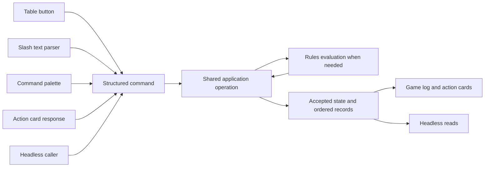

# Table commands and action cards

This specification defines the table's common interaction model. Confirmed requirements are binding;
the human syntax baseline was accepted on 2026-09-12. Detailed schemas and the broader command-family
catalog remain proposals. No command parser,
registry or action-card implementation is claimed here.

Start with [accepted human syntax](#accepted-human-syntax) for examples,
[confirmed requirements](#confirmed-requirements) for the contract, and
[remaining decisions](#decisions-still-open) for work left on resumption.

Confirmed boundary, 2026-09-12: neither engine logic nor parsing executes inside an action card. Cards
render interaction state and collect structured input; shared parsers/handlers interpret and execute it.

Confirmed extensibility requirement: the game log is a shared table interaction surface with an API-like
boundary that other programs and services can use to contribute activity and interactions. It must not be
limited to entries constructed by the current UI or the built-in rules engine. "Game log" remains the
working name; no replacement name is selected.

Recommended integration contract: accept structured activity submissions, action requests and interaction
responses through registered operations, then present their accepted records/cards through the same table
surface. Retain invoker/service provenance, ordering, audience and links to originating actions. Reported
external activity and app-applied effects must remain distinguishable: inserting a line alone does not
apply damage or certify a resolution. Existing authority and shared state/history rules still apply.
Precise extension registration, payload schemas, service authentication, supported card controls and
transport remain future design; this requirement does not select a public HTTP API or enable module hosting.

The supporting research consists of a [rules and argument inventory](research/table-command-rules-inventory.md),
[targeting and continuation cases](research/table-command-targeting-cases.md), and
[grammar comparison and accepted syntax baseline](research/table-command-grammar.md). The rules reports use the
core Heroes/Monsters corpus pinned at `fb83a789da8f0327a389c277a0c790b1648d5810`; syntax research uses
primary command-system documentation. The research is representative coverage of interaction families,
not certification of every ability or a claim that the existing app implements them.

## Accepted human syntax

Accepted 2026-09-12: an optional actor selector, a `/family verb` path and named arguments.
Names with spaces use double quotes; target lists support one or more references. The common spellings are:

```text
@Thorn /test roll characteristic=might skill=climb
@Thorn /ability use ability="Brutal Slam" targets=[@Goblin5]
@Elwin /ability use ability="Healing Grace" targets=[@self]
/encounter start type=combat
```

This replaces the earlier punctuation-chain sketches. Authenticated issuer attribution is display metadata,
not executable input. The [grammar report](research/table-command-grammar.md) compares alternatives,
defines lexical/EBNF rules, explains quoted and stable references, and supplies complex examples and error
behavior. The same report makes guided entry explicit: `/ability use` can open the card and collect all
options. Recommended preparation performs no roll or spending merely because the form opened. Fully specified operations and
structured headless calls use the same execution path.

The [command reference draft](table-command-catalog.md) organizes proposed names/argument shapes for
selection, turns, groups, persistent effects, requests and history. The formal grammar is unchanged;
new behavior is expressed through registered paths and typed data, not additional punctuation.

## Scope and authority

The contract applies **inside the table**, where the game log exists. It covers FreePlay, combat and other
supported table activities. It does not require account, campaign-management or character-authoring screens
outside the table to adopt a command palette or write into a session log. Table operations still obey their
existing session, access, privacy and character-build boundaries.

The [table specification](table-spec.md#confirmed-action-and-log-contract) owns the table lifecycle and
confirmed log requirement. This document owns the detailed command/card design. The
[engine architecture](engine-architecture.md#command-registry-and-palette) owns the client-independent
calculation/application boundary. The [rules adaptation principles](rules-adaptation-principles.md) govern
warnings, manual play and Director adjudication. Command coverage follows each release's supported scope;
researching a future command family does not bring a deferred system into v0.01 or V1.

## Confirmed requirements

| Requirement | Contract |
| --- | --- |
| Ordered activity | Every table ability, action, effect, condition and other table activity produces its own discrete, ordered game-log entry. Related lines can be presented together without losing their individual record or order. |
| Attribution | Every user-initiated operation identifies the actual invoking user. Acting character and Director context are separate. Requests, responses, edits and undo retain attribution. |
| Action cards | Any operation needing additional input or adjudication partway through surfaces an inline **action card**. Whenever one participant prompts action from another, it goes through a card. |
| User-aware controls | The same card exposes controls appropriate to its viewer, requested character and current authority. Card visibility does not grant permission. |
| Registered table controls | Every table UI button has a registered action available in the command palette. A dedicated button is never the only route to the operation. |
| Shared execution | Buttons, palette commands, slash text, game-log controls and action cards invoke the same operations. No rules or persistence behavior belongs exclusively to a component. |
| Headless completion | Agents and other programs can start operations, inspect pending interactions, provide responses and inspect applied results without rendering a card or opening a browser. |
| Guided entry | A short slash command can open an action card with a small GUI that walks through the available options. People need not type a long complete command; guided and fully specified paths feed the same operations. |
| Table-state actions | State transitions such as starting a combat encounter are registered actions too. They enter the applicable workflow and use action cards for its choices. Session/encounter authority and transition rules remain in force. |
| Director correction | The Director can edit inline results and submit with Enter. The resolution is reinterpreted, affected sheets/stat blocks update, and a Director adjudication entry is appended. |
| Undo | Inline results have Undo controls under existing permissions. Director redo restores recorded results without rerolling. Detailed dependency handling remains open. |
| Source and workings | Used actions expose their complete source text and actual calculations, accepted changes, warnings and unresolved work through the log, under existing disclosure rules. |

### Identity, actor and targets

The invoking user is authenticated by the application. The command selects the acting character; a
display such as `Jon@Thorn` attributes Jon's invocation to Thorn's action. A supplied username never
changes the authenticated issuer. The Director can perform any player table action without needing an
owner share, disconnect or routine approval. Ordinary players retain their existing character-control scope.

Confirmed character equivalence, 2026-09-13: apply the same gameplay mechanics to each character
regardless of whether one user controls several characters or different users control them. Resolve
abilities, resources, triggers, responses and dependent consequences from the characters and their
recorded actions; shared user control creates no special mechanical case. The sequential dependent-undo
policy produces the same gameplay result in both cases. Multi-character control adds UI navigation
and actor-labeling needs, not a separate rules model. Authentication, control permissions and actual-user
attribution remain separate application responsibilities.

The subsequent sequential undo ruling resolves the Recovery-grant case: the recipient's follow-up
closes the grantor's player undo window; the Director must rewind the response before the grant.

Confirmed character-context clarification, 2026-09-13: everything in the character sheet and player
pane belongs to the character the user is currently viewing. Sheet/pane tests and abilities use that
character's statistics and resources in FreePlay, during turns and between turns.

Game-log action cards can belong to either of a player's controlled characters, independently of the
viewed sheet. Clearly label the character who will act before the user interacts with a card. Its
controls execute for that labeled, bound character; viewing Elwin does not turn Thorn's response into
Elwin's action or require switching sheets to use it. Preserve actual-user attribution separately from
the acting character and apply normal authority, resource and opportunity-validity checks.

This narrows the earlier blanket all-UI-follows-selection wording. Whether the app otherwise prompts or
automatically switches the viewed character remains a separate open decision; no automatic sheet switch
is established by using a card. Explicit command actors and headless contexts retain their meaning.
Changing the viewed character does not retarget recorded actions or bound responses. Drafts spanning
turn changes remain open.

Confirmed explicit Take turn navigation, 2026-09-13: when a user chooses **Take turn** for a character
and that operation succeeds, switch that user's player pane/character sheet to the chosen character.
For example, taking Elwin's turn while viewing Thorn opens Elwin's sheet. Apply the existing actor-switch
draft-clearing rules when the viewed actor changes. This settles navigation following the user's own
explicit turn choice; it does not establish automatic switches for other users, passive turn changes,
or game-log card responses.

Commands can explicitly target another creature or use `self`. **Self means the operation's acting
character** (the sheet actor, explicit command actor or bound card actor as applicable), including when the Director invokes the command. The conversational examples
`Jon@thorn: \abilityname@target:goblin5` and `Sky@elwin: \healingsbility@self` establish those roles, not final
punctuation or real ability names. Naming Goblin 5 selects a particular foe instance, not its reusable
monster definition, squad or initiative group.

### Roster target selection

[The table's targeting contract](table-spec.md#roster-targeting-controls) owns the detailed UI behavior.
Registered selection controls and direct ability commands bind to the same stable actor/target references.
Ordinary single-target completion fires in either selection order; self-only supplies the actor. Multi-select
uses checkbox semantics and full-count auto-fire, with an explicit early fire control. Mapless area
selection uses explicit fire with no count inference. Additional required choices/costs still apply.

Draft selection belongs to the authenticated user, not the creature, and is visible to others under roster
privacy. Firing clears that user's pending ability/targets; actor switch, cancellation and undo clear the
draft. End turn and actual target death clear targeting. These changes never delete recorded targets or
already-fired continuations. Executing a preparatory selection control is not itself firing the ability.

Persistent area membership belongs to its effect and remains separate from user drafts. Its owner/Director
update targets immediately and confirm each new firing with prior membership prefilled; dependent clock
work waits. Resolve now supplies an unobserved trigger through the same interaction contract. Area cards
stack at the bottom while active; original ordered entries remain unchanged. See
[persistent areas](table-spec.md#persistent-area-effect-cards) for the current lifetime and open details.

### Ability costs and affordability

Confirmed resource-bookkeeping priority, 2026-09-13: retain each grant's causal event and resolution
stage, amount, before/after balance and applicable usage history. Spending checks and resource-dependent
features use the balance available at the relevant source stage; later-applied consequences cannot
fund an earlier response. Apply corrections/reversals coherently, preserving independently justified
gains and source-defined retained threshold benefits. This precision is a primary gameplay requirement;
the [table cost contract](table-spec.md#ability-costs-and-optional-spending) owns the detail.

Confirmed 2026-09-13: automatically deduct the applicable fixed resource cost when the ability is ready
to execute, with recorded spending. Pre-resolution optional enhancements use an action card to choose
the base ability or enhancements unless the command already supplies that choice. Opening preparation
alone does not pay costs; source-dependent later spending keeps its actual timing.

Resource affordability is an explicit exception to ordinary rule warnings: an ability cannot execute
when its cost cannot legally be paid. Enforce this through shared operations for all invocation surfaces
and both player/Director callers, against current pool state. No warning-through, implicit waiver,
unauthorized negative balance, roll or effect application occurs from a refused activation. Existing
attributed resource adjustments remain separate. Source waivers/reductions and legal negative ranges
(such as Talent clarity) inform affordability; do not implement a universal zero floor. Unknown cost
facts remain unresolved. See [ability costs](table-spec.md#ability-costs-and-optional-spending).

### Direct test rolls

**Deliberate scope decision:** generic Director test requests are intentionally omitted for now, not
an unanswered specification gap. Do not reintroduce the UI, command or request lifecycle as missing work
without a new user decision. Verbal requests and direct character rolls are the selected flow; tests
required by specific actions may still use those actions' cards.

Confirmed revision, 2026-09-13: remove the generic Director Request test UI and operation for now,
including request cards, recipient/response modes and their expiry/cancel/edit/reassignment lifecycle.
The Director asks verbally; players use **Roll test** / `/test roll` directly. The Director retains
existing acting authority. Record the actual user, character, dice, characteristic, agreed skill and
applicable modifiers, resource spending and action costs. No request ID is required for an ordinary test.
A source-specific action/effect can still supply a linked test step through its action card.

Show the roll calculation and total publicly. If the app knows the difficulty or source outcome table,
show the calculated outcome too. If it does not, accept the standalone roll and leave interpretation to
the Director; never invent success/failure. The campaign **Show test difficulty** setting defaults off
and governs recorded difficulty values in all displayed entries, including history. It does not hide
calculated outcomes or alter recorded results. Per-test visibility overrides remain deferred.
See [test initiation](table-spec.md#freeplay-baseline-and-combat-transition).

*Implementation note, 2026-09-14 (R04):* the recorded fields (dice, natural roll, characteristic and
value, skill bonus, other bonuses, edge/bane resolution, total, tier, critical success, optional
difficulty and outcome) are typed in `shared/contracts/rollResolution.ts` (`TestRollRequest`,
`TestRollResult`) per [the R04 contract](roll-and-damage-resolution.md), section 5.

### Starting combat through an action card

Confirmed FreePlay carryover, 2026-09-13: actions resolved before combat do not consume the new
encounter's action economy. Do not import an earlier attack as a first turn, mark an action or maneuver
spent because of it, or replay its effects when combat starts. Begin from the current recorded state:
damage remains and resource expenditures remain reflected in the relevant pools. Apply source-defined
combat-start initialization, grants or resets normally; this decision does not invent a reset or waive
an applicable resource cost. Earlier actions stay in FreePlay history. If the table intended an action
to happen during initiative, undo it while still in FreePlay, start combat, then execute it normally.
This does not add cross-encounter rewind authority.

Confirmed: the previously established initiative steps now live in a staged action card in the game log.
Invoking encounter start opens its setup phase: the Director organizes participants/groups and surprise.
Confirmation advances to the shared initiative-roll phase when the source calls for a roll, followed by
the winner's starting-side choice and announcement. If surprise determines the side, skip the ordinary
roll/choice and announce that result. The Director can choose even when players won the source choice.
The card exposes different controls to different viewers, preserving hidden-foe/private-stat-block policy.
Accepted steps and responses retain their individual attributed, ordered records. No standalone undefined
dialog is the owning interaction, and a headless caller can execute the same steps.

OK on the setup card commits combat. Before OK, inclusion/surprise/group choices are draft and Cancel
discards them, preserving separately accepted persistent-roster changes. On OK, capture the precombat
state, commit configuration and apply party-roster/character-edit locks before initiative and before
combat-start effects alter the restoration baseline.
After OK, abandoning the encounter uses Void keep-current/restore-starting-state, even if initiative is
unfinished. Shared operations record this commitment once across retries. Before OK, draft setup follows
live rosters: additions appear included, removals disappear, and remaining creatures retain participation,
surprise and group choices. Roster updates do not reset the draft; pause still blocks roster mutations.
The user refines initiative groups to contain actor-linked turn entries, usually one per actor.
Multiple entries share one live creature's state; each actual turn keeps distinct boundaries. Ordinary
one-turn group rules remain intact. Granted full-turn entries default to the bottom of the initiative
roster, each in its own new group, unless source timing requires an immediate/directly following turn.
This adds turn entries, not creatures, and does not impose a fixed initiative order. Dragging/regrouping
moves only the selected turn entry, leaving other entries for that actor where they are. This follows
directly from the selected model; it is not a separate unresolved product decision. The earlier repeated
mixed-group activation proposal is superseded.

Each ordinary monster defaults to its own initiative group, like heroes; minion squads are separate.
Saved-encounter operations preserve prepared initiative groups, squad membership and captain assignments
on reopening, duplication and loading. Restore relationships within each independent load through the
same UI/headless operations; do not require repeated preparation. Existing mid-combat group/turn rules
still govern loaded participants.
Source-specific start-effect ordering remains open. Any active player may submit the shared initiative
roll; the Director retains access, and observers cannot roll. See the
[initiative specification](table-spec.md#confirmed-initiative-setup-and-shared-presentation).

### Malice display setting

Confirmed: Show Malice is a persistent campaign setting, off by default, managed by the active Director.
The Director always sees the current shared pool; other table viewers see it only when enabled. Use
registered UI/headless settings operations and shared audience enforcement. This is a display policy,
not a change to resource mechanics or the public source text of used actions.

### Formal encounter closeout

Confirmed: an immediate granted turn can interrupt an unfinished individual turn. After it finishes,
resume the original turn with spending intact; do not end/restart it or refresh allowances. The granted
turn retains its own real start/end boundaries. Thorn's spent attack and unused maneuver survive a
War Dog Breaker's intervening final turn. Preserve the interrupted group's activation as well.

Confirmed immediate-turn sequencing: a source-forced normal turn such as Wode Sickness consumes
the target's normal round turn, then returns to the interrupted initiative group's remaining members.
Shared UI/headless operations preserve the group's activation separately from the temporary actor,
record genuine turn boundaries, and do not refresh the target when its own group later activates.

Confirmed 2026-09-13: the Director has UI for formal encounter closeout. Explicit End combat closes
unused optional combat responses, without waiting for another individual turn to begin. Required unfinished
resolution completes before rewards/cleanup, using action cards for missing input. Existing wrap-up then
completes applicable awards, allocation and cleanup before FreePlay. Preserve history, reject stale replies
to closed prompts and make closure/finalization retry-safe through the same registered headless operations.
The cutoff covers outstanding combat responses; ending-procedure effects retain their own resolution steps.
End combat ends structured turn play; it does not invoke End turn, finish the initiative group or advance
the round. Do not schedule final turn/round saves, damage or resource grants merely to close combat.
Already-caused required work still resolves; combat-ending effects and source-specific outside-combat
behavior remain distinct. Do not infer blanket removal of ongoing effects.
Closeout displays each character's applicable actions and effect choices as a list through the existing
log-card pattern. Players take stock and resolve the options they want; the Director retains acting
authority. Bind each option to its labeled character, check current applicability/costs and record its
chosen effects through shared headless operations. Do not automatically clear optional effects without
a choice. Source-required ending work remains automatic where defined. These new cleanup options are
not expired by the End combat cutoff for old combat responses. Director Finish cleanup closes remaining
unused optional cleanup choices after required unfinished work completes. Individual ready confirmations
are not required. Closing an unused choice does not execute it or remove its associated effect. Shared
UI/headless finalization records the closure once and rejects subsequent stale responses; this is the
existing closeout completion step, not an added turn or round event.
The Director grants Victories during closeout using an editable amount (initially 1, allowing 0) and
recipient heroes. Confirmation commits the grant; neither the initial value nor enemy elimination
awards it automatically. Record recipient resource changes and Director attribution through shared
UI/headless operations. Retrying or completing cleanup cannot duplicate the award; edits follow the
existing history boundary. Source eligibility and Director adjudication govern the chosen recipients.
Exact UI presentation and source-specific ending order remain open; Void keeps its separate behavior. See
[closeout](table-spec.md#formal-encounter-closeout).

Confirmed general early End turn: participants may end the current turn without exhausting its action
allowances. Use the same registered End turn operation for heroes, ordinary monsters and bosses;
source-granted extra actions/turns do not require a boss-specific skip control. Actual End turn retains
its source effects, required work and existing response window. The proposed eventless forgo-remaining-
turns operation was not accepted.

Confirmed paused Void: the active Director can invoke the existing Void keep/reset operation while
the session is paused. Shared authorization permits this lifecycle operation without resuming, while
ordinary gameplay/roster operations remain blocked. Commit the chosen Void state once, end the active
encounter and preserve session pause and its roster lock. No normal ending rewards/cleanup are run.
The same operation and state choice apply through the game-log card, command palette and headless path.

Confirmed Void roster scope: Restore starting state also restores combat-start foes-roster membership
and relationships: remove post-start additions and restore removed original instances with their
recorded identity/state and prepared group/squad/captain links. Preserve history and do not rerun catalog
loading or reopen initiative. Keep current state preserves the current roster. This is part of the
explicit Void transaction, even while paused, and grants no ordinary paused roster-edit permission.
The confirmed general scope is the Director panel's combat-start gameplay snapshot, including monsters
and loot/stash state. Restore removes post-start load rewards along with later foes and restores the
pre-start contents; Keep retains current content. Reconcile related claims/item locations without
orphaned allocations or duplicate items. Use recorded state and provenance, not new loads or grants.

### Minion squad additions and state

Use the [owning minion contract](table-spec.md#minion-squads-and-captain-state) through the same
registered UI/headless operations. One add creates one independent squad entry: default four minions,
count 1–8 in single increments, with optional captain additional to the count. Another squad is another
entry; no manual live split/merge or refill through the add control. Preserve individual identities and
reticles inside its shared turn. Prepared counts and relationships survive template save/load.

EV uses count × printed EV ÷ printed creature quantity, preserving fractions and counting the captain
separately. Multiple turn entries never multiply a creature’s EV. Keep template quantity, current living
membership, pooled Stamina and actual turn participation distinct.

Captain-bonus loss reduces the pool without casualties; replacement bonus gain applies only to survivors
and does not revive members. Later non-area pool exhaustion defeats all remaining ordinary minions,
subject to explicit source exceptions. Area casualties remain restricted to affected members. Record
stat adjustments, damage and each casualty distinctly; do not infer an individual current Stamina or
normalize living count from the pool. Unresolved arithmetic is listed in the table queue, not a new
command or fallback formula.

### Mid-combat group operations

A monster added during combat joins automatically in a new initiative group at the bottom of the
initiative list; the Director may change that placement/group. Do not default the addition to a reserve.
Director regrouping moves the selected turn entry and preserves its spent state and the linked
creature’s identity/state. Spent entries remain grayed out when their destination group activates, under
the existing warn-without-blocking policy. Neither a group flag nor one creature-wide acted flag can
replace turn-entry tracking. Shared squad turns also preserve individual participation and the captain’s
separate actions; member selection does not create new turns.
Expose additions/regrouping through registered, attributed, ordered headless operations as well as UI.
Newcomers have an unused turn available in the current round, with Director adjustment. Moving an
unspent creature into a finished group does not reactivate that group; preserve group completion
separately from the member's individual spent-turn state. Once all groups on both sides finish, advance
the round even if such an unacted arrival remains in a finished group. It waits for the group's next
activation; do not fabricate its turn, acted status or individual clock events. Active-turn and required
work completion still precede the genuine round boundary. Moving the current actor does not interrupt,
end or restart its turn or repeat clock events. After a current actor transfers, the original group
continues its activation when that actor finishes. An unspent arrival may act in a still-active group.
If regrouping leaves no remaining turns, automatically complete the group after any current individual
turn and required effects finish, using the existing side/exhaustion rules. Preserve active-turn and
active-group context separately from current membership. Confirmed 2026-09-13: removing the currently
acting monster during an ordinary individual turn automatically finishes that turn, resolves applicable
end-turn effects and continues through the existing handoff rules. Removing a member or captain during
a shared squad turn must preserve surviving participants’ allowances; exact shared-turn handoff on removal remains open. Captain-bonus Stamina adjustments follow the
confirmed owning table contract, including no casualties from bonus loss. Shared operations preserve the removed actor's required history/state
and do not repeat the boundary on retry. Pausing blocks changes to both rosters, including regrouping and
saved-encounter loads, through UI and shared headless operations. Refused removal queues no turn processing
for resume. Empty-group presentation and other dependency cases remain open; see
[mid-combat groups](table-spec.md#mid-combat-additions-and-regrouping).

### Triggered opportunities

An applicable triggered action can appear as a call to action on the originating log entry for its eligible
controller. Confirmed standing convention, 2026-09-13: all combat action-card response prompts stay active
through End turn and the following gap while still valid, with next-turn start as the outer turn-based
cutoff. Explicit End combat also closes unused optional responses; clarified event-window early closure applies. This includes
prompts first created at turn end and failed-save follow-ups. There is no wall-clock
countdown. Persistent effects keep their own lifetimes; required unresolved work still blocks dependent
progression. FreePlay has no artificial turn boundary; source-specific cards retain applicable lifetimes. See the owning table sequence below.

Confirmed early closure, 2026-09-13: accepting an unrelated new ability closes that character's earlier
unused optional triggered-action opportunity, regardless of the invoking controller. Preparation and
refused activations do not count. Preserve ordered response chains, new opportunities and explicit
continuations; responses to unrelated events and unrelated card kinds retain their lifetimes. Next-turn
start remains the outer deadline for opportunities still valid. This refines the app window convention.

Clarification of the existing cutoff: when Thorn commits another action or spends resources granted
by the hit, the response window for that hit closes for everyone, including his ally's Parry card.
Prompt ownership does not exempt that response. Unrelated trigger windows, ordered response chains,
explicit continuations and refused/prepared actions retain their existing treatment. Reject stale
Parry replies through the shared operation; no special dependency-repair mechanism is introduced.


Confirmed review clarification, 2026-09-13: for Lines of Force, the triggering action applies its outcome,
the engine surfaces the applicable response, and invoking that response modifies the original action's
effective forced-movement outcome. Do not wait for use/pass before applying the original outcome in this
case. The response appends linked, attributed changes and preserves the original record and unaffected
effects; a separate Director correction is not required. See the
[table sequence](table-spec.md#inline-interaction-cards-in-the-game-log). Confirmed dependent reversal:
accepting Lines of Force also reverses collision damage invalidated by the changed movement and resolves
its replacement consequences, requesting only newly needed facts. Original applied outcomes remain in
history, with linked reversals and response changes appended. Unaffected attack damage remains applied.
Later player choices, spent resource grants and other source-specific response consequences/order remain
open; turn-end prompt availability is settled.

Multiple responses to one trigger must retain the source's ordering rules rather
than defaulting to network arrival order. Undetected opportunities and deliberate late adjudication retain
the existing warned manual-play path. No universal pause until every player responds has been accepted.

### Director fine-tuning

Confirmed: the dedicated standalone damage tool, including separate collision/fall controls, is
intentionally omitted. Do not add it as a missing command/UI feature without a new user decision.
Director fine-tuning uses eligible result correction or direct live-stat adjustment on a monster stat
block/character sheet. Registered shared operations record actor/user, affected identity and before/after
state without applying the original action twice. Current adjustments are new events; historical edits
still require sequential rewind and cannot change archived encounters. Existing authority, session and
character-build boundaries remain. Shared damage resolution for supported abilities/effects is retained.

### Inline corrections and history

Power-roll inputs and resulting effects are distinct editable concepts. An edge or bane changes the roll
total or outcome tier; it is not a direct damage increment. Directly changing damage is a manual effect
adjustment. The original accepted dice remain available and are not rerolled simply because the Director
changes a modifier.

Submitting a correction updates the actual affected state and appends an attributed adjudication. It must
not apply full corrected damage a second time or silently replace later state with an old sheet snapshot.
The original entry is never rewritten. Confirmed 2026-09-13: corrections and undo each append new
entries; future interpretation and undo use the effective result on the current history branch. Undoing
an adjudication restores the prior effective result while preserving the original ability use; undoing
the ability is separate. An explicit manual damage override survives later modifier changes until cleared.
Undo/redo restores recorded effects without running rules or dice; an explicit correction may invoke
resolution again while retaining applicable overrides.

Confirmed historical-edit boundary, refined 2026-09-13: **rewind the entire intervening gameplay
chain before correcting an older event**, including within the same turn. Ordinary inline correction
may change the current effective result; it cannot change an earlier result while retaining later
committed actions. This applies to the Director as well as every other caller and covers roll inputs,
results and applied effects. Three turns back requires undoing all intervening gameplay, not a selective
patch to the old event. Turn progression also crosses the earlier event's boundary.

V26 clarification, 2026-09-16: directly linked corrections of the same effective ability roll can
continue consecutively, retaining separate sequential undo units. A player may continue only while
all such units remain within their authority; a Director correction is still a player seam. Other
later gameplay, including manual disposition, must be rewound first. See
[the inline correction contract](table-spec.md#director-edits-to-inline-results).

Enforce this through shared UI/headless operations, including stale inline controls. Rewind is sequential
under the existing player seams and Director current-encounter scope. Once at the intended point, append
the correction; original history remains readable, and new gameplay clears the available redo path while
retaining abandoned history and recorded outcomes for inspection. Closed sessions remain read-only.

An ongoing effect firing now or a valid source-specific response such as Lines of Force is current
rules resolution, not an ordinary manual edit of an older event. Those established response windows
and linked consequences remain. This does not authorize replaying later choices after an ordinary
historical edit. Automatic consequences belong to their initiating action; detailed internal undo-unit
representation remains an engineering contract.

## Command-family coverage

This is a recommended organization of the source-backed inventory, not a final list of endpoint names.
Several rows can share one underlying handler or resolve through source-defined ability data. An automatic
effect normally emits a recorded event without asking a player to invoke a separate command. Manual
operations remain available where the table needs to supply or correct the effect.

| Family | Mechanically distinct operations covered | Inputs that distinguish the family |
| --- | --- | --- |
| Discovery and inspection | Help, list available actions, inspect source/sheet/log/pending work, table view controls | Table context, visible entity/content/event reference, filters; read/presentation effects distinguished from gameplay mutations. |
| Table/session lifecycle | Start, pause, resume, close under current authority | Session, participants, active-encounter disposition; resume must not repeat start grants. |
| Encounter lifecycle | Start setup, configure/confirm opening, initiative roll, choose side, normal end, void | Participants, surprise, group assignments, setup revision, accepted roll/choice, ending type and keep/reset choice. |
| Turn and round progression | Choose group/member, Take turn, end turn/group, round transition, explicit extra turns | Actor/group, current event/phase, source entitlement, actual boundary; not just a universal has-acted flag. |
| Roster/group/squad state | Add/remove foes, visibility (hide/reveal and the Add visibility setting are fuller V1, deferred from v0.01), initiative membership, minion squad/captain relationships | Live-instance IDs and distinct roster/group/squad identities; individual participation and shared-pool relationships. |
| Ordinary tests | Direct roll, narrative outcome and changed-circumstance retry; generic Director requests deliberately excluded | Acting character, task, characteristic, optional skill, difficulty when known, modifiers, prior attempt. |
| Coordinated tests | Assistance, group and opposed tests | Helper/beneficiary, differing skill, participant set, comparison pairs or aggregation rule; multiple roll identities. |
| Source-defined tests | Reactive tests, printed outcomes and source exceptions | Source test definition, roller(s), permitted modifiers, hidden context where authorized; not every test uses the standard difficulty table. |
| Saves and ending effects | Normal/bonus save, failed-save conversion, direct ending, source-specific damage-for-ending | Effect instance, recipient, originating grant, d10 and bonuses if rolled, selected alternative payment; no invented death-save procedure. |
| Dice and roll decisions | Purpose-bound dice, reroll/replace/select dice, downgrade outcome, automatic tier | Roll/source reference, dice selection, target-local modifiers and entitlement; transport retry is never reroll. |
| Ability/feature use | Main/maneuver/move/triggered/free/no-action abilities, roll-free effects, modes and spends | Content, acting creature, mode, choices, targets, trigger/grant when applicable; action classification usually comes from source. |
| Basic/improvised actions | Charge, Defend, Aid Attack, Grab/Escape, Heal, Catch Breath, Hide/Search, Stand Up and ad hoc activity | Concrete action, target/source relationship, branch, action-budget conversion, facts and Director classification where needed. |
| Movement and placement | Advance/shift, charge path, force move, teleport, climb/ride, stability and collisions | Source/moved entity, route/origin/destination, movement mode, optional distance/stability, ordered targets, related terrain. |
| Effects and conditions | Apply/end/maintain effects, relationships, duration/expiry and recurring effects | Effect instance, source, recipient, duration anchor, payload, affected event and manual/automatic disposition. |
| Damage and healing | Damage, unpreventable Stamina loss, healing, Recoveries, temporary Stamina, knockout/revival | Source and recipient, damage type, resource payer, amount/branch, mitigation context, state thresholds; these are not one interchangeable number edit. |
| Resources and usage | Heroic/epic resources, surges, hero tokens (counter and spending deferred beyond v0.01), marks/judgment, performance/form, outside-combat reuse | Pool owner, source/benefit, target allocations, option identity, event limits, signed values and fictional time. |
| Granted and reactive actions | Opportunity attacks, critical extra actions, ally grants, nested abilities, replacement targets | Trigger/parent action, recipient/chooser, available source action, timing and accepted ordering. |
| Director/monster mechanics | Malice, villain actions, special turns, summoning, coordinated minion attacks | Shared Director pool, monster/source, turn/round limit, participant-to-target allocation, generated instance and casualty choices. |
| Items and environment | Item use/consume, operate/reload/spot/fire, detect/disable, linked mechanisms and terrain | Operator, item/object/area instance, charges/state, selected operation, target, skill/facts, resulting links. Inventory gameplay follows release scope. |
| World facts and time | Supplied spatial/observation/allegiance facts, area membership, elapsed fictional time | Fact scope, source/adjudicator, known/unknown value, duration units; no map is required to state a fact. |
| Action-card workflow | Guided prepare, request, inspect, respond, pass and eventual cancel/reassign | Interaction, input stage, answering actor, selected option, completion policy and revision. Source-specific card cancellation details remain open; generic Director test requests are out of scope. |
| Correction and history | Manual completion, inline adjudication, undo, redo | Original event/effect, replacement input/result, actual invoker and retained dependency/state record. |
| Respite and deferred core systems | Respite start/finish/interrupt, future montage/negotiation/project/retainer workflows | Participants, activities, progress, time, collective outcomes and source-specific roles; never a prototype scope expansion. |

The full matrices in the [rules inventory](research/table-command-rules-inventory.md) distinguish required,
optional, derived and unknown values. Some are required only at a later step. Its coverage ledger identifies
direct general-rule reads versus representative core-class/item/monster surveys and lists bounded uncertainties.

## Recommended execution model

This section is an engineering proposal implementing the requirements above. It does not settle unresolved
game mechanics or choose a backend transport, permanent engine language or parser library.



An action registry is a discoverable catalog of operations, not a list of one-off buttons. A command is a
request to do something. A recorded event states what actually happened. An action card is a view of an
identified pending interaction. Rendering a card neither executes nor commits the action.

The registry can use one ability-execution operation with many content-backed ability entries. Each
supported ability remains searchable and invocable. Main action, maneuver, move action and triggered
action are timing/cost classifications; a command must identify the actual operation being performed.
Navigation and other table presentation controls also register actions, but need not invoke rules or
mutate game state. The exact record granularity of presentation-only activity remains a design detail;
it must not hide gameplay effects or turn ordinary log reads into recursively logged operations.

### Registry definition

| Field | Purpose |
| --- | --- |
| Stable operation ID | Independent of display labels, translated names and aliases. |
| Title, category, description, aliases | Palette discovery, completion and human help. |
| Input schema | Typed fields and references; distinguish required to launch, required at this step, derived, optional and deferred until a later event. Separate structural validity from source-rule warnings. |
| Result and continuation schema | Applied effects, pending input, warnings, history references and visibility-safe results. |
| Context and authorization | Which table context and caller capabilities apply; evaluated again at execution. |
| Content binding | Ability/item/feature identity and source revision when relevant. |
| Availability explanation | Distinguishes ordinary game-rule warnings, blocking resource unaffordability, missing facts, insufficient permission and unsupported automation. |
| Handler and effect classification | Routes to the appropriate application or client operation; marks reads versus mutations. |

Do not add a separate parser branch for every ability. Resolve command structure first, then look up the
operation's schema and content. Resource names, ability choices and target constraints belong in data and
semantic validation. Adding content should normally add searchable entries and input definitions, not
punctuation or grammar productions.

### Structured invocation envelope

| Field | Source and meaning |
| --- | --- |
| Request ID | Caller-generated mutation identity, scoped by authenticated issuer and table; retrying identical input returns the accepted outcome. |
| Context | Explicit table/session and, when applicable, encounter. UI may supply this; headless clients must identify it. |
| Operation and schema version | Stable operation ID plus versioned input contract. |
| Acting entity | Stable live actor ID when the operation has one; Director operations may have no creature actor. |
| Arguments | Command-specific typed inputs; target IDs, choices, modifiers and references to pending interactions. |
| Expected revision | State or interaction revision used to detect stale submissions; exact concurrency policy remains to be specified. |
| Authenticated issuer | Supplied by authentication outside client-controlled command arguments. |

Implementation note (A01, 2026-09-14): the envelope as implemented is `shared/commands/envelope.ts`
(`schemaVersion`, `commandId`, `campaignId`, `operation` = `family.verb`, optional `actor` reference,
`arguments` in parsed shape, optional `expectedRevision` of the active session). The authenticated
issuer and the bound actor are added server-side and recorded in the event payload. Once-only
commitment is per issuer and command id over the canonical envelope; the same id with different
content is refused. `commands.submit` (slash text) and `commands.invoke` (structured) share one runner.

Dice generation belongs to shared operations. Explicit dice remain useful in deterministic engine fixtures,
but headless access does not grant an agent permission to choose live dice. Engine/content revisions and
mechanical source context must be retained with the accepted resolution; clients cannot silently select an
unauthorized rules version. A human-readable name is not the persistent identifier.

Confirmed sequential undo seams, 2026-09-13: the game log is one ordered event history. A player can
undo their own character's uninterrupted latest actions, in reverse order, only as far as the nearest
seam. A committed action by another character closes the earlier character's undo window, even within
the same turn and even if both characters share a controller. A response/accepted follow-up is an action
for this purpose. Merely affecting another character is not another character taking an action.
Automatic consequences stay linked to the action that caused them; they do not constitute another
participant acting. Reads, chat and sheet navigation do not create gameplay undo seams.

A committed Director correction is also an intervening gameplay action and closes the player's
undo window. The older exception allowing player End turn undo to reverse that Director correction
is superseded by the current sequential model. The Director must unwind the correction before reaching
the earlier action. Ordinary corrections to older events likewise require full sequential rewind
once later gameplay has committed. Valid source-specific responses retain their separate semantics.

The existing turn-start and FreePlay-stretch limits still provide outer boundaries. A player cannot skip
an intervening action, selectively remove an earlier grant, or pull another character's accepted response
into a player-initiated undo cascade. Director rewind proceeds sequentially through the intervening actions,
including across character/turn seams, within the existing current-encounter limit. Shared UI/headless
operations enforce the same order and authority; stale inline Undo controls cannot bypass a seam.

Example: Elwin grants Thorn an opportunity to spend a Recovery; Thorn accepts. Thorn's follow-up closes
Elwin's undo window. To remove Elwin's originating action, the Director first undoes Thorn's response
(reversing its healing and refunding its Recovery spend), then undoes Elwin's action. The result is the
same if Amy controls Zik as the recipient. No new permission to rewind closed sessions, separate
encounters or inventory history is created.

Redo restores recorded actions in forward order along the available redo path under existing authority
and seam limits. It does not reroll or re-execute rules. New gameplay still clears redo availability while
preserving abandoned history and its recorded results. New execution uses current conditions and fresh
dice. Internal event granularity does not permit
selective reversal around a later accepted action.

In FreePlay, players can undo their own uninterrupted latest actions as far as the nearest seam or
the beginning of the current FreePlay stretch,
under Enable user undo and existing control/session/dependency policies. Use the same registered history
operations as combat; no artificial turn boundary is required. This does not cross previous combat or
session boundaries, reroll recorded outcomes, or restore unsubmitted targeting/ability selection.

Players can redo their own undone actions through the shared history operations. Redo restores the exact
recorded action, state consequences and resource spending without new dice or recalculation. A new gameplay
action after undo clears the available redo path while preserving abandoned history. New executions
resolve normally with fresh dice; recorded outcomes are retained for history, not a separate reuse cache. Current session/control/history boundaries still apply.

The Director may repeatedly undo gameplay to any earlier point in the current encounter, across turns
and rounds without a fixed step limit. Shared history operations restore dependent state and preserve
recorded results. Finish cleanup, or Void after applying keep/reset, archives the encounter: no gameplay caller can undo finalization,
reopen it or rewind across the completed boundary. Archived event edits are refused. New adjustments
to current state remain separate, attributed actions. Other lifecycle questions remain separate;
closed sessions remain read-only.

A player can undo their own End turn until the next individual turn or another character's action
intervenes, subject to the existing user
undo setting and session/control permissions. This reopens the ended turn through the same history
operation used by UI and headless clients. Explicit Redo restores the recorded End turn and its
consequences unchanged. A new End turn execution resolves applicable work from current conditions,
including fresh dice. Do not retain a separate cache or same-end identity to reuse abandoned results.
New execution after undo clears redo availability while preserving ordinary history. The Director can
adjudicate reroll abuse through existing correction controls and history boundaries.

Fuller V1 (hero tokens are deferred beyond v0.01): sequentially unwinding the same character's optional hero-token spend and then End turn refunds
the token, reverses its success override and restores pre-end state. Undoing only the token spend
leaves the original failed save in effect. Ending anew rolls normally and offers a new token choice
if the result qualifies; explicit Redo restores the recorded End turn and, separately, the recorded
spend. Never automatically repeat optional spending during new resolution. Shared operations preserve
attribution and prevent duplicate refunds/charges. Another character's accepted response closes the
previous character's player undo window; Director rewind must unwind the response first.

If End turn advances the round, eligible undo also reverses its automatic round-boundary changes while
no next individual turn or intervening action seam has closed the player window. Restore round, usage,
resources and effect state from causal history. Redo restores recorded results; a new execution resolves
current due work with fresh dice and applies its grants/resets once. Retries of an accepted command
retain accepted results and must not duplicate effects. A committed Director correction creates a seam: player undo cannot absorb
it or skip past it. The Director must unwind that correction before the earlier End turn. This supersedes
the old dependent-adjudication exception; see the owning history contract.

Confirmed triggered-opportunity restoration, 2026-09-13: when authorized sequential undo restores
the point before a triggered action was used, restore its prompt if the trigger/opportunity is still
valid in the restored state. Reverse the response's recorded costs and effects, including its usage
bookkeeping, without rerolling the original triggering action. Preserve the original use and reversal
in history; restore the opportunity rather than creating a duplicate response entitlement.

Revalidate the prompt against current authority, restored game timing and source conditions. Undo does
not bypass player seams, pause/closure restrictions or the Director's rewind limit. Redo restores the
recorded response exactly; undo itself does not automatically use the reopened response. This settles
triggered-action prompt restoration, not every required-input card's recovery behavior.

### Clock-driven operations

Confirmed timing split, 2026-09-13: scheduled rules work resolves at its source-defined boundary;
optional follow-up controls remain available until the next individual turn starts. End-turn saves
resolve on End turn, without waiting for the optional response window to close. Resource grants retain
their specific source timing. Required unresolved dependencies remain separate from optional responses.

The [game clock](table-spec.md#game-clock-and-scheduled-rules-work) dispatches registered turn/round timing
work through shared headless operations. Due save-ends rolls fire automatically and log their outcomes;
ordinary saves do not need a Roll action card. After a failed automatic save, the result line offers a
hero-token spend without delaying turn completion (fuller V1; the hero-token counter and this follow-up
are deferred beyond v0.01). That opportunity closes when the next
individual turn starts, including within the same group; accepted token use updates the save/effect and
logs the change without rerolling. Its headless response shares the same lifetime and source use limits.
Expiry/reset and roll entries retain source/event linkage; actual user attribution belongs to user-initiated
operations, with consequent system work distinguished. The initial boundary-work default is enqueue order,
with save-ends rolls last, subject to applicable explicit source sequences. Other choice timing and
handling of work created during or after the save phase remain unresolved. Standing policy includes every
applicable save-ends effect applied before that final phase begins, including newly imposed effects,
unless its source specifies otherwise. No command for arbitrary user ticking is established here.

Confirmed clock ownership, 2026-09-13: activating an ability registers its turn/round-based effects
with the clock. The source does not independently schedule or fire them again. Due registrations can
invoke the same ability/effect operations, spatial inputs, rolls and linked consequences used by direct
actions, retaining source attribution and history. A terrain firing consumes no action from the current
turn's participant unless an explicit source rule requires one. Initial immediate effects and later
scheduled firings remain distinct; undo/redo restores registration state without causing a new firing.

Confirmed shared-turn counting, 2026-09-13: dispatch global turn work once per actual turn, including
one firing for the shared squad/captain turn, regardless of participant count. Resolve each creature’s
own personal effects/saves as applicable. A separate captain-only turn supplies a new boundary;
selecting a different shared participant or resuming an interrupted turn does not.

**Implementation note, 2026-09-14 (R05):** dispatch types for this section (`BoundaryEvent`, `ScheduledWorkRegistration`, `DispatchPlan`, `DispatchResult`) are in `shared/contracts/clock.ts`; the sourced contract and the two-round event list are in [conditions and clock](conditions-and-clock.md#23-order-of-due-work-at-a-boundary). Per Q-TS-1, no due save-ends roll exists in v0.01; the automatic save path described above stays dormant with no producer.

### Results and pending interactions

Confirmed usability direction: a slash command may simply open a guided action card, rather than requiring
the person to type all options. For example, a registered `/ability use` entry can collect actor, ability,
targets and available choices through small controls. Those controls use the same input definitions and
headless operations as the fully specified command. `/ability use` is part of the accepted syntax baseline.

The v0.01 turn UI is the detailed player sheet with remaining-action indicators and grayed spent action
categories, plus an explicit End turn control. End turn must also be available through a registered command
(proposed spelling `@Thorn /turn end`). A sequential interface filtering and ordering the player's available
actions is deferred beyond v0.01. Spent-action graying remains advisory; resource unaffordability is a
separate confirmed execution block.
Ordinary board movement is handled outside the app and is not a required log/command operation; the
client does not track movement use, distance or split segments. The initial V1 baseline omits dedicated
I moved and Convert to maneuver buttons; these may be revisited if usability warrants. Supported actions with nonmovement effects
still use the shared operations and log. Guided command input remains supported, but every sheet action is not
required to open a preparation card. See [player-sheet turn controls](table-spec.md#player-sheet-actions-and-explicit-end-turn).

Recommended preparation boundary for guided input, not an accepted universal sheet-action flow: opening a guided form does not roll dice, spend resources or apply
effects. It collects initial intent; an explicit submission starts resolution. After resolution starts,
later cards collect only the choices available at that step and preserve any accepted effects/dice.
Optional choices should remain discoverable in guided entry, even if no required field is missing.
An agent can request the same input schema and answer it incrementally. Guided entry and in-progress
continuation are different states, even when both render as action cards. A dedicated prepare mode for
an already complete invocation, its machine interface and draft persistence remain proposals.

Responses should distinguish accepted work, outstanding input, ordinary rule warnings, blocking resource
unaffordability, authorization failures and
unsupported resolution. A partially resolved action can have both accepted effects and outstanding effects;
one global success/failure flag cannot describe that state. Missing inputs should identify the relevant
field or step and the permitted choices, rather than returning only prose.

Recommended pending-interaction fields are: stable interaction ID; originating action/event; kind; required
inputs; eligible responder/actor scope; completion policy; current revision; status; and the game event or
phase that makes the response valid. The schema must distinguish unanswered, answered, declined, canceled,
expired and invalidated states where needed. These names are proposed, not an accepted complete state machine.

Implementation note (A01, 2026-09-14): pending interactions are rows of the `interactions` table
(status `awaiting-input | resolved | closed`, kind `guided-input`, the labeled bound actor, required
inputs, the continuation envelope, a revision and the opening/resolving event ids). The requester or
the Director may answer or close; one answer resolves the card and runs the continuation under the
responder's command id, with the opening event as its cause. Other kinds, cross-user request cards
and completion policies beyond one answer remain open.

Responses refer to a specific interaction and opportunity. Transport deduplication uses the authenticated
issuer, table and request ID with identical payload. Separately, the completion policy defines response
uniqueness, such as one answer per acting creature and opportunity. Two controllers answering for the same
hero cannot create duplicate accepted rolls; one user answering for two heroes is not inherently a duplicate.
Two legitimate responders are not necessarily duplicates. A single-roll request, a multi-character test and several
ordered triggered actions need different completion policies. A card's closure is not evidence that an
unresolved effect has been applied.

### Card lifetime investigation

Research checkpoint, 2026-09-12: being lower in the log is not itself a rules expiry event. Combat
response opportunities can be short-lived, but several source/product cases survive newer log activity.
These findings do not establish a separate pending-task panel or change the agreed trigger-window policy.

| Case | What can remain valid after newer entries | Lifetime implication |
| --- | --- | --- |
| Double Strike | Its first target resolves, the actor may take their maneuver and move action, then resolve the second target using the same roll. [Source](../vendor/steel-compendium/en/unified/md/feature/ability/dual-wielder/double-strike.md). | A continuation can be buried by intervening actions while remaining part of the current turn. Short lifetime does not guarantee the card stays at the bottom. |
| Group test | Each participant rolls separately and the Director waits for all results before interpreting the group outcome. [Source](../vendor/steel-compendium/en/unified/md/rule/test/group-test.md). | Group outcome resolution can depend on multiple recorded rolls. Generic Director test-request UI is removed; automated group aggregation remains separate and is not required by direct-roll support. |
| Unresolved manual/adjudicated work | Under the existing [manual-play principles](rules-adaptation-principles.md#manual-play-is-a-supported-mode), dependent automation waits while independent work may proceed. | Later activity does not prove the unresolved work completed or expired. The app must preserve its explicit disposition; exact cancellation/dependency handling is still open. |
| Maintaining an effect | Persistent Magic can be stopped at any time without an action while it remains active; encounter end or sufficient damage can end it. [Source](../vendor/steel-compendium/en/unified/md/feature/elementalist/level-1/persistent-magic.md). | A lasting effect can offer a later control, but the initial maintain decision happens immediately. An ongoing effect is not necessarily an unanswered card or a current demand for attention. |

Recommended conclusion: define each interaction's closing event and revalidate responses; do not infer
expiry from elapsed time, scroll position or the arrival of unrelated entries. Most importantly, separate
pending input, a still-valid optional opportunity, and a resolved entry with later correction/ongoing-effect
controls. Do not retain a stale roll button just because the history entry remains editable.

Confirmed product decision, 2026-09-12: no Needs your input indicator, reminder inbox or automatic
resurfacing for missed ordinary cards. Users are responsible for noticing actions when surfaced. Ongoing
area effects have their specifically accepted fixed-bottom card, with new log entries above and affected-
creature controls for the effect owner and Director until the effect ends. This presentation preserves
ordered history and does not change source/event response validity. Multiple simultaneous fixed cards stack for now; checkbox edits immediately update the affected-creature
list without an Apply button. Each later firing re-prompts the effect owner or Director to confirm
affected creatures, with the prior selection checked. Dependent clock work waits for confirmation and
area consequences; Resolve now supports unobserved triggers through the same shared operation.
Source-specific area-update resolution remains open; no general persistent inbox is implied.

### Target and fact model

Confirmed minimum-input direction, 2026-09-13: collect only the missing facts/choices required by the
specific action or dependent effect, through its card or equivalent headless response. Derive the rest
from known state; already-supplied input does not require redundant confirmation. A list of affected
creatures or a collision partner can suffice without coordinates or a complete movement report. See
[the table contract](table-spec.md#inline-interaction-cards-in-the-game-log). This does not claim complete
automation or settle unsupported mechanics, responder authority or dependent corrections.

Confirmed 2026-09-13: special actions can have small, purpose-specific card interfaces for their needed
inputs. A generic manual-resolution form is not required for every case. These controls still use shared
handlers and headless inputs; no parsing or engine logic belongs inside the card.

Confirmed unsupported-effect completion, 2026-09-13: the Director can mark a specific unsupported
effect Resolved at table through its originating log card or the same registered headless operation.
Record effect identity, manual disposition and actual Director attribution. Keep the action's other
effects independently applied/pending/manual. This acknowledgement does not execute the effect,
reroll, duplicate damage, or prove the engine understands it. Required state/facts must still be supplied
through shared adjustments/inputs before dependent automation can continue. Recheck existing authority,
pause and history boundaries and retain the recorded resolution for undo/redo. This is a fallback for
unsupported effects, not a routine confirmation for supported movement or other actions.

Squad action-card refinement, 2026-09-13: extend ordinary multi-target selection with participating
minion counts per target (normally up to three), then resolve one coordinated squad attack. The card
also provides the attached captain's normal actions on the shared turn. Captain targets/rolls/costs,
action allowances and Stamina remain separate; using the minion attack does not spend the captain's
action. Preserve member identities where needed, shared operation access and attributed result entries.
See [the owning group/card contract](table-spec.md#initiative-groups-confirmed-app-model).

Confirmed minion area-damage ceiling, 2026-09-13: the final damage to each affected squad's pool is
capped at the combined applicable Stamina of that squad's affected minions in the area, regardless of
weakness or other increasing modifiers. Area damage has no non-area overflow and cannot remove members
outside the area. Apply squad immunity/weakness once, then enforce the final ceiling. Offer only eligible
affected casualty identities; do not subtract excess damage while hiding extra deaths. Captain damage
remains separate. This is the selected interpretation of ambiguous source wording and supersedes the
research's earlier outside-area weakness inference.

Confirmed minion overflow input, 2026-09-13: an inline game-log action card uses the existing
area/spatial-targeting response pattern to collect missing overflow-kill assignments from the acting
user; the Director can also complete it. Shared operations derive the casualty count from resolved
damage and squad state, apply source casualty constraints using supplied spatial facts, and record the
selected minion identities against the original action. Do not roll another attack or debit the squad
pool again for the assignment. Required dependent work waits for the missing input under existing
policy. The same casualty response is available headlessly and reuses spatial-input operations. This
reuse does not remove the selected squad-turn UI for member participation and captain actions.

Separate acting creature, ability origin, selected targets and movement destination. Creature targets,
objects, area geometry and points are not interchangeable strings. Preserve each selected live entity's
identity and its per-target inputs/results. A relationship such as ally or enemy is evaluated for the
acting creature in the current state; do not replace it with permanent player-side/Director-side ownership.

Typed selectors such as self are conveniences that resolve to explicit values for a submitted command.
Autocomplete must disambiguate duplicate names and respect visibility. Discovery must not expose hidden
foes (fuller V1; all loaded foes are visible in v0.01), private abilities, full monster stat blocks or tower results. Unknown range, line of effect or other
spatial facts remain unknown until provided by a map adapter or manual adjudication.

Input needs extend beyond selecting multiple creatures: allocation of amounts across targets, exclusions,
ordered sequences, target replacement, optional spending and later choices can all affect resolution.
The source-backed inventory determines which of these need distinct fields or continuation steps. Geometry
must remain optional for the mapless client without pretending unsupported facts are known.

### Recording, ordering and recovery

Each accepted activity receives a stable event ID and authoritative order within the table history.
Parent/action IDs preserve causality between declaration, roll, effect, request, response and correction.
Client timestamps or arrival animations must not determine rules order. The precise sequence allocation
and storage schema remain implementation choices; the contract does not require adopting event sourcing
or reconstructing all state from log text.

Current state and the corresponding accepted record must remain coherent. A disconnected client can
recover the accepted result and outstanding interactions without rerolling. Retrying an identical request
must not spend resources twice. Reusing a request ID with different inputs is an error, not another edit.
An edit, reroll, response, undo and redo are distinct operations with their own attribution and references.

A rule conflict ordinarily produces an explanation and the existing warned manual path. Insufficient
resources for an ability instead block execution under the confirmed affordability exception.
Authentication, privacy,
session lifecycle and structurally uninterpretable commands remain separate. A hidden or inactive button
is not the enforcement mechanism. Paused gameplay cannot be revived by submitting a headless command, and
a permanently closed session is not reopened by editing an old card.

## Acceptance examples for implementation

These are future verification requirements, not tests already executed against the app.

| Scenario | Evidence required |
| --- | --- |
| Button, palette, text and headless parity | Equivalent inputs reach the same operation and produce equivalent mechanical results and recorded changes, without requiring a browser. |
| Multiple characters per player | Explicit actor selection controls who acts; preserve user attribution. The same actions, responses and dependent consequences produce the same gameplay results whether characters share a controller or have separate controllers. |
| Director acts as another hero | Command succeeds under Director table authority and logs the Director as issuer and the hero as actor. |
| Self target | Self resolves to the selected actor even when that actor differs from the invoking user's hero or the active initiative actor. |
| Missing target | An identified action card requests the target; a headless caller can inspect and answer it. |
| Guided preparation | Discover fields and optional choices, fill them and submit headlessly. Opening or abandoning preparation does not roll, spend or apply effects. Later-stage choices are not required before they exist. |
| Direct test | A character rolls without a prior request. Record dice, modifiers and total; calculate the outcome only when its required context is known, otherwise leave interpretation to the Director. Source-specific linked test steps remain supported. |
| Source-specific response | Exercise the originating action's completion policy; no generic Director test-request workflow is implied. |
| Trigger opportunity | Relevant viewers can respond while the opportunity is valid; stale response and next-turn-start closure follow the decided timing contract. |
| Multiple targets | One operation retains distinct target results and per-target effects; a shared roll does not collapse those differences. |
| Inline correction | Original entries remain unchanged; correction/undo append new effective-history entries. Manual damage overrides survive modifier changes until cleared. Editing an older event after later gameplay is refused until sequential rewind, even within the same turn and including for the Director. |
| Undo/redo | Recorded state is restored with attribution and without dice generation or rule re-evaluation. |
| Duplicate and concurrent delivery | Retries do not duplicate rolls/effects; distinct responses obey the interaction's completion and source ordering. |
| Partial automation | Full source remains available; manual completion is distinguishable from automatic effects and is not later applied twice. |
| Audience and lifecycle | Discovery, pending-input reads, response payloads and retry results enforce current permissions, privacy and pause/closure rules. |
| Start combat | The registered action opens the agreed participant/group/surprise setup and initiative/choice workflow. It does not skip setup or silently select a starting side. |

## Future adventure-module extension

Future direction only: an adventure module could supply its own logic engine/handlers for custom
interactions, such as a puzzle door, and expose them through registered commands and action cards.
The custom logic remains outside the card, just as core rules logic does. Preserve the same headless
interaction boundary so custom controls do not become the only way to run the interaction.

This establishes an extension possibility, not an adventure-module implementation requirement. Packaging,
runtime selection, hosting, trust/isolation and authoring remain undesigned. It does not enable custom
content in the current core-only scope or require each module to run a separately deployed engine.

## Decisions still open

1. Per-operation schemas and canonical names beyond the accepted common command examples.
2. Detailed source-specific action-card lifecycle transitions; the combat next-turn-start cutoff is confirmed. Generic Director test requests and their lifecycle are out of scope for now.
3. Later-stage/conditional resource commitment, partial resolution and responses after effects already applied; fixed-cost deduction and affordability blocking are confirmed.
4. Source-specific response consequences/order; Lines of Force's apply-then-modify sequence and all combat prompts closing at next-turn start are confirmed above.
5. Source-specific response reconciliation and pending-card recovery; manual override persistence and rewind before any older-event correction are confirmed.
6. Other character-switch prompts, passive sheet changes and remaining drafts spanning turn changes. Successful explicit Take turn switches the invoking user to that character; log cards execute for their labeled actor independently.
7. Target geometry/facts, multi-target and allocation presentation, without requiring a digital map.
8. Source-defined group-test aggregation and detailed test contexts. Per-test difficulty reveal is deferred; direct-roll workings are public and outcomes are calculated only when context is known.
9. Detailed persistence, ordering and input schema versions; no production API is frozen by this document.

The common command/card/log architecture is confirmed. These remaining choices do not reopen that decision,
and the accepted syntax does not decide the unresolved mechanics.

## Checkpoint and resumption

The 2026-09-13 documentation checkpoint consolidates gameplay decisions and updates the grammar reference
and affected earlier specs. No immediate user answer is pending. The next useful walkthrough is a sourced
ability with an optional choice, triggered response and correction within its allowed turn window.
Detailed schemas/registry/storage, remaining mechanics and implementation remain separate work. The
research inventory and command catalog do not expand the selected release scope. See
[current status](workstream-rules-status.md) for evidence and [the decision record](gameplay-decision-record.md)
for superseded recommendations.
