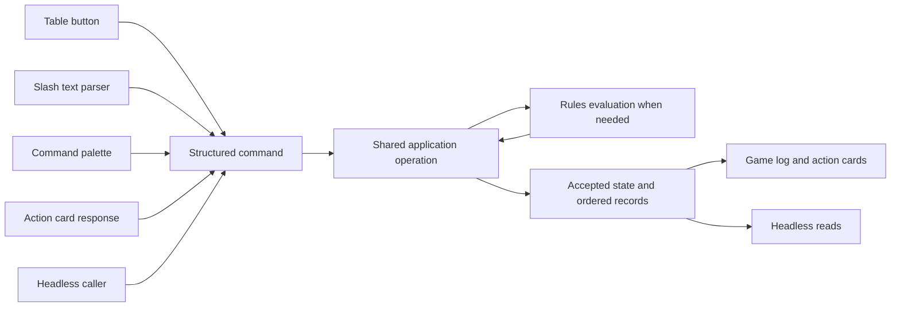

# Table commands and action cards

This specification defines the table's common interaction model. Confirmed requirements are binding;
the human syntax baseline was accepted on 2026-09-12. Detailed schemas and the broader command-family
catalog remain proposals. No command parser,
registry or action-card implementation is claimed here.

Start with [accepted human syntax](#accepted-human-syntax) for examples,
[confirmed requirements](#confirmed-requirements) for the contract, and
[remaining decisions](#decisions-still-open) for work left on resumption.

Confirmed boundary, 2026-09-12: neither engine logic nor parsing executes inside an action card. Cards
render interaction state and collect structured input; shared parsers/handlers interpret and execute it.

Confirmed extensibility requirement: the game log is a shared table interaction surface with an API-like
boundary that other programs and services can use to contribute activity and interactions. It must not be
limited to entries constructed by the current UI or the built-in rules engine. "Game log" remains the
working name; no replacement name is selected.

Recommended integration contract: accept structured activity submissions, action requests and interaction
responses through registered operations, then present their accepted records/cards through the same table
surface. Retain invoker/service provenance, ordering, audience and links to originating actions. Reported
external activity and app-applied effects must remain distinguishable: inserting a line alone does not
apply damage or certify a resolution. Existing authority and shared state/history rules still apply.
Precise extension registration, payload schemas, service authentication, supported card controls and
transport remain future design; this requirement does not select a public HTTP API or enable module hosting.

The supporting research consists of a [rules and argument inventory](research/table-command-rules-inventory.md),
[targeting and continuation cases](research/table-command-targeting-cases.md), and
[grammar comparison and accepted syntax baseline](research/table-command-grammar.md). The rules reports use the
core Heroes/Monsters corpus pinned at `fb83a789da8f0327a389c277a0c790b1648d5810`; syntax research uses
primary command-system documentation. The research is representative coverage of interaction families,
not certification of every ability or a claim that the existing app implements them.

## Accepted human syntax

Accepted 2026-09-12: an optional actor selector, a `/family verb` path and named arguments.
Names with spaces use double quotes; target lists support one or more references. The common spellings are:

```text
@Thorn /test roll characteristic=might skill=climb
@Thorn /ability use ability="Brutal Slam" targets=[@Goblin5]
@Elwin /ability use ability="Healing Grace" targets=[@self]
/test request characteristic=might actors=[@Thorn]
/encounter start type=combat
```

This replaces the earlier punctuation-chain sketches. Authenticated issuer attribution is display metadata,
not executable input. The [grammar report](research/table-command-grammar.md) compares alternatives,
defines lexical/EBNF rules, explains quoted and stable references, and supplies complex examples and error
behavior. The same report makes guided entry explicit: `/ability use` can open the card and collect all
options. Recommended preparation performs no roll or spending merely because the form opened. Fully specified operations and
structured headless calls use the same execution path.

The [command reference draft](table-command-catalog.md) organizes proposed names/argument shapes for
selection, turns, groups, persistent effects, requests and history. The formal grammar is unchanged;
new behavior is expressed through registered paths and typed data, not additional punctuation.

## Scope and authority

The contract applies **inside the table**, where the game log exists. It covers FreePlay, combat and other
supported table activities. It does not require account, campaign-management or character-authoring screens
outside the table to adopt a command palette or write into a session log. Table operations still obey their
existing session, access, privacy and character-build boundaries.

The [table specification](table-spec.md#confirmed-action-and-log-contract) owns the table lifecycle and
confirmed log requirement. This document owns the detailed command/card design. The
[engine architecture](engine-architecture.md#command-registry-and-palette) owns the client-independent
calculation/application boundary. The [rules adaptation principles](rules-adaptation-principles.md) govern
warnings, manual play and Director adjudication. Command coverage follows each release's supported scope;
researching a future command family does not bring a deferred system into v0.01 or V1.

## Confirmed requirements

| Requirement | Contract |
| --- | --- |
| Ordered activity | Every table ability, action, effect, condition and other table activity produces its own discrete, ordered game-log entry. Related lines can be presented together without losing their individual record or order. |
| Attribution | Every user-initiated operation identifies the actual invoking user. Acting character and Director context are separate. Requests, responses, edits and undo retain attribution. |
| Action cards | Any operation needing additional input or adjudication partway through surfaces an inline **action card**. Whenever one participant prompts action from another, it goes through a card. |
| User-aware controls | The same card exposes controls appropriate to its viewer, requested character and current authority. Card visibility does not grant permission. |
| Registered table controls | Every table UI button has a registered action available in the command palette. A dedicated button is never the only route to the operation. |
| Shared execution | Buttons, palette commands, slash text, game-log controls and action cards invoke the same operations. No rules or persistence behavior belongs exclusively to a component. |
| Headless completion | Agents and other programs can start operations, inspect pending interactions, provide responses and inspect applied results without rendering a card or opening a browser. |
| Guided entry | A short slash command can open an action card with a small GUI that walks through the available options. People need not type a long complete command; guided and fully specified paths feed the same operations. |
| Table-state actions | State transitions such as starting a combat encounter are registered actions too. They enter the applicable workflow and use action cards for its choices. Session/encounter authority and transition rules remain in force. |
| Director correction | The Director can edit inline results and submit with Enter. The resolution is reinterpreted, affected sheets/stat blocks update, and a Director adjudication entry is appended. |
| Undo | Inline results have Undo controls under existing permissions. Director redo restores recorded results without rerolling. Detailed dependency handling remains open. |
| Source and workings | Used actions expose their complete source text and actual calculations, accepted changes, warnings and unresolved work through the log, under existing disclosure rules. |

### Identity, actor and targets

The invoking user is authenticated by the application. The command selects the acting character; a
display such as `Jon@Thorn` attributes Jon's invocation to Thorn's action. A supplied username never
changes the authenticated issuer. The Director can perform any player table action without needing an
owner share, disconnect or routine approval. Ordinary players retain their existing character-control scope.

When typing in the game log during Thorn's individual initiative turn, the acting-character selector is
prepopulated with Thorn and remains editable. Switching actors supports reactions and Director actions.
In FreePlay, default to the character whose sheet the user is viewing; an explicit `@Character` can select
another character they control. Sheet visibility does not confer action authority. Headless callers use
an explicit actor or equivalent supplied context. Drafts spanning a turn change and actor selection while
a combined hero initiative group awaits its next individual turn remain open. During an active individual
turn, the same character default applies within combined groups. A group, character and controlling user
are distinct identities.

Commands can explicitly target another creature or use `self`. **Self means the selected acting
character**, including when the Director invokes the command. The conversational examples
`Jon@thorn: \abilityname@target:goblin5` and `Sky@elwin: \healingsbility@self` establish those roles, not final
punctuation or real ability names. Naming Goblin 5 selects a particular foe instance, not its reusable
monster definition, squad or initiative group.

### Roster target selection

[The table's targeting contract](table-spec.md#roster-targeting-controls) owns the detailed UI behavior.
Registered selection controls and direct ability commands bind to the same stable actor/target references.
Ordinary single-target completion fires in either selection order; self-only supplies the actor. Multi-select
uses checkbox semantics and full-count auto-fire, with an explicit early fire control. Mapless area
selection uses explicit fire with no count inference. Additional required choices/costs still apply.

Draft selection belongs to the authenticated user, not the creature, and is visible to others under roster
privacy. Firing clears that user's pending ability/targets; actor switch, cancellation and undo clear the
draft. End turn and actual target death clear targeting. These changes never delete recorded targets or
already-fired continuations. Executing a preparatory selection control is not itself firing the ability.

Persistent area membership belongs to its effect and remains separate from user drafts. Its owner/Director
update targets immediately and confirm each new firing with prior membership prefilled; dependent clock
work waits. Resolve now supplies an unobserved trigger through the same interaction contract. Area cards
stack at the bottom while active; original ordered entries remain unchanged. See
[persistent areas](table-spec.md#persistent-area-effect-cards) for the current lifetime and open details.

### Ability costs and affordability

Confirmed 2026-09-13: automatically deduct the applicable fixed resource cost when the ability is ready
to execute, with recorded spending. Pre-resolution optional enhancements use an action card to choose
the base ability or enhancements unless the command already supplies that choice. Opening preparation
alone does not pay costs; source-dependent later spending keeps its actual timing.

Resource affordability is an explicit exception to ordinary rule warnings: an ability cannot execute
when its cost cannot legally be paid. Enforce this through shared operations for all invocation surfaces
and both player/Director callers, against current pool state. No warning-through, implicit waiver,
unauthorized negative balance, roll or effect application occurs from a refused activation. Existing
attributed resource adjustments remain separate. Source waivers/reductions and legal negative ranges
(such as Talent clarity) inform affordability; do not implement a universal zero floor. Unknown cost
facts remain unresolved. See [ability costs](table-spec.md#ability-costs-and-optional-spending).

### Requests and responses

Both players and the Director may initiate tests. A Director can also request a test from another
character. A request addressed to Thorn is actionable for Thorn's eligible controller; Director acting
authority remains. Omitting the character opens the request to eligible participants. The requester can
choose **one volunteer** or **one roll per character**. Preserve this response mode in headless inputs;
exact argument names remain open. Observers do not acquire gameplay authority through an open card.
An open request needs no routine Director close step: allow eligible remaining responses until the end
of the current combat round, then expire its ordinary controls while retaining history. Response limits
still apply, including only one accepted response in one-volunteer mode. This does not define group-test
aggregation or every source-specific test window. In FreePlay, open requests remain usable until combat
starts or the session ends, subject to response limits; no artificial round or wall-clock timer applies.

A requested-test card offers a Roll control and can supply an agreed applicable skill bonus. Recording the
skill name alongside the bonus is recommended. Table agreement does not require an additional in-app
approval workflow. The campaign setting **Show test difficulty** defaults off: keep difficulty available
to the Director and engine while hiding it from players; enabling the setting shows it. Ordinary dice
rolls remain public, including the base roll, applied modifiers, total and calculated success/failure.
The outcome is not held for Director reveal when difficulty is hidden. Preserve this public calculation
and result through the shared log/headless read model while respecting the difficulty setting.
Per-test difficulty reveal/overrides are deferred for now; use the campaign visibility setting. How
setting changes affect existing entries remains open. Missing difficulty is not permission to invent
success or narrative consequences.

### Starting combat through an action card

Confirmed: the previously established initiative steps now live in a staged action card in the game log.
Invoking encounter start opens its setup phase: the Director organizes participants/groups and surprise.
Confirmation advances to the shared initiative-roll phase when the source calls for a roll, followed by
the winner's starting-side choice and announcement. If surprise determines the side, skip the ordinary
roll/choice and announce that result. The Director can choose even when players won the source choice.
The card exposes different controls to different viewers, preserving hidden-foe/private-stat-block policy.
Accepted steps and responses retain their individual attributed, ordered records. No standalone undefined
dialog is the owning interaction, and a headless caller can execute the same steps.

OK on the setup card commits combat. Before OK, inclusion/surprise/group choices are draft and Cancel
discards them, preserving separately accepted persistent-roster changes. On OK, capture the precombat
state, commit configuration and apply party-roster/character-edit locks before initiative and before
combat-start effects alter the restoration baseline. Expire FreePlay test requests at that transition.
After OK, abandoning the encounter uses Void keep-current/restore-starting-state, even if initiative is
unfinished. Shared operations record this commitment once across retries. Draft roster reconciliation,
and source-specific start-effect ordering remain open. Any active player may submit the shared initiative
roll; the Director retains access, and observers cannot roll. See the
[initiative specification](table-spec.md#confirmed-initiative-setup-and-shared-presentation).

### Mid-combat group operations

A monster added during combat joins automatically in a new initiative group at the bottom of the
initiative list; the Director may change that placement/group. Do not default the addition to a reserve.
Director regrouping during combat preserves the creature's identity and individual spent-turn/action
state. Already-acted creatures remain grayed out when their new group activates, under the existing
warn-without-blocking policy. A group-level acted flag cannot replace per-entity tracking.
Expose additions/regrouping through registered, attributed, ordered headless operations as well as UI.
Newcomers have an unused turn available in the current round, with Director adjustment. Moving an
unspent creature into a finished group does not reactivate that group; preserve group completion
separately from the member's individual spent-turn state. Moving the current actor does not interrupt,
end or restart its turn or repeat clock events. After a current actor transfers, the original group
continues its activation when that actor finishes. An unspent arrival may act in a still-active group.
If regrouping leaves no remaining turns, automatically complete the group after any current individual
turn and required effects finish, using the existing side/exhaustion rules. Preserve active-turn and
active-group context separately from current membership. Empty-group presentation, current-actor removal
and dependency cases remain open; see
[mid-combat groups](table-spec.md#mid-combat-additions-and-regrouping).

### Triggered opportunities

An applicable triggered action can appear as a call to action on the originating log entry for its eligible
controller. The requested table interaction keeps that opportunity available through the triggering
creature's turn and makes it inactive when that turn ends. There is no wall-clock countdown.

That UI convention is separate from ability-specific rules timing. A reaction that changes an effect
before it completes may need an earlier resolution boundary or an explicit correction of an applied effect.
The details remain open. Multiple responses to one trigger must retain the source's ordering rules rather
than defaulting to network arrival order. Undetected opportunities and deliberate late adjudication retain
the existing warned manual-play path. No universal pause until every player responds has been accepted.

### Inline corrections and history

Power-roll inputs and resulting effects are distinct editable concepts. An edge or bane changes the roll
total or outcome tier; it is not a direct damage increment. Directly changing damage is a manual effect
adjustment. The original accepted dice remain available and are not rerolled simply because the Director
changes a modifier.

Submitting a correction updates the actual affected state and appends an attributed adjudication. It must
not apply full corrected damage a second time or silently replace later state with an old sheet snapshot.
The original entry is never rewritten. Confirmed 2026-09-13: corrections and undo each append new
entries; future interpretation and undo use the effective result on the current history branch. Undoing
an adjudication restores the prior effective result while preserving the original ability use; undoing
the ability is separate. An explicit manual damage override survives later modifier changes until cleared.
Undo/redo restores recorded effects without running rules or dice; an explicit correction may invoke
resolution again while retaining applicable overrides.

Once the next individual turn starts, prior-turn events cannot be directly modified by anyone, including
the Director. This blanket history boundary covers more than rolls. The user must undo through the
intervening history to the turn/point being changed under their existing undo authority, then append the
correction. A stale card, command, or reconciliation response cannot bypass that rewind. The gap after
End turn but before the next turn starts remains within the existing edit/undo window. A new current-event
firing or valid continuation is distinct from editing its historical source event. Same-turn dependency
reconciliation remains open; no retroactive cross-turn reconciliation bypass is established.

## Command-family coverage

This is a recommended organization of the source-backed inventory, not a final list of endpoint names.
Several rows can share one underlying handler or resolve through source-defined ability data. An automatic
effect normally emits a recorded event without asking a player to invoke a separate command. Manual
operations remain available where the table needs to supply or correct the effect.

| Family | Mechanically distinct operations covered | Inputs that distinguish the family |
| --- | --- | --- |
| Discovery and inspection | Help, list available actions, inspect source/sheet/log/pending work, table view controls | Table context, visible entity/content/event reference, filters; read/presentation effects distinguished from gameplay mutations. |
| Table/session lifecycle | Start, pause, resume, close under current authority | Session, participants, active-encounter disposition; resume must not repeat start grants. |
| Encounter lifecycle | Start setup, configure/confirm opening, initiative roll, choose side, normal end, void | Participants, surprise, group assignments, setup revision, accepted roll/choice, ending type and keep/reset choice. |
| Turn and round progression | Choose group/member, Take turn, end turn/group, round transition, explicit extra turns | Actor/group, current event/phase, source entitlement, actual boundary; not just a universal has-acted flag. |
| Roster/group/squad state | Add/remove foes, visibility, initiative membership, minion squad/captain relationships | Live-instance IDs and distinct roster/group/squad identities; individual participation and shared-pool relationships. |
| Ordinary tests | Direct roll, Director request, narrative outcome and changed-circumstance retry | Task, characteristic, optional skill, difficulty when known, modifiers, requested actors, prior attempt. |
| Coordinated tests | Assistance, group and opposed tests | Helper/beneficiary, differing skill, participant set, comparison pairs or aggregation rule; multiple roll identities. |
| Source-defined tests | Reactive tests, printed outcomes and source exceptions | Source test definition, roller(s), permitted modifiers, hidden context where authorized; not every test uses the standard difficulty table. |
| Saves and ending effects | Normal/bonus save, failed-save conversion, direct ending, source-specific damage-for-ending | Effect instance, recipient, originating grant, d10 and bonuses if rolled, selected alternative payment; no invented death-save procedure. |
| Dice and roll decisions | Purpose-bound dice, reroll/replace/select dice, downgrade outcome, automatic tier | Roll/source reference, dice selection, target-local modifiers and entitlement; transport retry is never reroll. |
| Ability/feature use | Main/maneuver/move/triggered/free/no-action abilities, roll-free effects, modes and spends | Content, acting creature, mode, choices, targets, trigger/grant when applicable; action classification usually comes from source. |
| Basic/improvised actions | Charge, Defend, Aid Attack, Grab/Escape, Heal, Catch Breath, Hide/Search, Stand Up and ad hoc activity | Concrete action, target/source relationship, branch, action-budget conversion, facts and Director classification where needed. |
| Movement and placement | Advance/shift, charge path, force move, teleport, climb/ride, stability and collisions | Source/moved entity, route/origin/destination, movement mode, optional distance/stability, ordered targets, related terrain. |
| Effects and conditions | Apply/end/maintain effects, relationships, duration/expiry and recurring effects | Effect instance, source, recipient, duration anchor, payload, affected event and manual/automatic disposition. |
| Damage and healing | Damage, unpreventable Stamina loss, healing, Recoveries, temporary Stamina, knockout/revival | Source and recipient, damage type, resource payer, amount/branch, mitigation context, state thresholds; these are not one interchangeable number edit. |
| Resources and usage | Heroic/epic resources, surges, hero tokens, marks/judgment, performance/form, outside-combat reuse | Pool owner, source/benefit, target allocations, option identity, event limits, signed values and fictional time. |
| Granted and reactive actions | Opportunity attacks, critical extra actions, ally grants, nested abilities, replacement targets | Trigger/parent action, recipient/chooser, available source action, timing and accepted ordering. |
| Director/monster mechanics | Malice, villain actions, special turns, summoning, coordinated minion attacks | Shared Director pool, monster/source, turn/round limit, participant-to-target allocation, generated instance and casualty choices. |
| Items and environment | Item use/consume, operate/reload/spot/fire, detect/disable, linked mechanisms and terrain | Operator, item/object/area instance, charges/state, selected operation, target, skill/facts, resulting links. Inventory gameplay follows release scope. |
| World facts and time | Supplied spatial/observation/allegiance facts, area membership, elapsed fictional time | Fact scope, source/adjudicator, known/unknown value, duration units; no map is required to state a fact. |
| Action-card workflow | Guided prepare, request, inspect, respond, pass and eventual cancel/reassign | Interaction, input stage, answering actor, selected option, completion policy and revision. Cancellation details remain open. |
| Correction and history | Manual completion, inline adjudication, undo, redo | Original event/effect, replacement input/result, actual invoker and retained dependency/state record. |
| Respite and deferred core systems | Respite start/finish/interrupt, future montage/negotiation/project/retainer workflows | Participants, activities, progress, time, collective outcomes and source-specific roles; never a prototype scope expansion. |

The full matrices in the [rules inventory](research/table-command-rules-inventory.md) distinguish required,
optional, derived and unknown values. Some are required only at a later step. Its coverage ledger identifies
direct general-rule reads versus representative core-class/item/monster surveys and lists bounded uncertainties.

## Recommended execution model

This section is an engineering proposal implementing the requirements above. It does not settle unresolved
game mechanics or choose a backend transport, permanent engine language or parser library.



An action registry is a discoverable catalog of operations, not a list of one-off buttons. A command is a
request to do something. A recorded event states what actually happened. An action card is a view of an
identified pending interaction. Rendering a card neither executes nor commits the action.

The registry can use one ability-execution operation with many content-backed ability entries. Each
supported ability remains searchable and invocable. Main action, maneuver, move action and triggered
action are timing/cost classifications; a command must identify the actual operation being performed.
Navigation and other table presentation controls also register actions, but need not invoke rules or
mutate game state. The exact record granularity of presentation-only activity remains a design detail;
it must not hide gameplay effects or turn ordinary log reads into recursively logged operations.

### Registry definition

| Field | Purpose |
| --- | --- |
| Stable operation ID | Independent of display labels, translated names and aliases. |
| Title, category, description, aliases | Palette discovery, completion and human help. |
| Input schema | Typed fields and references; distinguish required to launch, required at this step, derived, optional and deferred until a later event. Separate structural validity from source-rule warnings. |
| Result and continuation schema | Applied effects, pending input, warnings, history references and visibility-safe results. |
| Context and authorization | Which table context and caller capabilities apply; evaluated again at execution. |
| Content binding | Ability/item/feature identity and source revision when relevant. |
| Availability explanation | Distinguishes ordinary game-rule warnings, blocking resource unaffordability, missing facts, insufficient permission and unsupported automation. |
| Handler and effect classification | Routes to the appropriate application or client operation; marks reads versus mutations. |

Do not add a separate parser branch for every ability. Resolve command structure first, then look up the
operation's schema and content. Resource names, ability choices and target constraints belong in data and
semantic validation. Adding content should normally add searchable entries and input definitions, not
punctuation or grammar productions.

### Structured invocation envelope

| Field | Source and meaning |
| --- | --- |
| Request ID | Caller-generated mutation identity, scoped by authenticated issuer and table; retrying identical input returns the accepted outcome. |
| Context | Explicit table/session and, when applicable, encounter. UI may supply this; headless clients must identify it. |
| Operation and schema version | Stable operation ID plus versioned input contract. |
| Acting entity | Stable live actor ID when the operation has one; Director operations may have no creature actor. |
| Arguments | Command-specific typed inputs; target IDs, choices, modifiers and references to pending interactions. |
| Expected revision | State or interaction revision used to detect stale submissions; exact concurrency policy remains to be specified. |
| Authenticated issuer | Supplied by authentication outside client-controlled command arguments. |

Dice generation belongs to shared operations. Explicit dice remain useful in deterministic engine fixtures,
but headless access does not grant an agent permission to choose live dice. Engine/content revisions and
mechanical source context must be retained with the accepted resolution; clients cannot silently select an
unauthorized rules version. A human-readable name is not the persistent identifier.

In FreePlay, players can undo their own actions back to the beginning of the current FreePlay stretch,
under Enable user undo and existing control/session/dependency policies. Use the same registered history
operations as combat; no artificial turn boundary is required. This does not cross previous combat or
session boundaries, reroll recorded outcomes, or restore unsubmitted targeting/ability selection.

Players can redo their own undone actions through the shared history operations. Redo restores the exact
recorded action, state consequences and resource spending without new dice or recalculation. A new gameplay
action after undo clears the available redo path while preserving the abandoned history and stamped
end-turn/round-boundary outcomes for reuse. Current session/control/history boundaries still apply.

The Director may repeatedly undo gameplay to any earlier point in the current encounter, across turns
and rounds without a fixed step limit. Shared history operations restore dependent state and preserve
recorded results. Cross-encounter/lifecycle rewind remains separate; closed sessions remain read-only.

A player can undo their own End turn until the next individual turn starts, subject to the existing user
undo setting and session/control permissions. This reopens the ended turn through the same history
operation used by UI and headless clients. Stamp the resolved turn end: ending that same turn after undo
reuses the original results without rerolling or recalculating already resolved work. A new invocation
must retain that same-end identity. After further actions, reuse prior results for existing effects, resolve
newly added effects when due, and leave removed effects removed. Retain new results with that turn end;
never overwrite intervening state with a whole-sheet snapshot. Other dependent restoration remains open;
undo/redo restores recorded state without rerunning dice.

Undoing a player's End turn also reverses their dependent hero-token expenditure on that end's failed
save: refund the token and reverse the success override, retaining the original failed roll. Ending again
reuses that failure and reoffers the spend choice while its opportunity is valid; prior spending is not
automatically repeated. Shared operations retain attributed spend/undo/new-spend history and prevent
duplicate refunds or charges. Cross-user and other dependencies remain separate open work.

If End turn advances the round, undo also reverses its automatic round-boundary changes while no next
individual turn has started. Preserve the boundary stamp/results so crossing it again reuses the recorded
resolution without fresh rolls or duplicate grants/resets. Restore round, usage, resources and effect
state from causal history. An intervening Director adjudication of the end-turn result does not block the
player's undo: reverse that dependent adjudication too, without requiring Director approval. Retain its
attribution and reversal. Unrelated actions and other dependency shapes are not decided by this case.

### Clock-driven operations

The [game clock](table-spec.md#game-clock-and-scheduled-rules-work) dispatches registered turn/round timing
work through shared headless operations. Due save-ends rolls fire automatically and log their outcomes;
ordinary saves do not need a Roll action card. After a failed automatic save, the result line offers a
hero-token spend without delaying turn completion. That opportunity closes when a different participant
starts an individual turn, including within the same group; accepted token use updates the save/effect and
logs the change without rerolling. Its headless response shares the same lifetime and source use limits.
Expiry/reset and roll entries retain source/event linkage; actual user attribution belongs to user-initiated
operations, with consequent system work distinguished. The initial boundary-work default is enqueue order,
with save-ends rolls last, subject to applicable explicit source sequences. Other choice timing and
handling of work created during or after the save phase remain unresolved. Standing policy includes every
applicable save-ends effect applied before that final phase begins, including newly imposed effects,
unless its source specifies otherwise. No command for arbitrary user ticking is established here.

### Results and pending interactions

Confirmed usability direction: a slash command may simply open a guided action card, rather than requiring
the person to type all options. For example, a registered `/ability use` entry can collect actor, ability,
targets and available choices through small controls. Those controls use the same input definitions and
headless operations as the fully specified command. `/ability use` is part of the accepted syntax baseline.

The v0.01 turn UI is the detailed player sheet with remaining-action indicators and grayed spent action
categories, plus an explicit End turn control. End turn must also be available through a registered command
(proposed spelling `@Thorn /turn end`). A sequential interface filtering and ordering the player's available
actions is deferred beyond v0.01. Spent-action graying remains advisory; resource unaffordability is a
separate confirmed execution block.
Ordinary board movement is handled outside the app and is not a required log/command operation; the
client does not track movement use, distance or split segments. The initial V1 baseline omits dedicated
I moved and Convert to maneuver buttons; these may be revisited if usability warrants. Supported actions with nonmovement effects
still use the shared operations and log. Guided command input remains supported, but every sheet action is not
required to open a preparation card. See [player-sheet turn controls](table-spec.md#player-sheet-actions-and-explicit-end-turn).

Recommended preparation boundary for guided input, not an accepted universal sheet-action flow: opening a guided form does not roll dice, spend resources or apply
effects. It collects initial intent; an explicit submission starts resolution. After resolution starts,
later cards collect only the choices available at that step and preserve any accepted effects/dice.
Optional choices should remain discoverable in guided entry, even if no required field is missing.
An agent can request the same input schema and answer it incrementally. Guided entry and in-progress
continuation are different states, even when both render as action cards. A dedicated prepare mode for
an already complete invocation, its machine interface and draft persistence remain proposals.

Responses should distinguish accepted work, outstanding input, ordinary rule warnings, blocking resource
unaffordability, authorization failures and
unsupported resolution. A partially resolved action can have both accepted effects and outstanding effects;
one global success/failure flag cannot describe that state. Missing inputs should identify the relevant
field or step and the permitted choices, rather than returning only prose.

Recommended pending-interaction fields are: stable interaction ID; originating action/event; kind; required
inputs; eligible responder/actor scope; completion policy; current revision; status; and the game event or
phase that makes the response valid. The schema must distinguish unanswered, answered, declined, canceled,
expired and invalidated states where needed. These names are proposed, not an accepted complete state machine.

Responses refer to a specific interaction and opportunity. Transport deduplication uses the authenticated
issuer, table and request ID with identical payload. Separately, the completion policy defines response
uniqueness, such as one answer per acting creature and opportunity. Two controllers answering for the same
hero cannot create duplicate accepted rolls; one user answering for two heroes is not inherently a duplicate.
Two legitimate responders are not necessarily duplicates. A single-roll request, a multi-character test and several
ordered triggered actions need different completion policies. A card's closure is not evidence that an
unresolved effect has been applied.

### Card lifetime investigation

Research checkpoint, 2026-09-12: being lower in the log is not itself a rules expiry event. Combat
response opportunities can be short-lived, but several source/product cases survive newer log activity.
These findings do not establish a separate pending-task panel or change the agreed trigger-window policy.

| Case | What can remain valid after newer entries | Lifetime implication |
| --- | --- | --- |
| Double Strike | Its first target resolves, the actor may take their maneuver and move action, then resolve the second target using the same roll. [Source](../vendor/steel-compendium/en/unified/md/feature/ability/dual-wielder/double-strike.md). | A continuation can be buried by intervening actions while remaining part of the current turn. Short lifetime does not guarantee the card stays at the bottom. |
| Group test | Each participant rolls separately and the Director waits for all results before interpreting the group outcome. [Source](../vendor/steel-compendium/en/unified/md/rule/test/group-test.md). | The group request can remain pending beneath other participants' result entries. FreePlay has no universal turn-end expiry; cancellation or loss of task relevance needs its own contract. |
| Unresolved manual/adjudicated work | Under the existing [manual-play principles](rules-adaptation-principles.md#manual-play-is-a-supported-mode), dependent automation waits while independent work may proceed. | Later activity does not prove the unresolved work completed or expired. The app must preserve its explicit disposition; exact cancellation/dependency handling is still open. |
| Maintaining an effect | Persistent Magic can be stopped at any time without an action while it remains active; encounter end or sufficient damage can end it. [Source](../vendor/steel-compendium/en/unified/md/feature/elementalist/level-1/persistent-magic.md). | A lasting effect can offer a later control, but the initial maintain decision happens immediately. An ongoing effect is not necessarily an unanswered card or a current demand for attention. |

Recommended conclusion: define each interaction's closing event and revalidate responses; do not infer
expiry from elapsed time, scroll position or the arrival of unrelated entries. Most importantly, separate
pending input, a still-valid optional opportunity, and a resolved entry with later correction/ongoing-effect
controls. Do not retain a stale roll button just because the history entry remains editable.

Confirmed product decision, 2026-09-12: no Needs your input indicator, reminder inbox or automatic
resurfacing for missed ordinary cards. Users are responsible for noticing actions when surfaced. Ongoing
area effects have their specifically accepted fixed-bottom card, with new log entries above and affected-
creature controls for the effect owner and Director until the effect ends. This presentation preserves
ordered history and does not change source/event response validity. Multiple simultaneous fixed cards stack for now; checkbox edits immediately update the affected-creature
list without an Apply button. Each later firing re-prompts the effect owner or Director to confirm
affected creatures, with the prior selection checked. Dependent clock work waits for confirmation and
area consequences; Resolve now supports unobserved triggers through the same shared operation.
Source-specific area-update resolution remains open; no general persistent inbox is implied.

### Target and fact model

Separate acting creature, ability origin, selected targets and movement destination. Creature targets,
objects, area geometry and points are not interchangeable strings. Preserve each selected live entity's
identity and its per-target inputs/results. A relationship such as ally or enemy is evaluated for the
acting creature in the current state; do not replace it with permanent player-side/Director-side ownership.

Typed selectors such as self are conveniences that resolve to explicit values for a submitted command.
Autocomplete must disambiguate duplicate names and respect visibility. Discovery must not expose hidden
foes, private abilities, full monster stat blocks or tower results. Unknown range, line of effect or other
spatial facts remain unknown until provided by a map adapter or manual adjudication.

Input needs extend beyond selecting multiple creatures: allocation of amounts across targets, exclusions,
ordered sequences, target replacement, optional spending and later choices can all affect resolution.
The source-backed inventory determines which of these need distinct fields or continuation steps. Geometry
must remain optional for the mapless client without pretending unsupported facts are known.

### Recording, ordering and recovery

Each accepted activity receives a stable event ID and authoritative order within the table history.
Parent/action IDs preserve causality between declaration, roll, effect, request, response and correction.
Client timestamps or arrival animations must not determine rules order. The precise sequence allocation
and storage schema remain implementation choices; the contract does not require adopting event sourcing
or reconstructing all state from log text.

Current state and the corresponding accepted record must remain coherent. A disconnected client can
recover the accepted result and outstanding interactions without rerolling. Retrying an identical request
must not spend resources twice. Reusing a request ID with different inputs is an error, not another edit.
An edit, reroll, response, undo and redo are distinct operations with their own attribution and references.

A rule conflict ordinarily produces an explanation and the existing warned manual path. Insufficient
resources for an ability instead block execution under the confirmed affordability exception.
Authentication, privacy,
session lifecycle and structurally uninterpretable commands remain separate. A hidden or inactive button
is not the enforcement mechanism. Paused gameplay cannot be revived by submitting a headless command, and
a permanently closed session is not reopened by editing an old card.

## Acceptance examples for implementation

These are future verification requirements, not tests already executed against the app.

| Scenario | Evidence required |
| --- | --- |
| Button, palette, text and headless parity | Equivalent inputs reach the same operation and produce equivalent mechanical results and recorded changes, without requiring a browser. |
| Multiple characters per player | Explicit actor selection controls which character acts; authenticated user attribution remains correct. |
| Director acts as another hero | Command succeeds under Director table authority and logs the Director as issuer and the hero as actor. |
| Self target | Self resolves to the selected actor even when that actor differs from the invoking user's hero or the turn default. |
| Missing target | An identified action card requests the target; a headless caller can inspect and answer it. |
| Guided preparation | Discover fields and optional choices, fill them and submit headlessly. Opening or abandoning preparation does not roll, spend or apply effects. Later-stage choices are not required before they exist. |
| Requested test | Requester and responder remain distinguishable; responding applies one accepted roll to the request. |
| Open request | Exercise the selected completion policy once it is decided; do not assume one-click completion today. |
| Trigger opportunity | Relevant viewers can respond while the opportunity is valid; stale response and turn-end closure follow the decided timing contract. |
| Multiple targets | One operation retains distinct target results and per-target effects; a shared roll does not collapse those differences. |
| Inline correction | Original entries remain unchanged; correction/undo append new effective-history entries. Manual damage overrides survive modifier changes until cleared. Prior-turn editing is refused once the next turn starts unless history is rewound first, including for the Director. |
| Undo/redo | Recorded state is restored with attribution and without dice generation or rule re-evaluation. |
| Duplicate and concurrent delivery | Retries do not duplicate rolls/effects; distinct responses obey the interaction's completion and source ordering. |
| Partial automation | Full source remains available; manual completion is distinguishable from automatic effects and is not later applied twice. |
| Audience and lifecycle | Discovery, pending-input reads, response payloads and retry results enforce current permissions, privacy and pause/closure rules. |
| Start combat | The registered action opens the agreed participant/group/surprise setup and initiative/choice workflow. It does not skip setup or silently select a starting side. |

## Future adventure-module extension

Future direction only: an adventure module could supply its own logic engine/handlers for custom
interactions, such as a puzzle door, and expose them through registered commands and action cards.
The custom logic remains outside the card, just as core rules logic does. Preserve the same headless
interaction boundary so custom controls do not become the only way to run the interaction.

This establishes an extension possibility, not an adventure-module implementation requirement. Packaging,
runtime selection, hosting, trust/isolation and authoring remain undesigned. It does not enable custom
content in the current core-only scope or require each module to run a separately deployed engine.

## Decisions still open

1. Per-operation schemas and canonical names beyond the accepted common command examples.
2. Detailed request lifecycle transitions; response modes, combat round-end expiry and FreePlay expiry at combat start/session end are confirmed.
3. Later-stage/conditional resource commitment, partial resolution and responses after effects already applied; fixed-cost deduction and affordability blocking are confirmed.
4. How the turn-end opportunity convention interacts with ability-specific earlier trigger timing.
5. Same-turn dependent reconciliation and pending-card recovery; manual override persistence and prior-turn rewind are confirmed.
6. Combined-group actor selection between individual turns and drafts spanning turn changes; FreePlay defaults to the viewed character sheet.
7. Target geometry/facts, multi-target and allocation presentation, without requiring a digital map.
8. Difficulty-setting changes affecting existing entries, request cancellation/editing and reassigning an unanswered request; per-test difficulty reveal is deferred, and roll workings/success/failure are public.
9. Detailed persistence, ordering and input schema versions; no production API is frozen by this document.

The common command/card/log architecture is confirmed. These remaining choices do not reopen that decision,
and the accepted syntax does not decide the unresolved mechanics.

## Checkpoint and resumption

The 2026-09-13 documentation checkpoint consolidates gameplay decisions and updates the grammar reference
and affected earlier specs. No immediate user answer is pending. The next useful walkthrough is a sourced
ability with an optional choice, triggered response and correction within its allowed turn window.
Detailed schemas/registry/storage, remaining mechanics and implementation remain separate work. The
research inventory and command catalog do not expand the selected release scope. See
[current status](workstream-rules-status.md) for evidence and [the decision record](gameplay-decision-record.md)
for superseded recommendations.
