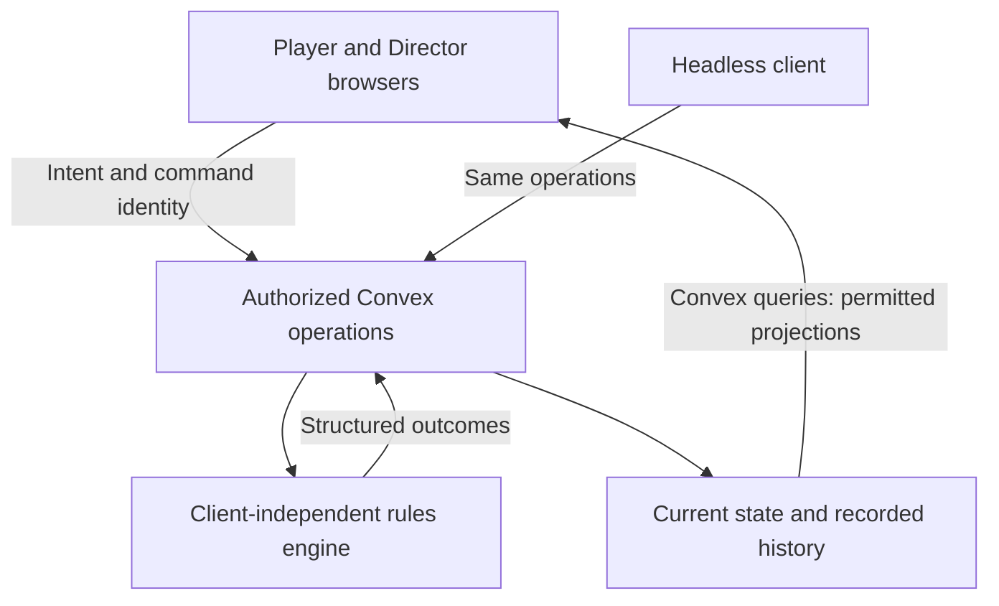

# V1 technology stack and deployment specification

Version 0.1 — 2026-09-11. Specification and recommendations. Written before the pre-alpha app was scaffolded;
section 2 records the current checkout state, and no deployment beyond the local development backend exists.

This document consolidates the technology discussion, including the later clarifications about long table
sessions, multiplayer responsiveness, Cloudflare hosting, and a possible home-server/LAN edition. It records
the reasoning behind the recommended stack without treating every suggested library as a confirmed choice.

The [v1 checkpoint](v1-spec-checkpoint.md) controls release scope. The [table](table-spec.md),
[accounts and access](accounts-and-access-spec.md), [characters](character-wizard-spec.md),
[data architecture](data-architecture-spec.md), [engine](engine-architecture.md), and
[dice](dice-roller-spec.md) specifications retain authority over their respective behavior.

## 1. Decision status and product constraints

**Confirmed v0.01 UI scope:** focus on desktop browsers. All UI built at this stage is temporary and serves
to prove concepts and the connected workflows. Mobile/tablet layouts and finished visual polish are not
prototype acceptance gates. The broader device and presentation goals below remain the product destination.
Keep game behavior in shared operations so replacing the UI does not require rewriting the underlying
systems. This scope change does not remove the established priority on table performance and responsiveness.

**Confirmed decisions and requirements:**

- Convex is the application backend. **Better Auth is the chosen authentication library**, integrated with
  Convex. This supersedes the earlier provisional Convex Auth preference and auth-library comparison.
- The app is web-only and must work across phones, tablets, and desktop computers. There are no native-app
  plans. The user prefers Tailwind for styling and pnpm for package management.
- The intended experience is highly polished and responsive, with expressive animations and tactile
  interactions. Low hardware usage must coexist with that presentation.
- A play session can last **two to six hours**. The table is the sustained-use surface: chat, effective
  character sheets, ability selection, Director monster management, encounter transitions, inventory, and loot.
  Freezing or degrading until someone must repeatedly hard-refresh interrupts the whole group and is
  unacceptable ordinary behavior.
- Character creation/editing and full reference libraries are mostly individual, shorter-lived workflows.
  They need normal good performance, not the same six-hour workload as the table. Director search/add and
  rendered play sheets remain available inside the table without bringing their full authoring interfaces.
- The table is the primary realtime multiplayer surface. Participants should promptly see consistent
  accepted actions. Other screens still need correct membership, permissions, review, and cross-tab updates;
  describing them as mostly single-user does not remove those requirements.
- The table is an integral gameplay surface in this app, not a standalone project or an embedding product.
  Its distinction from setup screens calls for particular care with performance and interaction quality,
  including in the pre-alpha; it does not itself require a separate technology stack or deployment.
- The planned hosted deployment uses **Cloudflare for frontend/assets/object storage** and **Convex Cloud
  for the backend**.
- Preserve the option to run the application on one home server with players connecting over LAN. The v1
  architecture must allow this; a packaged self-hosted edition is not established as an initial release gate.
- Cloudflare Email Service is selected (2026-09-17), with sender `salient@blackgate.studio`.
  [V39](build/V39-account-email.md) enables hosted password reset, the only v1 email flow; Cloudflare
  queued the delivery test and the user confirmed receipt. Offline LAN recovery remains pending.

**Recommended baseline** below means an implementation recommendation with supporting reasoning. Only
explicitly confirmed entries are settled user choices. SSR, engine technology, and exact package versions
remain open where identified; the engine language is confirmed TypeScript (section 4). The pre-alpha scaffold
was separately authorized on 2026-09-11 (see [app status](workstream-app-status.md)); this specification does
not itself authorize deployment.

## 2. Recommended stack

| Layer | Choice or recommendation | Status and reason |
| --- | --- | --- |
| Application backend | Convex | **Confirmed.** Persistent state, server operations, transactions, and reactive clients fit a shared table. |
| Authentication | Better Auth through `@convex-dev/better-auth` | **Confirmed.** Documented Convex integration and regular-account management; portable to a self-hosted backend. Credential-flow details still require implementation verification. |
| Frontend | React + TypeScript + Vite | **Recommended baseline.** Fits complex interactive sheets, reusable controls, and the researched 3D ecosystem. Vite can produce a locally servable static app. |
| Routing | TanStack Router | **Recommended.** Typed routes/search parameters, nested layouts, and code splitting fit campaigns, characters, reference filters, and a persistent table shell. |
| Styling | Tailwind CSS | **User preference; recommended.** Direct control over responsive layouts and a project-specific visual design, with a documented Vite integration. |
| UI controls | shadcn/ui using Base UI | **Recommended for a new UI.** Customizable source components supply menus, dialogs, selectors, tabs, and sheets. Existing UI choices in the other thread must be inspected before proposing migration. |
| Animation | Motion for React plus native CSS | **Recommended.** Motion supplies springs, presence, and layout transitions; CSS handles simple state transitions. Use one coherent motion system. |
| Browser data access | Native Convex React hooks | **Recommended baseline.** Direct subscriptions and mutations without an additional mandatory cache framework. |
| Forms | React Hook Form + Zod | **Recommended.** Manage fields, input shapes, and feedback. Shared character evaluation remains separate from form state. |
| Optional visual dice | Three.js through React Three Fiber, with Drei and Rapier as needed | **Recommended prototype direction.** Matches the existing Owlbear extraction research; accepted-result animation remains unproven. Load separately from ordinary table controls. |
| Package manager | pnpm workspaces | **User preference; recommended.** Supports shared engine/contracts and app packages with one lockfile. |
| Development/CLI runtime | Node | **Recommended continuation of the prototype.** Avoids an unrelated runtime migration; does not decide the engine's long-term runtime or the SSR host runtime. |
| Hosted frontend and assets | Cloudflare; Workers Static Assets and R2 as concrete candidates | **Provider confirmed; service configuration recommended.** Static delivery and object storage remain replaceable for LAN hosting. |
| New app tests | Vitest, convex-test, and Playwright | **Recommended.** Function/authorization tests and multi-user browser scenarios. Retain existing Node engine tests unless migration has a concrete benefit. |
| Email | Hosted delivery provider, behind a small integration boundary | **Deferred.** Resend was an earlier suggestion, not a selected dependency. Provider-specific setup and local recovery are later work. |

The checkout (2026-09-14) uses pnpm (`pnpm-lock.yaml`, `pnpm-workspace.yaml`, `packageManager` pinned in
`package.json`) with a Node `>=24.12.0` requirement, and retains the TypeScript headless experiment and its
Node tests. Installed: React, Vite, TanStack Router, Tailwind, Convex, Better Auth via
`@convex-dev/better-auth`, Vitest, convex-test and Playwright. Not installed: shadcn/ui, Motion, React Hook
Form, Zod and the Three.js/React Three Fiber dice stack; those rows remain recommendations. The table above is
not an installed-package inventory. Pin compatible versions during implementation, especially React/Three Fiber and Better Auth/the Convex
integration; do not copy the old Owlbear manifest or upgrade vendored sources automatically.

**Why pnpm rather than Bun:** the user's familiar package manager already supplies the required workspace
support. Bun's package manager, runtime, and bundler are separate choices; using its installer need not mean
changing runtime. A Node-to-Bun change would need compatibility verification for the CLI and tests, with no
identified v1 benefit to justify it. Installer speed does not improve browser animation or replace Convex's
execution environment. Keep this a tooling decision rather than a condition of hardware efficiency.
[Bun workspaces](https://bun.sh/docs/pm/workspaces),
[Bun's Node compatibility](https://bun.sh/docs/runtime/nodejs-compat).

Evidence: [Convex React](https://docs.convex.dev/client/react/overview),
[Better Auth with a React/Vite SPA](https://labs.convex.dev/better-auth/framework-guides/react),
[TanStack Router](https://tanstack.com/router/latest/docs/overview),
[Tailwind with Vite](https://tailwindcss.com/docs/installation/using-vite),
[shadcn Base UI choice](https://ui.shadcn.com/docs/changelog/2026-07-base-ui-default),
[form integration](https://ui.shadcn.com/docs/forms/react-hook-form), and
[pnpm workspaces](https://pnpm.io/workspaces). Documentation reviewed during this discussion on 2026-09-11;
recheck against the actual versions when implementing.

## 3. Rendering: SPA baseline, SSR remains optional

The user raised SSR to reduce device load. The subsequent clarification focuses sustained performance on the
table, not every screen. A seamless app experience does not require client-only initial rendering, and adding
SSR does not by itself solve degradation after hours of play.

| Technique | Useful effect | Limit for a long table session |
| --- | --- | --- |
| Traditional SSR | Supplies initial HTML and can prepare the first data view before the browser renders it. | Interactive React components still hydrate and run in the browser; ongoing memory and rendering costs remain. |
| Server-only components or prepared content | Keeps eligible component code, parsers, and processing dependencies out of browser bundles. | Interactive controls still need browser code. This is a separate capability from ordinary SSR. |
| Server-side application calculations | Keeps authoritative rules, validation, search, and history processing off player devices throughout play. | Local interaction feedback and visual presentation still need to be fast; every tap should not require a server round trip. |

**Recommendation:** start from React/Vite/TanStack Router as the simplest baseline, while leaving the initial
rendering decision open until a representative screen exists. Public reference pages and initial campaign
views are plausible prerendering/SSR candidates. The table continues with direct browser-to-Convex updates
after initial loading in either arrangement.

If SSR shows worthwhile benefits, **TanStack Start is the leading alternative** because it retains TanStack
Router and has documented Convex/Better Auth integration. Its documentation at review labels Start a release
candidate and Server Components experimental. Do not make v1 hardware efficiency depend on experimental RSC
support. Next.js is not required by the current needs; adopting another framework needs a concrete benefit.

With Start, reconsider TanStack Query for initial Convex data loading and subscription handoff. The official
Convex Query adapter is currently beta, and native hooks can coexist with it. Tune cache/subscription
lifetimes: the documented integration retains unused subscriptions for five minutes by default. Route loaders
must not become a second stale authoritative view of the live table.

SSR would require a server runtime in addition to static assets. Preserve a conventional self-hosted build
alongside a Cloudflare target; isolate any Cloudflare runtime bindings from reusable application code.

Sources: [React hydration](https://react.dev/reference/react-dom/client/hydrateRoot),
[React Server Components](https://react.dev/reference/rsc/server-components),
[Start overview](https://tanstack.com/start/latest/docs/framework/react/overview),
[selective SSR](https://tanstack.com/start/latest/docs/framework/react/guide/selective-ssr),
[Start Server Components](https://tanstack.com/start/latest/docs/framework/react/guide/server-components),
[Convex with Start](https://docs.convex.dev/client/tanstack/tanstack-start/), and
[Convex Query adapter](https://docs.convex.dev/client/tanstack/tanstack-query/).

## 4. Shared operations and the realtime table

Recommended request/data flow:

TypeScript is the standing engine-language choice, confirmed 2026-09-14, unless a concrete reason
to change emerges. In-process invocation versus a service remains an integration decision; the
diagram does not require an external engine service or a browser dependency on engine internals.
Preserve deterministic inputs, portable contracts and independent tests. No routine later language
comparison is required; see [the engine decision](engine-architecture.md#standalone-engine-and-portability).

Recommended operation behavior, subject to the detailed data/resolution contracts:

1. A browser acknowledges input locally and submits an intent with stable command identity and relevant
   expected state. It can open panels, select a target, and indicate progress without a network round trip.
2. Server operations authenticate and authorize the caller, validate current state, and invoke shared
   calculations. External work, when required, must be revalidated before committing against changed state.
3. Commit each accepted effect batch with its corresponding journal changes atomically. Retry recovery must
   neither apply it twice nor reroll accepted dice. This does not make an entire multi-step action one
   transaction or settle the deferred reaction/partial-resolution workflow.
4. Convex pushes relevant committed projections to clients. The SSR host is not an extra relay in this loop.
5. Each client presents its authorized result, optionally animating it. Animation completion, graphics
   failures, and slow devices never gate authoritative progress or other participants.

“Simultaneous” means prompt, consistent shared results, not identical frame timing across devices. Do not add
a barrier waiting for every participant to acknowledge an animation. Also do not infer game-action ordering
from arbitrary arrival order: stale intent, concurrent control, triggered actions, and undo dependencies
still follow the table and future resolution contracts.

The browser receives only data it may read. Player, Director, and observer projections differ; private
notes, personal inventories, hidden roster entries, and planned tower results follow the access spec.
Public reference availability is not permission to disclose private live-table data. Access changes must
invalidate the relevant view/cache rather than rely on a hidden button or gameplay undo.

Use Convex normally outside the table too. Mostly individual workflows do not justify a second backend or
fetching architecture. Keep live updates where they improve correctness, including review decisions and
permission changes, without subscribing to every campaign and character in the app.

## 5. Browser state and table resource lifetimes

Recommended ownership:

- **Convex:** persisted/shared state, effective builds, saved drafts, permissions, accepted outcomes, and
  journals. Browsers retain bounded projections rather than a complete duplicate database.
- **URL/router:** navigable campaign/character/reference selections and useful search/filter state. Do not
  put private notes, credentials, or transient gesture state into URLs.
- **Local React state:** open panels, focus, gesture state, unsaved field edits, pending presentation, and
  short-lived selections. Persist drafts through the character operations when required.

Do not initially add Redux, Zustand, TanStack DB, or another global store merely because the app is complex.
Introduce a small UI store only if shared local state needs it. A form library must not become the sole
implementation of character legality: the wizard, level-up, import, and headless paths use the same evaluator.

| Table surface | Recommended lifetime and loading behavior |
| --- | --- |
| Effective character sheets | Load the authorized play projection and relevant ability text. Keep full wizard/editor code out of the table's initial bundle. |
| Chat and game log | Bound recent data and rendered rows independently; load older pages/details on demand and evict unused pages. Preserve scroll position. These remain separate records/lifetimes even if visually combined later. |
| Director search/add | Fetch bounded results when searching and load selected definitions. Closing search releases unused work without changing the persistent foes roster. |
| Foes/encounters | Release obsolete views, listeners, and caches as membership changes. Surviving foes remain authoritative campaign state across encounters/sessions; memory cleanup must not delete them. |
| Inventory/stash | Load permitted visible details as needed. Preserve relevant live summaries; subscribe to detailed panels while useful and refresh on return. Closing a panel does not withdraw a claim or change ownership. |
| Dice/effects | Keep only useful presentation state, stop idle simulation/rendering, and dispose of unused graphics resources when appropriate. Accepted rolls remain in server history. |

Virtualized lists limit mounted DOM nodes; they do not automatically limit retained query data, decoded
images, or graphics resources. Bound all of those separately. Repeated switching, loading, rolling, and
opening/closing panels must not accumulate subscriptions, timers, event handlers, or stale snapshots.

Update the smallest relevant components when state changes. A resource counter change should not recompute
all sheets or rerender the whole campaign workspace. Subscribe to bounded current state and recent events,
consistent with the [data architecture](data-architecture-spec.md#7-realtime-and-analytics-boundaries).

## 6. Visual quality and sustained performance

Tailwind and reusable UI primitives should support a project-specific design system: typography, spacing,
surfaces, ability cards, resource counters, conditions, and readable touch targets. A polished tabletop tool
does not need to retain the component library's default visual treatment. Preserve keyboard, touch, and
screen-reader operation across phone, tablet, and desktop layouts.

Use Motion for meaningful panel/card transitions, roster changes, and interaction feedback; use CSS for
simple transitions. Prefer short animations that finish and let the device return to idle. Reduced-motion
presentation must communicate the same outcome. Optional dragging always retains a button/keyboard path.

The long-session engineering target belongs specifically to the table. Avoid persistent ambient effects,
unnecessary polling, high-frequency timers, and work in hidden surfaces. Backgrounding the page should stop
unnecessary presentation work; resuming reestablishes permitted current state without replaying every missed
cosmetic effect. A lost connection, browser suspension, or all clients leaving does not pause/end the session.

The optional dice tray presents accepted values; physics never supplies gameplay randomness. Prefer rendering
on demand while idle, measured limits on resolution/effects, and correct static/text fallback. Prototype the
result-matching technique on actual phones. Lazy loading reduces initial cost but does not itself release
memory after use. Consult the existing dice spec for extraction and acceptance details.

Server-side calculation can reduce browser work, but local feedback should remain immediate. Do not run the
whole character evaluator on every keystroke or ship the full rules corpus to display a sheet. Preprocess
content into portable versioned definitions and safe display material. Search and archive preparation belong
on the server/build side; final rule validation and state commits remain authoritative.

Sources: [Motion layout animation](https://motion.dev/docs/react-layout-animations),
[Motion accessibility](https://motion.dev/docs/react-accessibility),
[WebKit power guidance](https://webkit.org/blog/8970/how-web-content-can-affect-power-usage/), and
[Three Fiber performance](https://r3f.docs.pmnd.rs/advanced/scaling-performance).

## 7. Authentication and email

**Better Auth is selected**, not an alternative awaiting a Convex Auth comparison. Use the Convex integration
and retain an application identity independent of mutable email/name. Authentication identifies the caller;
campaign ownership, active Director authority, character grants, observer restrictions, and inventory rights
remain checks in shared application operations.

V0.01 must prove sign-up, sign-in and sign-out, including the resulting access/session behavior. Profile
editing, password recovery and account deletion are deferred. The fuller delivery must also prove reset,
credential changes, session revocation and deletion against the [access spec](accounts-and-access-spec.md).
Verify supported package/plugin versions and the chosen SPA or SSR origin/session setup. This is verification
of the selected library, not a
new library-selection gate. Provider support for verification email, MFA, or OAuth does not add those flows
to v1 or restore the excluded admin dashboard.

Keep email delivery behind a small integration boundary. The user selected Cloudflare Email Service on
2026-09-17, from `salient@blackgate.studio`, using the REST API from Convex. See
[the account-email contract](accounts-and-access-spec.md#cloudflare-account-email--2026-09-17).
Hosted recovery is configured and browser-verified; the user confirmed receiving the delivery test.
Offline LAN recovery remains pending. Existing password-reset scope and pending
credential-change policy remain fuller-product requirements; password recovery is not a v0.01 gate.

For a disconnected LAN edition, local email/password login should not depend on a cloud identity service.
External OAuth, cloud CAPTCHA, and hosted email cannot be mandatory dependencies of core local play. Offline
recovery is a separate design task, not permission to silently bypass authentication or remove recovery.

## 8. Hosted and LAN deployment boundaries

| Responsibility | Planned hosted deployment | Future LAN deployment |
| --- | --- | --- |
| Frontend files | Cloudflare static delivery | Local web server serving the built app |
| Optional SSR | Cloudflare-compatible server runtime | Conventional locally runnable server build |
| Backend/realtime | Convex Cloud | Self-hosted Convex with persistent storage |
| Accounts | Better Auth in the Convex integration | Same integration against the local backend |
| Application assets/objects | Cloudflare storage; R2 recommended | Local files, Convex file storage, or an S3-compatible service behind the same application interface |
| Rules engine | Application-owned execution environment | Same engine release running on the home server, in-process or as a local service |
| Email | Hosted provider, selection deferred | Delivery/recovery arrangement deferred |

Cloudflare remains the delivery provider, not a required source of game semantics. Keep essential gameplay
independent of Worker-only bindings, edge queues, image transformation URLs, or other hosted APIs. If a hosted
service is useful, isolate the dependency and preserve a practical local equivalent for essential features.

Recommended storage boundary: a small set of upload/read/delete operations with stable asset keys. Resolve
URLs using deployment configuration, including authorization for private files and expiry for signed URLs.
Do not embed permanent R2/CDN URLs as the identity of assets in characters, encounters, or content packages.
R2 supports an S3-compatible API with documented differences; verify the operations actually used rather than
assume all S3 providers are interchangeable. An R2 application bucket is separate from Convex Cloud's managed
database/internal storage; choosing R2 does not reconfigure Convex Cloud's internals.

For LAN use, provide local copies of required permitted content, fonts, images, and dice assets. Source
licenses/attribution still apply. Configure the frontend, Convex API/WebSocket endpoint, HTTP/auth endpoint,
and asset addresses for the hostname clients actually reach. A phone's `localhost` is not the home server.
Secrets and deployment admin keys stay server-side. A local reverse proxy must support the live connection
and HTTP/auth routes, with trusted HTTPS and appropriate origins/cookies. Caddy is one possible implementation;
its locally issued certificates require trust on the client devices.

Convex's documented self-hosted Docker setup defaults to local SQLite and persistent volumes, with file
storage configurable locally or through S3. Recommend a pinned container setup for the future LAN edition,
including persistent state/secrets and a recovery procedure. Use a durable self-hosted deployment rather than
depend on an interactive development server. Installation/updates can require internet; the target is that
prepared core play can continue without WAN access. A Cloudflare Tunnel is not a required LAN transport.

One local server remains authoritative and all browsers connect to it. This is distinct from independent
offline clients that merge changes later; no offline conflict-resolution system is implied. A local instance
has its own data/accounts. Cloud-to-home campaign migration, asset transfer, identity mapping, and any future
cloud/LAN synchronization need separate contracts. Self-hosting does not implement them, and they are distinct
from the Forge Steel character export feature deferred in v1.

Sources: [Cloudflare SPA hosting](https://developers.cloudflare.com/workers/static-assets/routing/single-page-application/),
[R2 S3 compatibility](https://developers.cloudflare.com/r2/api/s3/api/),
[Convex self-hosting](https://github.com/get-convex/convex-backend/blob/main/self-hosted/README.md),
[Convex file-storage configuration](https://github.com/get-convex/convex-backend/blob/main/self-hosted/advanced/s3_storage.md),
[Better Auth email/password](https://better-auth.com/docs/authentication/email-password), and
[Caddy local HTTPS](https://caddyserver.com/docs/automatic-https#local-https).

## 9. Verification and acceptance

These are proposed acceptance procedures supporting the confirmed requirements, not completed measurements.
For v0.01, apply them to the desktop workflows and features selected in the
[scope checkpoint](pre-alpha-design-gaps.md). Chat, inventory, grants/delegation, standalone rules search,
mobile layouts and finished animations are not prototype gates. Table responsiveness, correct authorized
state and ordinary save/reload/reconnect remain required. The six-hour exercise below is a proposed fuller
validation target; the exact prototype duration and group size have not been selected.

| Check | Expected evidence |
| --- | --- |
| Shared table slice | Director and multiple players see permitted committed changes to sheets, foes, inventory, and recent activity promptly. Pending feedback is immediate; inconsistent/stale intent is handled explicitly. |
| Independent presentation | A slow/disabled dice renderer cannot delay others or change outcomes. Reconnects do not duplicate effects or replay the entire cosmetic history. |
| Six-hour table session | Representative repeated play completes without freezes or performance-driven hard refreshes. After warm-up, retained resources remain bounded for the active workload rather than growing with elapsed history. |
| Repeated lifecycle operations | Monster add/remove, encounter start/end/void, searches, panel transitions, rolls, inventory, and loot do not accumulate subscriptions, handlers, timers, cached pages, or graphics objects. Persisted foes/claims survive UI cleanup as specified. |
| Idle/background/resume | Idle CPU/GPU work is minimal; unnecessary background work stops. Resume or a forced reload restores permitted server state without resetting the session, losing saved drafts, or repeating a command. |
| Access change | Blocking, removal, share revocation, and Director changes promptly remove unauthorized data/control, including retained client views. Test observer, player, and Director projections separately. |
| Ordinary app workflows | Wizard/reference/account flows remain responsive and accessible across phone, tablet, and desktop, without requiring each to pass the table's six-hour workload. |
| Rendering decision | If considering SSR, compare the same screen's initial display, usable-interaction time, JavaScript/data payload, and hydration cost. Measure sustained table behavior separately. |
| Future LAN readiness | After installation/content provisioning, disconnect WAN and exercise local sign-in and the core table loop from multiple devices. Missing email delivery is an explicit deferred service limitation, not a hidden gameplay dependency. |

Use Vitest/convex-test for application behavior and permission tests, retaining meaningful existing engine
tests. Use Playwright's independent browser contexts for simultaneous Director/player/observer scenarios.
When mobile delivery returns to scope, automated WebKit runs do not replace testing actual iPhone/iPad Safari
hardware. For the desktop prototype, include a representative desktop Chrome run and real network
interruption/backgrounding. Record device/browser, workload, and evidence for memory trends, interaction
latency, idle work, and graphics behavior. Set numerical budgets from those
measurements; this discussion establishes no arbitrary universal RAM or latency threshold.

Recommended first technical proof within the connected journey: two authenticated desktop users (Director
and player), an effective character from the minimal wizard, a catalog foe, one agreed shared gameplay
operation and its visible game-log entry. Exercise repetitions and reconnects before expanding the surface.
Two users are a proposed technical test fixture, not a settled maximum or complete group-size acceptance
criterion. Animations and a finished dice tray are not needed to prove these boundaries.

Sources: [convex-test](https://docs.convex.dev/testing/convex-test),
[Vitest](https://vitest.dev/guide/), and
[Playwright browser contexts](https://playwright.dev/docs/browser-contexts).

## 10. Remaining implementation choices

- Confirm the recommended frontend/UI/form libraries against the existing UI work and pin compatible versions.
- Decide whether initial delivery benefits enough from SSR/prerendering to adopt TanStack Start; do not
  reopen this solely because a long-running table needs memory cleanup.
- Establish runtime placement and server integration for the TypeScript engine. Revisit its language
  only if a concrete reason emerges, using the separate engine criteria.
- Implement and verify Better Auth account flows; verify the selected Cloudflare email delivery and design offline local recovery later.
- Select the concrete Cloudflare storage/upload arrangement and local storage adapter, and define future LAN
  packaging/migration when that edition becomes an implementation task.
- Establish measured table payload/cache/resource budgets and prove the optional dice technique.

This specification claims no implementation itself; the current checkout (pnpm, React/Vite frontend, Better
Auth, local Convex backend) is recorded in section 2 and [app status](workstream-app-status.md). No storage
migration or hosting configuration exists, and no deployment is authorized. Detailed action economy, resource reconciliation, and other remaining product work
continue under the primary specifications.
